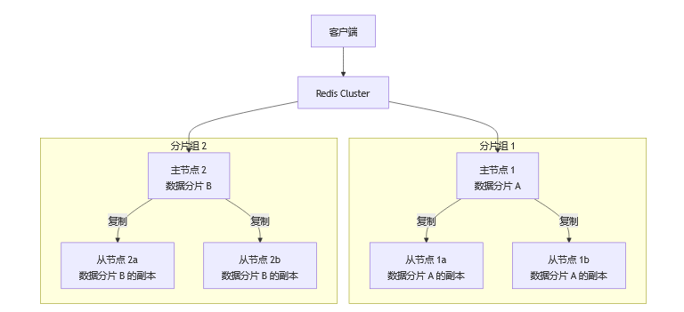

# Redis综合

## 五、Redis

### 1、介绍下Redis Redis有哪些数据类型

​		**Redis**（**Re**mote **Di**ctionary **S**erver）是一个开源的、基于内存的**键值存储系统**（Key-Value Store）。它通常被归类为 **NoSQL** 数据库。

​		本质上是一个Key-Value类型的内存数据库，整个数据库统统加载在内存当中进行操作，定期通过异步操作把数据库数据flush到硬盘上进行保存。因为是纯内存操作，Redis的性能非常出色，每秒可以处理超过 10万次读写操作，是已知性能最快的Key-Value DB。
​		Redis的主要缺点是数据库容量受到物理内存的限制，不能用作海量数据的高性能读写，因此Redis适合的场景主要局限在较小数据量的高性能操作和运算上。

常见数据类型：

| string            | 字符串（一个字符串类型最大存储容量为512M）                   |
| ----------------- | ------------------------------------------------------------ |
| list              | 字符串列表，按插入顺序排序。可以重复的集合 。                |
| set               | 无序、唯一的字符串集合。 不可以重复的集合   。               |
| hash              | 键值对集合，非常适合存储对象。 类似于Map<String,String>   。 |
| zset(sorted set） | 有序的、唯一的字符串集合，每个元素关联一个分数（score）用于排序。带分数的set。 |


### 2、Redis提供了哪几种持久化方式

​		RDB持久化方式能够在指定的时间间隔能对你的数据进行快照存储。

​		AOF持久化方式记录每次对服务器写的操作,当服务器重启的时候会重新执行这些命令来恢复原始的数据，AOF命令以redis协议追加保存每次写的操作到文件末尾.Redis还能对AOF文件进行后台重写,使得AOF文件的体积不至于过大。

​		如果你只希望你的数据在服务器运行的时候存在，你也可以不使用任何持久化方式。

​		你也可以同时开启两种持久化方式，在这种情况下，当redis重启的时候会优先载入AOF文件来恢复原始的数据,因为在通常情况下AOF文件保存的数据集要比RDB文件保存的数据集要完整。


**（1）RDB（Redis Database） - 快照方式**

​		每隔一段时间，将内存中的数据集写到磁盘

​		Redis会单独创建（fork）一个子进程来进行持久化，会先将数据写入到个临时文件中，待持久化过程都结束了，再用这个临时文件替换上次持久化好的文件。整个过程中，主进程是不进行任何IO操作的，这就确保了极高的性能如果需要进行大规模数据的恢复，且对于数据恢复的完整性不是非常敏感，那RDB方式要比AOF方式更加的高效。
​		如果Redis意外停机（如断电），您可能会丢失**最后一次快照之后的数据**。

**（2）AOF（Append Only File） - 日志方式**

​		AOF 持久化记录**每一个对数据库进行写操作**的命令，将这些命令追加到一个日志文件的末尾。当Redis重启时，它会**重新执行**AOF文件中的所有命令来重建数据集。

**保存策略：**

- appendfsync always：每次产生一条新的修改数据的命令都执行保存操作；效率低，但是安全！
- appendfsync everysec：每秒执行一次保存操作。如果在未保存当前秒内操作时发生了断电，仍然会导致一部分数据丢失（即1秒钟的数据）。
- appendfsync no：从不保存，将数据交给操作系统来处理。更快，也更不安全的选择。

推荐（并且也是默认）的措施为每秒 fsync 一次， 这种 fsync 策略可以兼顾速度和安全性。

**缺点：**

1 比起RDB占用更多的磁盘空间

2 恢复备份速度要慢

3 每次读写都同步的话，有一定的性能压力


### 3、Redis为什么快

**1. 基于内存存储 (In-Memory)**

​		**这是最根本的原因**。所有数据都存储在内存(RAM)中。

**优势**：完全避免了磁盘 I/O 瓶颈。读写操作直接在内存中进行，速度极快。

**2. 高效的数据结构**

​		Redis 不仅仅是简单的 Key-Value 存储，它提供了丰富且**高度优化**的数据结构。

| **数据结构**   | **底层实现**                 | **优势**                              |
| -------------- | ---------------------------- | ------------------------------------- |
| **String**     | SDS (Simple Dynamic String)  | O(1) 获取长度，预分配，避免缓冲区溢出 |
| **Hash**       | 哈希表 或 ziplist (元素少时) | 高效查找，ziplist 节省内存            |
| **List**       | 双向链表 或 ziplist          | 两端插入/删除 O(1)                    |
| **Set**        | 哈希表 或 intset (纯整数时)  | intset 节省内存，查找 O(1)            |
| **Sorted Set** | 跳表 (SkipList) + 哈希表     | 范围查询快，查找 O(1)                 |

​		**特殊编码优化**：Redis 会根据 value 的大小和类型，自动选择最节省内存的编码方式。例如，一个小的 Hash 可能会使用内存效率极高的 `ziplist`而不是 `hashtable`。

**3. 单线程模型 (Single-Threaded)**

​		**这是最反直觉但最关键的设计**。Redis 的核心网络 I/O 和命令处理是单线程的。

**优势**：

- **无锁竞争**：完全避免了多线程环境下昂贵的锁开销和上下文切换。
- **原子性**：所有命令自然原子执行，简化开发。
- **可预测性**：性能表现稳定，没有因线程调度导致的延迟毛刺。

**澄清误解**：

- **并非完全单线程**：持久化（`BGSAVE`、`BGREWRITEAOF`）、异步删除（`UNLINK`）、模块加载等操作由后台线程处理，不阻塞主线程。
- **CPU 不是瓶颈**：对于内存访问，多线程并不能带来线性提升，反而会引入复杂性。Redis 的瓶颈通常是**网络 I/O 或内存大小**，而非 CPU。

**4. I/O 多路复用 (I/O Multiplexing)**

​		单线程如何处理数万个并发连接？答案是 **I/O 多路复用**技术。

​		Redis 使用操作系统提供的机制（Linux 上的 `epoll`，MacOS 上的 `kqueue`），使得单个线程可以**同时监听**大量客户端连接的文件描述符（Socket）。

​		这使得 Redis 用 **极少的线程资源** 就能处理海量网络连接，性能极高。

**5. 优化的网络协议与序列化**

- **RESP (Redis Serialization Protocol)**：简单的文本协议，易于解析，减少 CPU 开销。
- **管道 (Pipelining)**：客户端可以一次性发送多个命令，然后一次性读取所有回复，极大减少网络往返时间（RTT）。


**3.1 什么情况下 Redis 会变慢？**

理解了 Redis 为什么快，也就知道了什么情况下它会慢：

1. **执行慢查询命令**：例如 `KEYS *`、`FLUSHALL`、对大集合执行 `SINTER`/`SUNION`。

2. **使用大 Key**：单个 String value 过大（如 1MB），或一个 Hash 中有数百万个字段。传输和序列化成本高。

3. **内存不足**：触发 Swap，导致 Redis 访问数据需要读写磁盘，性能急剧下降。

4. **持久化阻塞**：**RDB**：`fork`子进程时，如果内存数据量大，`fork`操作本身可能耗时。

   **AOF**：`appendfsync always`策略每次写入都刷盘，会显著降低性能。

5. **网络瓶颈**：如果网络带宽打满或延迟很高，Redis 再快也无力回天。

**3.2 Redis的危险操作**

**1.KEYS * 命令：全键扫描**

```bash
# 添加测试数据
SET user:1 "Alice"
SET user:2 "Bob"
HSET product:100 name "iPhone" price 999
SADD tags:tech "AI" "Blockchain"

# 执行 KEYS *
KEYS *

1) "user:1"
2) "user:2"
3) "product:100"
4) "tags:tech"
```

安全替代方案

```
# 模式匹配
SCAN 0 MATCH "user:*" COUNT 100
```

**2.FLUSHALL 命令：删除所有数据**

```bash
# 执行 FLUSHALL
FLUSHALL
```

灾难性后果

- **数据永久丢失**：所有数据库（默认16个）全部清空
- **服务中断**：缓存穿透导致后端数据库压力激增
- **无后悔药**：除非有备份，否则无法恢复

**3.SINTER/SUNION：大集合运算**

```bash
# 创建两个集合
SADD set1 "A" "B" "C" "D"
SADD set2 "C" "D" "E" "F"

# 交集
SINTER set1 set2  # 输出: 1) "C" 2) "D"

# 并集
SUNION set1 set2  # 输出: 1) "A" 2) "B" 3) "C" 4) "D" 5) "E" 6) "F"
```

非常耗时

```
交集大小: 50000, 耗时: 0.35s
并集大小: 150000, 耗时: 0.52s
```

风险

- **CPU 飙升**：集合运算复杂度 O(N*M)，百万级成员需数秒
- **内存暴增**：结果集可能非常大（如并集）
- **阻塞服务**：单线程处理期间无法响应其他请求

**3.3 如何避免以上危险操作**

​		**永不**在生产环境使用 `KEYS *`和 `FLUSHALL`

​		为所有危险命令设置别名或禁用


### 4、Redis为什么是单线程的

​		官方FAQ表示，因为Redis是基于内存的操作，CPU不是Redis的瓶颈，Redis的瓶颈最有可能是机器内存的大小或者网络带宽。既然单线程容易实现，而且CPU不会成为瓶颈，那就顺理成章地采用单线程的方案了Redis利用队列技术将并发访问变为串行访问

1）绝大部分请求是纯粹的内存操作

2）采用单线程,避免了不必要的上下文切换和竞争条件

### 5、Redis服务器的的内存是多大

​		配置文件中设置redis内存的参数：。

​		该参数如果不设置或者设置为0，则redis默认的内存大小为：

​		32位下默认是3G

​		64位下不受限制

​		一般推荐Redis设置内存为最大物理内存的四分之三，也就是0.75

​		命令行设置config set maxmemory <内存大小，单位字节>，服务器重启失效

​		config get maxmemory获取当前内存大小

​		永久则需要设置maxmemory参数，maxmemory是bytes字节类型，注意转换


### 6、为什么Redis的操作是原子性的，怎么保证原子性的

在 Redis 中，**原子性**指的是：

- **单命令操作**：每个 Redis 命令执行时不会被其他命令中断
- **多命令组合**：通过特定机制保证一组命令的不可分割性
- **执行结果**：要么全部成功，要么全部失败（无中间状态）


**关键机制**：

- Redis 使用**单线程处理所有命令**
- 每个命令执行**不会被中断**，直到完成
- 天然避免了多线程的**竞态条件**和**锁竞争**


### 7、Redis有事务吗

​		**是的，Redis 支持事务**，但与传统关系型数据库（如 MySQL）的 ACID 事务有显著区别。Redis 事务的核心是 **MULTI/EXEC 命令组合**，它们提供了原子性执行的能力，但**不支持回滚（Rollback）**。

> multi	/ˈmʌlti/	多
>
> exec	/ɪɡˈzek/	执行
>
> queued	/kjuːd/	排队

```bash
redis 127.0.0.1:6379> MULTI
OK
redis 127.0.0.1:6379> set name mk
QUEUED
redis 127.0.0.1:6379> set age 10
QUEUED
redis 127.0.0.1:6379> EXEC
1) OK
2) OK
```

​		当输入MULTI命令后，服务器返回OK表示事务开始成功，然后依次输入需要在本次事务中执行的所有命令，每次输入一个命令服务器并不会马上执行，而是返回”QUEUED”，这表示命令已经被服务器接受并且暂时保存起来，最后输入EXEC命令后，本次事务中的所有命令才会被依次执行，可以看到最后服务器一次性返回了两个OK，这里返回的结果与发送的命令是按顺序一一对应的，这说明这次事务中的命令全都执行成功了。

​		Redis的事务除了保证所有命令要不全部执行，要不全部不执行外，还能保证一个事务中的命令依次执行而不被其他命令插入。同时，redis的事务是不支持回滚操作的。


### 8、Redis数据和MySQL数据库的一致性如何实现

**1.延迟双删**

为什么需要“双删”？

​		一个**读请求**在写请求**更新数据库后、删除缓存前**的极短时间窗口内，读取了旧数据并将其重新加载到了缓存中，导致缓存被污染。

过程：

1）先删除缓存（第一次删除）；

2）再写数据库；

3）休眠500毫秒（根据具体的业务时间来定，包括redis集群同步时间）；

4）再次删除缓存（第二次删除）。

​		**第二次删除的核心目的**：清除掉在“更新数据库”到“第一次删除缓存”这个极短时间窗口内，可能被其他读请求写入缓存的**脏数据**。

**2.监听binlog同步redis**

前期：maven引入 Canal 客户端 依赖。

1）监听指定字典表的指定数据

2）发生更新、删除等操作时异步更改redis值


### 9、缓存击穿，缓存穿透，缓存雪崩的原因和解决方案

| **问题**     | **描述**                                    | **根本原因**                  | **危害**                   |
| ------------ | ------------------------------------------- | ----------------------------- | -------------------------- |
| **缓存击穿** | 某个**热点Key**过期瞬间，大量请求直达数据库 | 热点Key集中失效               | 数据库短期压力剧增         |
| **缓存穿透** | 查询**不存在的数据**，缓存和数据库都没有    | 恶意攻击或业务bug             | 数据库持续被无效查询冲击   |
| **缓存雪崩** | **大量Key同时失效**，或Redis服务宕机        | 批量Key设置相同TTL、Redis宕机 | 数据库压力过大导致系统崩溃 |

**1.缓存击穿**

​		一个**访问非常频繁的热点Key**（如明星绯闻、热门商品）在过期瞬间，大量并发请求无法从缓存中读到数据，同时去访问数据库，导致数据库瞬间压力过大。

1.1 互斥锁（Mutex Lock） - 推荐

```java
public Object getData(String key) {
    Object value = redisTemplate.opsForValue().get(key);
    if (value == null) {
        // 尝试获取分布式锁
        String lockKey = "lock:" + key;
        if (redisTemplate.opsForValue().setIfAbsent(lockKey, "1", 30, TimeUnit.SECONDS)) {
            try {
                // 获取锁成功，查询数据库
                value = database.query(key);
                // 写入缓存
                redisTemplate.opsForValue().set(key, value, 1, TimeUnit.HOURS);
            } finally {
                // 释放锁
                redisTemplate.delete(lockKey);
            }
        } else {
            // 未获取到锁，短暂等待后重试
            Thread.sleep(100);
            return getData(key); // 重试
        }
    }
    return value;
}
```

1.2 逻辑过期（Logical Expiration）

​		不设置实际的Redis过期时间，而是在value中存储过期时间戳：

1.3 永不过期 + 异步更新

​		对真正的热点Key设置为永不过期，通过后台任务定期更新：

**2.缓存穿透（Cache Penetration）**

​		请求查询**数据库中根本不存在的数据**。导致每次请求都穿透缓存直达数据库，可能被恶意攻击利用。

2.1 缓存空值（Null Caching）

```java
public Object getData(String key) {
    Object value = redisTemplate.opsForValue().get(key);
    if (value != null) {
        // 如果是特殊空值标记，直接返回null
        if (NULL_VALUE.equals(value)) {
            return null;
        }
        return value;
    }
    
    // 查询数据库
    value = database.query(key);
    if (value == null) {
        // 数据库也没有，缓存空值（设置较短过期时间）
        redisTemplate.opsForValue().set(key, NULL_VALUE, 5, TimeUnit.MINUTES);
        return null;
    }
    
    // 数据库有数据，写入缓存
    redisTemplate.opsForValue().set(key, value, 1, TimeUnit.HOURS);
    return value;
}
```

**3.缓存雪崩（Cache Avalanche）**

​		**大量缓存Key在同一时间点失效**，或者Redis服务宕机，导致所有请求直达数据库，造成数据库压力过大甚至崩溃。

3.1 差异化过期时间

```java
// 为Key设置基础过期时间 + 随机偏移量
public void setCache(String key, Object value, long baseTimeout, TimeUnit unit) {
    // 生成随机偏移量（±10%）
    long randomOffset = (long) (baseTimeout * 0.2 * Math.random()); 
    long timeout = unit.toMillis(baseTimeout) + randomOffset;
    
    redisTemplate.opsForValue().set(
        key, value, timeout, TimeUnit.MILLISECONDS
    );
}
```


### 10、哨兵模式是什么样的

​		Redis Sentinel（哨兵）是Redis官方提供的**高可用性解决方案**，用于管理Redis主从架构，实现自动故障转移、监控和通知。

​		**哨兵模式的本质**：通过运行特殊的Redis哨兵进程，监控主从节点的健康状态，并在主节点故障时**自动选举新的主节点**，完成故障转移。

> raft	/ræft/	筏
>
> quorum	/ˈkwɔːrəm/	法定人数

**1 主观下线（Subjective Down，SDOWN）**

**定义**：某个**单独的哨兵实例**自己认为主节点不可用。

**触发条件**：哨兵按照配置（`down-after-milliseconds`，默认30秒）定期向所有节点（主、从、其他哨兵）发送 `PING`命令。如果对方在指定时间内返回了无效响应（如超时、返回错误等）或根本没有响应。

注意：这个超时时间对**所有类型的节点**都有效。如果一台机器网络拥塞，可能导致哨兵同时认为主节点、从节点和其他哨兵都“主观下线”了。

- **性质**：**单机观点**，并不代表主节点真的挂了，可能只是这个哨兵到主节点之间的网络出现了临时问题。

**2 客观下线（Objective Down，ODOWN）**

**定义**：**足够数量的哨兵**（达成共识）都认为主节点不可用。

**触发条件**：当一个哨兵判断主节点“主观下线”后，它会向**其他所有哨兵**发送命令，询问它们是否也认为该主节点下线了。其他哨兵会根据自身与主节点的连接情况回复 **“同意”** 或 **“拒绝”**。

如果收到的**同意票数**达到了配置文件中设定的 **`quorum`** 值（法定人数），那么这个哨兵就会将主节点状态标记为“客观下线”（`odown`），并立即发起故障转移流程。

- **性质**：**集群共识**，表明主节点故障是大概率事件，可以安全地启动故障转移。

**3 选举领头哨兵（Leader Election）**

​		一旦确认为“客观下线”，哨兵们需要选举出一个**领头哨兵**（Leader）来负责执行具体的故障转移操作。

​		选举采用了 **Raft算法** 的变种，每个“客观下线”的确认者都会要求其他哨兵投票给自己。

​		获得**多数票**（`> N/2`，注意这个多数票和`quorum`值不同）的哨兵成为Leader。如果一次选举失败，一段时间后会重新进行选举。


### 11、Redis常见性能问题和解决方案

**1 大 Key（Big Key）**

**现象**：单个 Key 的 Value 过大（如一个 Hash 有百万个字段），导致操作延迟高、网络阻塞、迁移困难。

**解决**：

- **拆分**：将一个大 Hash 拆分为多个小 Hash，例如 `user:1000:profile`-> `user:1000:profile:1`, `user:1000:profile:2`，并通过算法定位具体子 Key。
- **使用 SCAN 系列命令**：替代 `HGETALL`, `SMEMBERS`等，避免阻塞。
- **删除优化**：删除大 Key 时使用 `UNLINK`（异步删除）替代 `DEL`。
- **诊断**：使用 `redis-cli --bigkeys`或 `memory usage key`命令扫描和分析。

**2 fork 阻塞**

**现象**：在生成 RDB 或 AOF 重写时，主进程发生明显阻塞（尤其内存越大越明显）。

**原因**：`fork`操作需要复制主进程的页表，如果内存很大，`fork`操作会很耗时。

**解决**：

- **降低 fork 频率**：避免频繁触发 RDB 和 AOF 重写。
- **使用物理机**：在虚拟化环境中，`fork`性能更差。
- **预留内存**：确保系统有足够的内存，避免在 `fork`期间发生 Swap。

**3 主从复制延迟**

**现象**：从库读取到旧数据。

**解决**：

- **优化网络**：主从节点间使用高质量内网。
- **避免主节点过载**：主节点压力过大会导致其无法及时推送数据。
- **使用环形复制**：或引入更多从节点来分担读压力，而不是让一个从节点承担所有复制流量。
- **监控**：使用 `redis-cli info replication`关注 `slave_repl_offset`和 `master_repl_offset`的差值。

注意点：

(1) Master最好不要做任何持久化工作，如RDB内存快照和AOF日志文件

(2) 如果数据比较重要，某个Slave开启AOF备份数据，策略设置为每秒同步一次

(3) 为了主从复制的速度和连接的稳定性，Master和Slave最好在同一个局域网内

(4) 尽量避免在压力很大的主库上增加从库


### 12、MySQL里有大量数据，如何保证Redis中的数据都是热点数据

​		要保证 Redis 中都是热点数据，本质上是**缓存淘汰策略**和**缓存更新策略**的结合。

**关键淘汰策略选择：**

| 策略               | 含义                                               | 适用场景                                            | 命令示例                                   |
| ------------------ | -------------------------------------------------- | --------------------------------------------------- | ------------------------------------------ |
| **`volatile-lru`** | 从**设置了过期时间**的键中，淘汰**最近最少使用**的 | 混合数据，部分永久、部分临时                        | `CONFIG SET maxmemory-policy volatile-lru` |
| **`allkeys-lru`**  | **从所有键中**，淘汰**最近最少使用**的             | **<font color="red">保证热点数据的最佳选择</font>** | `CONFIG SET maxmemory-policy allkeys-lru`  |
| `volatile-ttl`     | 从设置了过期时间的键中，淘汰**剩余存活时间最短**的 | 缓存数据，且新旧热度有区别                          |                                            |
| `allkeys-random`   | 从所有键中，**随机淘汰**                           | 数据访问概率均匀，无热点                            |                                            |
| **`noeviction`**   | **不淘汰**，新写入操作会报错                       | 纯存储，不能丢数据                                  |                                            |

**缓存更新模式**

1.双删缓存：控制数据加载逻辑，**按需缓存**。

2.binlog监听更新：根据mysql数据的更新而更新。

3.设置合理的 **TTL（过期时间）**：定期清理，防止冷数据沉淀。


### 13、Redis集群方案应该怎么做 都有哪些方案 

**方案一**：Redis Sentinel（主从复制 + 哨兵） - **高可用方案**

​		这不是严格意义上的“数据分片”集群，而是**高可用（HA）方案**。它解决的是主节点故障时自动故障转移的问题，**所有节点存储全量数据**。

**优点**：配置简单，成熟度高。实现高可用，避免单点故障。

支持读写分离（客户端实现）。

**缺点**：**无法扩展数据容量**：所有节点存储全量数据，受单机内存限制。

**适用场景**：数据量不大（一台机器内存能装下），但要求高可用性的场景。读写分离场景，用从节点来扩展读性能。


**方案二**：Redis Cluster（官方集群） - **去中心化分片方案**

​		Redis 官方提供的**数据分片**解决方案，真正意义上的“集群”。它将数据自动分片（sharding）到多个节点上，同时具备高可用性。

**核心概念**：

- **哈希槽（Slot）**：共有 16384 个槽，每个 Key 通过 CRC16 算法计算后，对 16384 取模，确定其属于哪个槽。
- **数据分片**：每个主节点负责一部分哈希槽。例如：3个节点，可能分别负责 0-5460, 5461-10922, 10923-16383。
- **高可用**：每个主节点都有对应的从节点，主节点故障时，从节点会自动提升为主节点。

**优点**：

- **官方原生支持**，无需第三方组件。
- **可线性扩展**：通过增加节点来扩展数据容量和吞吐量。
- **自动故障转移和高可用**。
- 客户端直接连接任意节点，节点间通过 `gossip`协议通信，去中心化。

**缺点**：

- **不支持跨节点事务**和多 Key 操作（除非这些 Key 在同一个槽位，可通过 **hash tag** `{}`控制）。
- 架构较重，管理和配置稍复杂。
- 客户端需要支持 Cluster 协议（现代客户端库基本都支持）。

**适用场景**：数据量巨大，需要突破单机内存限制。需要高可用和线性扩展的综合场景。**这是目前最主流、最通用的生产环境方案。**


**生产环境标准做法**：

​		分片 + 复制（如 Redis Cluster） - **数据不会丢失**

​		核心思想是：**先进行数据分片，然后为每一个分片配置主从复制**，从而实现高可用。



1 如果崩溃的是**从节点**（Slave）

**后果**：**数据完全不会丢失**。

**原因**：从节点只是主节点的**副本**（热备）。它的唯一作用就是备用。

**集群行为**：集群将该从节点标记为下线，但整个分片的数据访问完全不受影响（只要主节点和其他从节点正常）。之后可以修复并重启它。

2 如果崩溃的是**主节点**（Master） - **这是关键**

**后果**：**在正确配置下，数据不会丢失**。

**集群行为（自动故障转移 Failover）**：

1. 集群检测到主节点宕机。
2. 它会自动将一个**数据最完整的从节点**提升为新的主节点。
3. 客户端会被重定向到新的主节点进行读写。
4. 服务恢复正常。

**为什么数据不会丢失？** 因为数据在另一个节点（从节点）上有**完整的副本**。


### 14、说说Redis哈希槽的概念

​		Redis 的**哈希槽（Hash Slot）** 是 Redis Cluster（官方集群方案）实现数据分片的核心机制。它通过将数据划分为固定数量的逻辑分区（槽），再将槽分配到不同节点上，实现了数据的分布式存储和高效路由。

**哈希槽的本质**

**定义**：Redis 将整个数据集划分为 **16384 个固定槽位**（Slot），编号 `0-16383`。

**数据路由规则**：

- 每个 Key 通过 **CRC16 算法**计算哈希值：`HASH = CRC16(key)`
- 最终槽位：`SLOT = HASH % 16384`


### 15、Redis有哪些适合的场景

**1 缓存（Cache） - 最经典的场景**

**目标**：减轻后端数据库（如 MySQL）的压力，加速应用程序响应。

**优势**：

- **性能极致**：内存访问速度是磁盘的10^5倍。
- **高并发**：单机可处理10万+ QPS。

**实践技巧**：设置合理的**过期时间（TTL）**。

**2 会话存储（Session Store）**

**目标**：在分布式或微服务架构中，集中管理用户会话状态。

- **传统问题**：在集群中，用户下次请求可能被路由到另一台服务器，导致基于内存的Session丢失。
- **Redis方案**：将所有服务器的Session集中存储在Redis中，实现**无状态服务**。

**优势**：

- **解耦**：应用服务器可任意扩展、重启，会话不丢失。
- **共享**：所有服务器都能访问同一份会话数据。

**3 计数器（Leaderboard & Counter）**

**目标**：实现实时更新的排行榜、计数统计。

**数据结构**：**Sorted Set（有序集合）**。每个成员都有一个分数（Score），自动按分数排序。

**典型操作**：``

```
ZINCRBY leaderboard 1 "user:123"  # 用户123得分+1 ZREVRANGE leaderboard 0 9 WITHSCORES  # 获取前十名
```

**应用场景**：游戏玩家积分排行榜。社交媒体帖子点赞数、阅读量计数。实时销售额排名。

**4 消息队列（Message Queue）**

**目标**：实现系统间的异步通信和解耦。

**数据结构**：**List**，使用 `LPUSH`（生产消息）/ `BRPOP`（阻塞式消费消息）命令。

**适用场景**：

- 任务队列（如异步发送邮件、处理视频转码）。
- 秒杀系统：将请求缓冲到队列中，防止后端服务被冲垮。

**5 实时发布/订阅（Pub/Sub）**

**目标**：实现一对多的实时消息广播。

**工作原理**：客户端订阅一个或多个频道（Channel），当有消息发布到该频道时，所有订阅者都会立即收到。``

```
SUBSCRIBE news  # 客户端订阅“news”频道 PUBLISH news "Hello!"  # 服务器发布消息，所有订阅者收到
```

**应用场景**：

- 实时聊天室。
- 实时通知系统（如站内信、公告广播）。
- 实时数据大屏（如股票行情、赛事比分）。


### 16、Redis在项目中的应用

- 作为缓存，将热点数据进行缓存（String：key-value存字典数据）
- 作为分布式锁的解决方案（SETNX：同一时刻只有一个客户端持有锁）
- 作为消息队列（List：邮件发送）
- 热门商品计数

**16.1 热门商品计数实现**

**1 记录购买事件（recordPurchase方法）**

**INCRBY**：命令：`INCRBY key increment`作用：将键存储的值增加指定的增量（这里用于增加购买数量）

对应代码：`connection.incrBy(purchaseKey.getBytes(), quantity)`


**EXPIRE**：命令：`EXPIRE key seconds`作用：为键设置过期时间（这里设置为时间窗口+缓冲时间）

对应代码：`connection.expire(purchaseKey.getBytes(), timeWindow + 60)`


**ZADD**：命令：`ZADD key score member`作用：向有序集合中添加成员（这里将购买记录的键添加到时间窗口集合，以时间戳作为分数）

- 对应代码：`connection.zAdd(TIME_WINDOW_KEY.getBytes(), currentTime, purchaseKey.getBytes())`

**2 获取购买计数（getPurchaseCount方法）**

**ZRANGEBYSCORE**：命令：`ZRANGEBYSCORE key min max`作用：返回有序集合中分数在[min, max]之间的成员（这里用于获取时间窗口内的所有购买记录键）

对应代码：`connection.zRangeByScore(TIME_WINDOW_KEY.getBytes(), startTime, currentTime)`


**GET**（管道批量执行）：命令：`GET key`作用：获取键的值（这里用于批量获取多个计数器的值）

- 对应代码：在管道中循环执行`connection.get(key)`

**3 清理过期计数器（cleanupExpiredCounters方法）**

**ZRANGEBYSCORE**：命令：`ZRANGEBYSCORE key min max`作用：同上，这里用于获取过期的键（分数在0到currentTime - 86400之间）

对应代码：`connection.zRangeByScore(TIME_WINDOW_KEY.getBytes(), 0, currentTime - 86400)`


**DEL**：命令：`DEL key`作用：删除键（这里删除过期的计数器键）

对应代码：`connection.del(key)`


**ZREM**：命令：`ZREM key member`作用：从有序集合中移除一个或多个成员（这里从时间窗口集合中移除过期的键）对应代码：`connection.zRem(TIME_WINDOW_KEY.getBytes(), key)`


