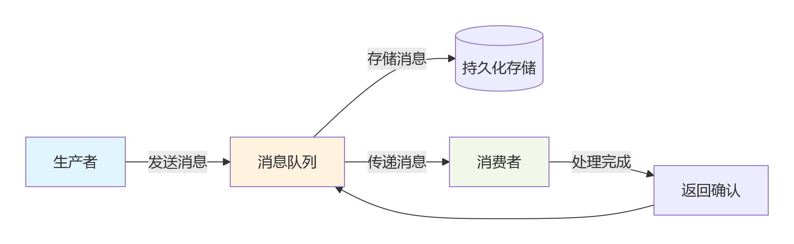
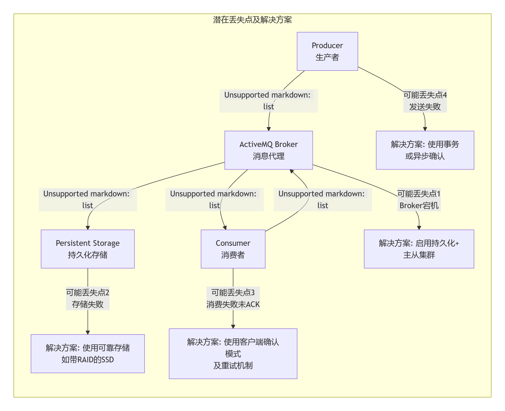
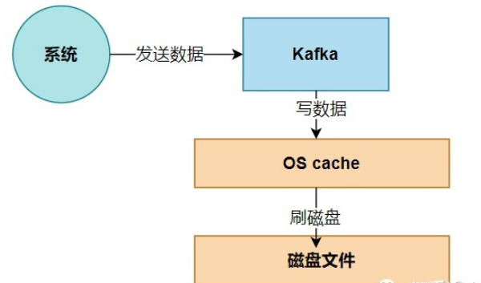
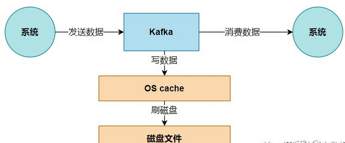
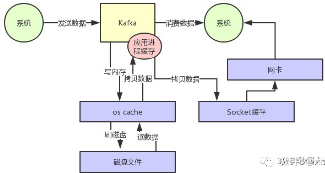
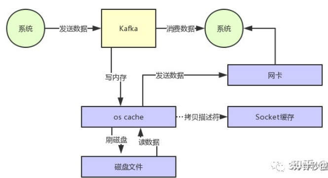
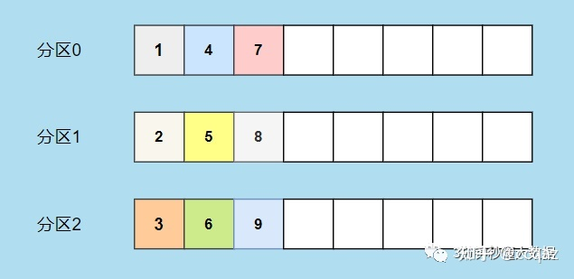
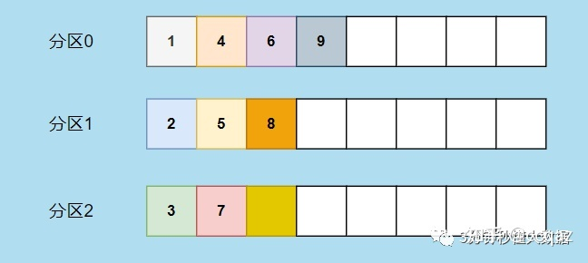
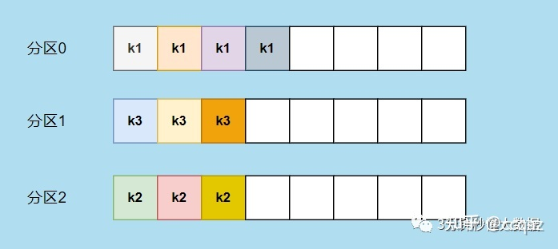

# 消息队列综合

## 六、消息队列

### 1、什么是消息队列

​		消息队列（Message Queue）是一种**异步通信机制**，允许应用程序通过**写入和读取消息**来进行通信，而无需直接连接。它是分布式系统中至关重要的组件，用于解耦服务、缓冲流量和提高系统可靠性。



**1.1 核心特性：**

1. 异步通信

```java
# 传统同步调用（阻塞）
response = user_service.create_user(data)  # 等待返回
notification_service.send_welcome_email()   # 必须等待上一个完成

# 使用消息队列（非阻塞）
queue.send("user_created", data)  # 立即返回，继续执行
# 后续操作无需等待
```

2. 消息持久化

- 消息通常会被持久化到磁盘
- 确保系统崩溃或重启后消息不丢失

3. 消息确认机制

```java
# 消费者处理成功后发送确认
def process_message(message):
    try:
        # 处理业务逻辑
        process_business(message)
        # 发送确认
        message.ack()
    except Exception as e:
        # 处理失败，消息重新入队
        message.nack()
```

**1.2 消息队列的五大核心价值**

1.应用解耦：

降低系统间依赖，提高灵活性

场景：通过消息队列解耦，下游某个系统故障不影响核心流程。

2.流量削峰：

平衡系统负载，防止过载

场景：月底大量数据异步导出。

3.异步处理：

提升系统响应速度和吞吐量

场景：拍卖成功后发送短信。

4.顺序保证

场景：确保消息的处理顺序。

5.最终一致性：

解决分布式事务难题

场景：分布式发送消息到队列，即使后续步骤失败，也可以通过重试保证最终一致性。

**1.3 消息模式**

1. 点对点模式（Queue）

```
# 消息只能被一个消费者消费
# 适合任务分发场景
生产者 -> 队列 -> 消费者1
                 -> 消费者2
```

2. 发布订阅模式（Pub/Sub）

```
# 消息被所有订阅者接收
# 适合事件通知场景
生产者 -> 主题 -> 订阅者1
          -> 订阅者2
          -> 订阅者3
```


### 2、什么是消息幂等性

​		**消息幂等性**是指：**无论同一条消息被消费多少次，最终的系统状态都是一致的**。

​		在分布式消息系统中，消息重复是无法避免的：

| **场景**     | **原因**       | **后果**         |
| ------------ | -------------- | ---------------- |
| 生产者重试   | 网络抖动、超时 | 同一消息发送多次 |
| 消费者重试   | 处理失败、超时 | 同一消息处理多次 |
| 消息队列重投 | ACK丢失、超时  | 消息重新投递     |

**没有幂等性会导致**：

- 重复扣款
- 重复发货
- 重复生成订单
- 数据不一致

**2.1 幂等性实现方案**

1 唯一标识符方案

**原理**：为每条消息分配全局唯一ID，在处理前检查是否已处理过。

2 数据库唯一约束

**原理**：利用数据库的唯一索引防止重复操作。

3 版本号控制

**原理**：为数据添加版本号，每次更新时检查版本。

4 Redis使用SETNX实现分布式锁

**原理：**请求同一方法时，先校验redis中是否有指定的key，没有则继续执行并在redis中增加这个key，有则不能执行代码内容。

> 通过实施这些策略，您可以构建出能够正确处理重复消息的健壮系统，确保数据一致性和业务可靠性。

**2.2 天然幂等性操作**

有些操作天然就是幂等的：

- HTTP GET、PUT、DELETE 请求
- 设置某个值的操作（如 SET key value）
- 删除操作


### 3、主流消息队列产品对比

| **产品**         | **语言**   | **特点**           | **适用场景**           |
| ---------------- | ---------- | ------------------ | ---------------------- |
| **RabbitMQ**     | Erlang     | 功能丰富、稳定可靠 | 企业级应用、复杂路由   |
| **Kafka**        | Scala/Java | 高吞吐、分布式     | 日志处理、大数据流     |
| **Redis Stream** | C          | 轻量级、高性能     | 简单消息队列、实时通信 |
| **RocketMQ**     | Java       | 低延迟、高可用     | 电商交易、金融业务     |
| **ActiveMQ**     | Java       | JMS规范、多协议    | 传统企业系统           |


### 4、ActiveMQ

​		ActiveMQ是消息中间件。可以在分布式系统的不同服务之间进行消息的发送和接收；它是Apache的开源产品，支持跨平台跨语言。完美的实现了 JMS java消息规范，我们在项目可以直接使用jms的api来进行开发。

​		遵循了JMS消息协议，支持多种消息格式（字符串、Map、Object、字节数组、数据流）
​		包含两个角色（Producer生产者 Consumer消费者）， (broker)
​		包含两种消费模式 队列模式（queue）点对点 主题模式(topic)

### 5、为什么要用ActiveMQ

​		可以让系统解耦。异步处理，应对高并发。

应用场景：

- 报表异步导出
- 拍品成交后的短信推送


### 6、ActiveMQ消息发送失败

​		ActiveMQ有两种通信方式，点到点形式和发布订阅模式。
​		如果是点到点模式的话，如果消息发送不成功，此消息默认会保存到ActiveMQ服务端直到有消费者将其消费，所以此消息是不会丢失的。
​		如果是发布订阅模式的通信方式，默认情况只通知一次，如果接受不到此消息就没有了，这种场景使用于对消息发送率要求不高的情况。如果要求消息必须送达不可以丢失的话，需要配置持久订阅。每个订阅端定义一个id，在订阅时向ActiveMQ注册，发布消息和接受消息时需要配置发送模式为持久化，此时如果客户端接受不到消息，消息会持久化到服务端，直到客户端正常接收后为止。

### 7、如何防止消息重复发送

**解决方法：**增加消息状态表

​		通俗来说就是一个账本，用来记录消息的处理状态，每次处理消息之前，都去状态表中查询一次，如果已经有相同的消息存在，那么不处理，可以防止重复发送。


### 8、什么情况下才使用ActiveMQ

- 多个项目之间集成：
  - **跨平台**
  - **多语言**
  - **多项目**
- 优点：
  - **降低系统间模块的耦合度**
  - **解耦**
  - **软件扩展性**


### 9、ActiveMQ丢消息怎么办

​		消息从生产者发出到被消费者成功处理，会经历多个环节，任何一个环节失败都可能导致消息丢失。



**生产者端**： 

[ ] 使用事务或持久化模式 

[ ] 实现发送失败重试机制

[ ] 处理Broker返回的确认

**Broker端**： 

[ ] 配置持久化适配器（KahaDB/JDBC）

 [ ] 确保存储空间充足 

[ ] 配置适当的内存限制

[ ] 设置主从集群（高可用需求）

**消费者端**： 

[ ] 使用客户端确认或事务会话 

[ ] 在业务处理成功后才确认消息 

[ ] 实现幂等性处理应对重复消息

**监控运维**：

 [ ] 监控队列深度和内存使用

 [ ] 设置磁盘空间警报

 [ ] 定期检查死信队列 

[ ] 有完善的重启和故障转移流程


### 10、ActiveMQ中死信队列

​		**死信（Dead Letter）** 是指由于各种原因无法被消费者成功处理的消息。这些消息不会被随意丢弃，而是被转移到另一个特定的队列中，这个队列就是**死信队列**。

**消息成为“死信”的常见原因**：

1. **消费失败重试超限**：消息被消费者拒绝（`Reject`）或否定确认（`NACK`），并且达到了系统配置的最大重试次数。
2. **消息过期（TTL过期）**：消息在队列中停留的时间超过了设置的生存时间（Time-To-Live, TTL）。
3. **队列已满**：目标队列的长度限制已满，无法再接收新消息。
4. **消息过大**：消息体积超过了配置的最大允许大小。
5. **目标不存在**：消息无法被路由到指定的队列（例如，在RabbitMQ中发送到一个不存在的交换机）。


### 11、ActiveMQ崩溃后的行为

​		**ActiveMQ 进程会立即终止，它本身无法进行任何主动处理。所有的“善后工作”都依赖于其持久化机制、集群架构以及客户端配置。**

​		ActiveMQ Broker 崩溃时，其本身是“无能无力”的。系统的恢复能力和消息的可靠性，完全取决于您的**预先架构和配置**。

| **配置项**           | **崩溃后结果**                   | **推荐实践**                                           |
| -------------------- | -------------------------------- | ------------------------------------------------------ |
| **无持久化**         | **内存消息全部丢失**             | **生产环境必须启用持久化** (`DeliveryMode.PERSISTENT`) |
| **无集群**           | **服务完全中断，等待人工重启**   | **至少配置主从集群**，实现自动故障转移                 |
| **无客户端故障转移** | **客户端报错连接失败，业务中断** | **使用 `failover:`传输协议**，提供备用Broker地址       |
| **无重试策略**       | **发送失败的消息直接丢失**       | **配置合理的重试策略** (`RedeliveryPolicy`)            |

11.1 activemq集群其中一条broker崩溃应该如何处理

模式一：主从共享存储集群（Master-Slave with Shared Storage）

​		这是最高可用性的方案。**好消息是：您通常不需要做任何紧急操作！** 因为故障转移是自动的。

**处理流程：**

1. **确认故障转移已发生**： 检查客户端连接是否已自动切换到新的 Master。 登录备用节点（Slave），查看其日志，确认它是否已提升为 Master。
2. **修复崩溃的 Broker**： 根据日志诊断结果修复根本问题（如清理磁盘、增加内存）。 **重要**：修复后，**确保它以 Slave 身份重新启动**。它需要连接到共享存储，并等待当前 Master 失效，而不是抢占为主。


模式二：网络集群（Network of Brokers）

​	在这种模式下，每个 Broker 是独立的，通过网络连接器互联。一个节点崩溃会影响其上的连接和队列。

**处理流程：**

1. **确认客户端重连**： 使用 `failover`协议的客户端应已自动重连到集群中其他健康的 Broker。检查客户端日志确认。
2. **监控消息流**： 网络连接器会自动处理消息的路由重定向。但需要关注**消息是否在崩溃节点的队列中堆积**。
3. **重启崩溃的 Broker**： 修复根本问题后，直接重启即可。


### 12、ActiveMQ【JMS的同步与异步】发送消息的方式有哪些

**1 同步方式**

​		两个通信应用服务之间必须要进行同步，两个服务之间必须都是正常运行的。发送程序和接收程序都必须一直处于运行状态，并且随时做好相互通信的准备。
​		发送程序首先向接收程序发起一个请求，称之为发送消息，发送程序紧接着就会堵塞当前自身的进程，不与其他应用进行任何的通信以及交互，等待接收程序的响应，待发送消息得到接收程序的返回消息之后会继续向下运行，进行下一步的业务处理。

**2 异步方式**

​		两个通信应用之间可以不用同时在线等待，任何一方只需各自处理自己的业务，比如发送方发送消息以后不用登录接收方的响应，可以接着处理其他的任务。也就是说发送方和接收方都是相互独立存在的，发送方只管方，接收方只能接收，无须去等待对方的响应。

​		Java中JMS就是典型的异步消息处理机制，JMS消息有两种类型：点对点、发布/订阅

|              | **工作原理**                                       | **适用场景**                             | **代码示例**                               |
| ------------ | -------------------------------------------------- | ---------------------------------------- | ------------------------------------------ |
| **同步接收** | 消费者主动调用 `receive()`方法**阻塞等待**消息到达 | 需要即时响应、顺序处理或强事务控制的场景 | `Message msg = consumer.receive();`        |
| **异步接收** | 注册 `MessageListener`回调，消息到达时**被动触发** | 高吞吐、非阻塞、事件驱动架构             | `consumer.setMessageListener(myListener);` |

vs

| **维度**     | **同步模式**               | **异步模式**               |
| ------------ | -------------------------- | -------------------------- |
| **吞吐量**   | 低（受限于单线程处理）     | 高（可并发处理）           |
| **实时性**   | 消息即时处理               | 可能有延迟（取决于线程池） |
| **复杂度**   | 简单直接                   | 需要回调管理，更复杂       |
| **资源占用** | 线程阻塞等待，资源利用率低 | 非阻塞，资源利用率高       |
| **错误处理** | 可直接在调用处捕获异常     | 需在回调中处理异常         |


### 13、Kafka

​		Kafka是由Apache软件基金会开发的一个开源流处理平台，由Scala和Java编写。它是一种高吞吐量的分布式发布订阅消息系统，可以处理消费者在网站中的所有动作流数据。

**13.1 Kafka 与传统消息队列的本质区别：**

| **特性**     | **传统消息队列（ActiveMQ/RabbitMQ）** | **Kafka**                |
| ------------ | ------------------------------------- | ------------------------ |
| **数据模型** | 临时存储，消费后删除                  | **持久化日志**，长期存储 |
| **消息消费** | 推送模式（Push）                      | **拉取模式（Pull）**     |
| **设计目标** | 消息路由和系统解耦                    | **高吞吐流数据处理**     |
| **数据保留** | 基于确认删除                          | **基于时间/大小策略**    |
| **架构思想** | 消息中间件                            | **分布式提交日志系统**   |

**13.2 适合使用 Kafka 的场景：**

1. **实时数据管道**：日志收集、指标监控、事件流
2. **流式处理**：实时ETL、复杂事件处理、实时分析
3. **消息解耦**：高吞吐的微服务通信
4. **数据重放**：需要回溯历史数据的场景

**13.3 Kafka 本质上是一个 MQ（Message Queue），使用消息队列的好处？**

1.解耦：允许我们独立的扩展或修改队列两边的处理过程。

2.可恢复性：即使一个处理消息的进程挂掉，加入队列中的消息仍然可以在系统恢复后被处理。

3.缓冲：有助于解决生产消息和消费消息的处理速度不一致的情况。

4.灵活性&峰值处理能力：不会因为突发的超负荷的请求而完全崩溃，消息队列能够使关键组件顶住突发的访问压力。

5.异步通信：消息队列允许用户把消息放入队列但不立即处理它。


### 14、发布订阅的消息系统那么多，为啥选择`kafka`?

1.多个生产者：

​		KafKa 可以无缝地支持多个生产者，不管客户端使用一个主题，还是多个主题。**Kafka 适合从多个前端系统收集数据**，并以统一的格式堆外提供数据。

2.多个消费者：

​		Kafka 支持多个消费者从一个单独的消息流中读取数据，并且消费者之间互不影响。这与其他队列系统不同，其他队列系统一旦被客户端读取，其他客户端就不能 再读取它。并且**多个消费者可以组成一个消费者组，他们共享一个消息流，并保证消费者组对每个给定的消息只消费一次**。

3.基于磁盘的数据存储

​		Kafka 允许消费者非实时地读取消息，原因在于 Kafka 将消息提交到磁盘上，设置了保留规则进行保存，无需担心消息丢失等问题。

4.伸缩性

​		可扩展多台 broker。用户可以先使用单个 broker，到后面可以扩展到多个 broker。

5.高新能

​		Kafka 可以轻松处理百万千万级消息流，同时还能保证 **亚秒级** 的消息延迟。


### 15、kafka 如何做到高吞吐量和性能的？

kafka 实现高吞吐量和性能，主要通过以下几点：

**1、页缓存技术**

​		`Kafka` 是基于 **操作系统** 的`页缓存`来实现文件写入的。

​		操作系统本身有一层缓存，叫做 **page cache**，是在 **内存里的缓存**，我们也可以称之为 **os cache**，意思就是操作系统自己管理的缓存。

​		Kafka 在写入磁盘文件的时候，可以直接写入这个 os cache 里，也就是仅仅写入内存中，接下来由操作系统自己决定什么时候把 os cache 里的数据真的刷入磁盘文件中。通过这一个步骤，就可以将磁盘文件**写性能**提升很多了，因为其实这里相当于是在写内存，不是在写磁盘，原理图如下：



**2、磁盘顺序写**

​		另一个主要功能是 kafka 写数据的时候，是以磁盘顺序写的方式来写的。也就是说，**仅仅将数据追加到文件的末尾**，`不是在文件的随机位置来修改数据`。

​		普通的机械磁盘如果你要是随机写的话，确实性能极差，也就是随便找到文件的某个位置来写数据。

​		但是如果你是 **追加文件末尾** 按照顺序的方式来写数据的话，那么这种磁盘顺序写的性能基本上可以跟写内存的性能相差无几。

​		**基于上面两点，kafka 就实现了写入数据的超高性能**。

**3、零拷贝**

​		大家应该都知道，从 Kafka 里经常要消费数据，那么消费的时候实际上就是要从 kafka 的**磁盘文件**里**读取某条数据**然后发送给下游的消费者，如下图所示。



​		那么这里如果频繁的从磁盘读数据然后发给消费者，会增加两次没必要的拷贝，如下图：



​		一次是从操作系统的 cache 里拷贝到应用进程的缓存里，接着又从应用程序缓存里拷贝回操作系统的 Socket 缓存里。

​		而且为了进行这两次拷贝，中间还发生了好几次上下文切换，一会儿是应用程序在执行，一会儿上下文切换到操作系统来执行。所以这种方式来读取数据是比较消耗性能的。

​		**Kafka 为了解决这个问题，在读数据的时候是引入零拷贝技术**。

​		也就是说，直接让操作系统的 cache 中的数据发送到**网卡**后传输给下游的消费者，**中间跳过了两次拷贝数据的步骤**，Socket 缓存中仅仅会拷贝一个描述符过去，不会拷贝数据到 Socket 缓存，如下图所示：



​		通过 **零拷贝技术**，就不需要把 os cache 里的数据拷贝到应用缓存，再从应用缓存拷贝到 Socket 缓存了，两次拷贝都省略了，所以叫做零拷贝。

​		对 Socket 缓存仅仅就是拷贝数据的描述符过去，然后数据就直接从 os cache 中发送到网卡上去了，**这个过程大大的提升了数据消费时读取文件数据的性能**。

​		Kafka 从磁盘读数据的时候，会先看看 os cache 内存中是否有，如果有的话，其实读数据都是直接读内存的。

​		kafka 集群经过良好的调优，数据直接写入 os cache 中，然后读数据的时候也是从 os cache 中读。相当于 Kafka 完全基于内存提供数据的写和读了，所以这个整体性能会极其的高。


### 16、kafka 和 zookeeper 之间的关系

​		**kafka** 使用 **zookeeper** 来保存集群的元数据信息和消费者信息(偏移量)，没有 zookeeper，kafka 是工作不起来。在 `zookeeper` 上会有一个专门用来进行 `Broker` 服务器列表记录的点，节点路径为`/brokers/ids`。

​		每个 Broker 服务器在启动时，都会到 Zookeeper 上进行注册，即创建 `/brokers/ids/[0-N]` 的节点，然后写入 IP，端口等信息，**Broker 创建的是临时节点**，所以一旦 Broker 上线或者下线，对应 Broker 节点也就被删除了，因此可以通过 zookeeper 上 Broker 节点的变化来动态表征 Broker 服务器的可用性。


### 17、生产者向 Kafka 发送消息的执行流程介绍一下

（1）生产者要往 Kafka 发送消息时，需要创建 **ProducerRecoder**

（2）**ProducerRecoder** 对象会包含目标 **topic**，**分区内容**，以及指定的 **key** 和 **value**,`在发送 ProducerRecoder 时，生产者会先把键和值对象序列化成字节数组`，然后在网络上传输。

（3）生产者在将`消息`发送到某个 Topic ，需要经过**拦截器**、**序列化器**和**分区器**（Partitioner）。

（4）如果消息 **ProducerRecord** 没有指定 partition 字段，那么**就需要依赖分区器**，根据 key 这个字段来计算 partition 的值。**分区器的作用就是为消息分配分区**。

1. 若没有指定分区，且消息的 key 不为空，则使用 murmur 的 Hash 算法（非加密型 Hash 函数，具备高运算性能及低碰撞率）来计算分区分配。
2. 若没有指定分区，且消息的 key 也是空，则用**轮询**的方式选择一个分区。

（5）分区选择好之后，会将消息添加到一个记录批次中，这个批次的所有消息都会被发送到相同的 **Topic** 和 **partition** 上。然后会有一个独立的线程负责把这些记录批次发送到相应的 broker 中。

（6）**broker** 接收到 Msg 后，会作出一个响应。如果成功写入 Kafka 中，就返回一个 **RecordMetaData** 对象，它包含 `Topic` 和 `Partition` 信息，以及记录在分区的 `offset`。

（7）若写入失败，就返回一个错误异常，生产者在收到错误之后尝试重新发送消息，几次之后如果还失败，就返回错误信息。


### 18、kafka 如何实现消息是有序的

**生产者**：通过分区的 leader 副本负责数据以先进先出的顺序写入，来保证消息顺序性。

**消费者**：同一个分区内的消息只能被一个 group 里的一个消费者消费，保证分区内消费有序。

​		kafka 每个 partition 中的消息在写入时都是有序的，消费时， 每个 partition 只能被每一个消费者组中的一个消费者消费，保证了消费时也是有序的。

​		整个 kafka 不保证有序。**如果为了保证 kafka 全局有序，那么设置一个生产者，一个分区，一个消费者。**


### 19、kafka 有哪些分区算法

**（1）轮询策略**

​		也称 Round-robin 策略，即顺序分配。比如一个 topic 下有 3 个分区，那么第一条消息被发送到分区 0，第二条被发送到分区 1，第三条被发送到分区 2，以此类推。当生产第四条消息时又会重新开始。



​		轮询策略是 kafka java 生产者 API 默认提供的分区策略。轮询策略有非常优秀的负载均衡表现，它总是能保证消息最大限度地被平均分配到所有分区上，故默认情况下它是最合理的分区策略，也是平时最常用的分区策略之一。

**（2）随机策略**

​		也称 Randomness 策略。所谓随机就是我们随意地将消息放置在任意一个分区上，如下图：



**（3）按 key 分配策略**

​		kafka 允许为每条消息定义消息键，简称为 key。一旦消息被定义了 key，那么你就可以保证同一个 key 的所有消息都进入到相同的分区里面，由于每个分区下的消息处理都是有顺序的，如下图所示：




### 20、kafka 如何实现单个集群间的消息复制

​		Kafka 消息负责机制只能在单个集群中进行复制，不能在多个集群之间进行。

​		kafka 提供了一个叫做 **MirrorMaker** 的核心组件，该组件包含一个生产者和一个消费者，两者之间通过一个队列进行相连，当消费者从一个集群读取消息，生产者把消息发送到另一个集群。


### 21、Kafka 消息确认(ack 应答)机制了解吗

​		为保证 producer 发送的数据，能可靠的达到指定的 topic ,Producer 提供了消息确认机制。生产者往 Broker 的 topic 中发送消息时，**可以通过配置来决定有几个副本收到这条消息才算消息发送成功**。可以在定义 Producer 时通过 **acks** 参数指定，这个参数支持以下三种值：

**（1）acks = 0：producer 不会等待任何来自 broker 的响应**。

特点：低延迟，高吞吐，数据可能会丢失。

如果当中出现问题，导致 broker 没有收到消息，那么 producer 无从得知，`会造成消息丢失`。

**（2）acks = 1（默认值）：只要集群中 partition 的 Leader 节点收到消息，生产者就会收到一个来自服务器的成功响应。**

​		如果在 follower 同步之前，leader 出现故障，将会丢失数据。

​		此时的`吞吐量`主要取决于使用的是 **同步发送** 还是 **异步发送** ，吞吐量还受到发送中消息数量的限制，例如 producer 在收到 broker 响应之前可以发送多少个消息。

**（3）acks = -1：只有当所有参与复制的节点全部都收到消息时，生产者才会收到一个来自服务器的成功响应**。

​		这种模式是最安全的，可以保证不止一个服务器收到消息，就算有服务器发生崩溃，整个集群依然可以运行。

​		根据实际的应用场景，选择设置不同的 acks，以此保证数据的可靠性。

​		另外，Producer 发送消息还可以选择同步或异步模式,如果设置成异步，虽然会极大的提高消息发送的性能，但是这样会增加丢失数据的风险。如果需要**确保消息的可靠性**，必须将 producer.type 设置为 sync。

```
#同步模式
producer.type=sync 
#异步模式
producer.type=async 
```


### 22、说一下什么是副本

​		kafka 为了保证数据不丢失，从 `0.8.0` 版本开始引入了分区副本机制。在创建 topic 的时候指定 `replication-factor`,默认副本为 3 。

​		副本是相对 partition 而言的，一个分区中包含一个或多个副本，其中一个为`leader` 副本，其余为`follower` 副本，各个副本位于不同的 `broker` 节点中。

​		所有的`读写操作`都是经过 Leader 进行的，同时 follower 会定期地去 leader 上复制数据。当 Leader 挂掉之后，其中一个 follower 会重新成为新的 Leader。**通过分区副本，引入了数据冗余，同时也提供了 Kafka 的数据可靠性**。

​		Kafka 的分区多副本架构是 Kafka 可靠性保证的核心，把消息写入多个副本可以使 Kafka 在发生崩溃时仍能保证消息的持久性。


### 23、说一下 kafka 的 ISR 机制

​		ISR是Kafka保证数据一致性的核心机制。

​		**什么是ISR？** ISR是一个由Leader维护的、与Leader**保持基本同步**的副本集合（包括Leader自己）。只有ISR中的副本才有资格在Leader宕机时被选举为新的Leader。

​		**如何判断是否"同步"？** 一个Follower副本是否在ISR中，取决于它是否满足以下条件（可配置）： 

- **时间阈值（`replica.lag.time.max.ms`）**：这是最主要的判断标准。默认值为30秒。如果一个Follower在过去的30秒内成功地向Leader发送了FETCH请求（即使没有新数据，空请求也算），那么它就在ISR中。如果超过这个时间没有"心跳"，Leader就认为它"脱节"了，会将其从ISR中移除。 
- **消息差距阈值（旧版本重要，新版本已弱化）**：早期版本有`replica.lag.max.messages`参数，如果Follower的LEO落后Leader的LEO超过这个值，就会被踢出ISR。但在高吞吐场景下这有问题，新版本已弃用，主要依靠时间阈值。


### 24、LEO、HW、LSO、LW 分别代表什么

核心概念：LEO和HW（高水位线）

要理解同步，必须掌握两个关键偏移量概念：

**LEO（Log End Offset，日志末端偏移量）**：

- 指副本日志中**下一条待写入消息**的偏移量。 
- 每个副本（Leader和Follower）都有自己的LEO。
- **Leader的LEO**：表示生产者最新写入的消息的位置。
- **Follower的LEO**：表示该Follower已成功复制的最后一条消息的位置。


**HW（High Watermark，高水位线）**： 

- 这是一个分区级别的概念，**所有副本共享同一个HW值**。 
- 它表示**已成功被所有ISR中的副本复制的消息**的偏移量。换句话说，HW之前的消息被认为是**已提交（Committed）** 的，是安全、不会丢失的。

- **消费者只能消费到HW之前的消息**。HW之后的消息对消费者不可见，因为它们可能还未被完全复制，如果Leader宕机可能会丢失。

**HW的更新机制**：Leader负责跟踪所有Follower的LEO。HW被确定为所有ISR副本中**最小的LEO**。例如，如果Leader的LEO是10，Follower1的LEO是10，但Follower2的LEO是9（可能因为网络稍慢），那么HW就是9。


### 25、如何进行 Leader 副本选举

​		每个分区的 leader 会维护一个 ISR 集合，ISR 列表里面就是 follower 副本的 Borker 编号，只有“跟得上” Leader 的 follower 副本才能加入到 ISR 里面，这个是通过 `replica.lag.time.max.ms` 参数配置的。只有 ISR 里的成员才有被选为 leader 的可能。

​		所以当 Leader 挂掉了，而且 `unclean.leader.election.enable=false` 的情况下，Kafka 会从 ISR 列表中选择 **第一个** follower 作为新的 Leader，因为这个分区拥有最新的已经 committed 的消息。通过这个可以保证已经 committed 的消息的数据可靠性。