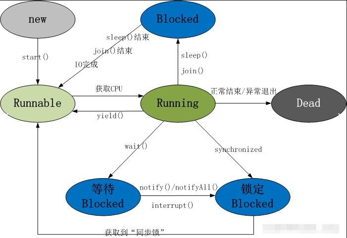
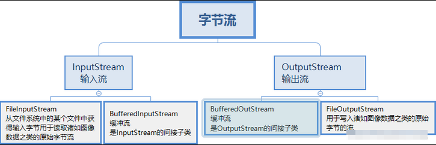
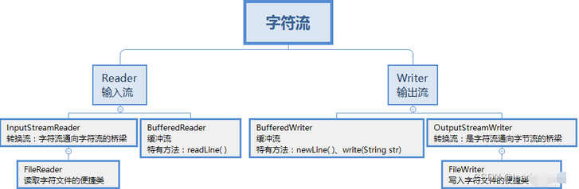

# Java综合

## 一、Java基础

### 1、怎样理解OOP面向对象

面向对象是利于语言对现实事物进行抽象。面向对象具有以下特征：

1. 继承**：**继承是从已有类得到继承信息创建新类的过程
2. 封装：封装是把数据和操作数据的方法绑定起来，对数据的访问只能通过已定义的接口
3. 多态性：多态性是指允许不同子类型的对象对同一消息作出不同的响应

> ### 多态的优点
>
> 1. **代码可扩展性**：可以轻松添加新的子类而不需要修改现有代码
> 2. **代码可维护性**：减少重复代码，提高代码复用
> 3. **接口统一**：可以使用父类/接口类型处理不同的子类对象
> 4. **灵活性**：运行时决定调用哪个方法，使程序更加灵活


### 2、重载与重写区别

1. 重载发生在本类，重写发生在父类与子类之间
2. 重载的方法名必须相同，重写的方法名、参数列表和返回类型必须完全相同
3. 重载的参数列表不同（参数类型、个数或顺序），重写的参数列表必须相同
4. 重写：重写的访问权限不能比父类中被重写的方法的访问权限更低
5. 重写：构造方法不能被重写
6. 重写：不能重写final、private和static方法
7. 重写：子类抛出的异常不能比父类更宽泛


### 3、接口与抽象类的区别

1. 抽象类要被子类继承；接口要被类实现
2. 接口可多继承接口；但类只能单继承
3. 抽象类可以有构造方法；接口不能有构造方法
4. 抽象类：除了不能实例化抽象类之外，它和普通Java类没有任何区别
5. 抽象类：抽象方法可以有public、protected和default这些修饰符；接口：只能是public
6. 抽象类：可以有成员变量；接口：只能声明常量(默认是`public static final`)
7. 抽象类：子类必须实现所有抽象方法(除非子类也是抽象类)
8. 接口：一个类可以实现多个接口

> 接口：
>
> 1.所有方法默认是`public abstract`(Java 8之前)
>
> 2.从Java 8开始可以有默认方法(`default`关键字)和静态方法
>
> 3.从Java 9开始可以有私有方法


### 4、深拷贝与浅拷贝的理解 

​		深拷贝和浅拷贝就是指对象的拷贝，一个对象中存在两种类型的属性，一种是基本数据类型，一种是实例对象的引用。

1. 浅拷贝是指，只会拷贝基本数据类型的值，以及实例对象的引用地址，并不会复制一份引用地址所指向的对象，也就是浅拷贝出来的对象，内部的类属性指向的是同一个对象
2. 深拷贝是指，既会拷贝基本数据类型的值，也会针对实例对象的引用地址所指向的对象进行复制，深拷贝出来的对象，内部的类执行指向的不是同一个对象

> **深拷贝实现方式1：重写clone方法**
>
> **深拷贝实现方式2：通过序列化**


### 5、sleep和wait区别

1.sleep方法

- `sleep()`是Thread类的静态方法，使当前线程暂停执行指定的时间。
- 让当前线程进入**TIMED_WAITING**状态
- 释放cpu给其它线程，不释放任何锁资源
- 需要处理InterruptedException
- sleep(1000) 等待超过1s被唤醒

2.wait方法

- `wait()`是Object类的方法，使当前线程等待，直到其他线程调用该对象的`notify()`或`notifyAll()`方法。
- 让当前线程进入**WAITING**或**TIMED_WAITING**状态
- 释放cpu给其它线程，同时释放锁资源
- wait 方法必须配合 synchronized 一起使用，不然在运行时就会抛出IllegalMonitorStateException异常

> ## 锁资源的概念
>
> **锁资源**指的是通过`synchronized`关键字或`Lock`对象获取的线程同步控制权。当一个线程持有锁时，其他试图获取同一锁的线程会被阻塞。

| 方法        | 作用             | 锁行为   | 唤醒范围     | 使用建议                         |
| ----------- | ---------------- | -------- | ------------ | -------------------------------- |
| wait()      | 使线程等待       | 释放锁   | -            | 必须用while循环检查条件          |
| notify()    | 唤醒一个等待线程 | 不释放锁 | 单个线程     | 可能导致信号丢失，不推荐优先使用 |
| notifyAll() | 唤醒所有等待线程 | 不释放锁 | 所有等待线程 | 更安全，推荐优先使用             |

**5.1 wait()为什么必须用while循环检查条件**

​		**虚假唤醒**是指线程在没有收到`notify()`/`notifyAll()`调用的情况下，也可能从`wait()`状态中被唤醒。这是Java语言规范允许的行为，虽然不常见但确实存在。

1. **防止虚假唤醒**：
   - 即使线程被意外唤醒，while循环会再次检查条件
   - 如果条件不满足，线程会继续等待
2. **条件可能再次改变**：
   - 在被唤醒和重新获取锁之间，其他线程可能已经改变了条件
   - while循环能确保条件仍然满足
3. **多消费者场景安全**：
   - 当多个消费者线程被notifyAll()唤醒时
   - 第一个获取锁的线程可能已经消费了资源
   - 后续线程需要重新检查条件

> if可能出现的问题：
>
> 生产者：p1\p2\p3
>
> 消费者：c1\c2\c3
>
> buffer缓冲区容量为1，共6条线程。
>
> p1生产0
>
> p2判断buffer已满，进入wait()等待
>
> p3判断buffer已满，进入wait()等待
>
> c2判断buffer已满，消费0，notifyAll()唤醒所有线程
>
> p2被唤醒，从wait()出继续执行，生产1
>
> p2被唤醒，从wait()出继续执行（由于用if判断，没有获取buffer最新容量），生产2，此时buffer溢出异常


### 6、什么是自动拆装箱 int和Integer有什么区别

基本数据类型，如int,float,double,boolean,char,byte,不具备对象的特征，不能调用方法。

1. 装箱：将基本类型转换成包装类对象
2. 拆箱：将包装类对象转换成基本类型的值


**java为什么要引入自动装箱和拆箱的功能？**

主要是用于java集合中，List<Integer> list=new ArrayList<Integer>();

list集合如果要放整数的话，只能放对象，不能放基本类型，因此需要将整数自动装箱成对象。

实现原理：javac编译器的语法糖，底层是通过Integer.valueOf()和Integer.intValue()方法实现。

区别：

1. Integer是int的包装类，int则是java的一种基本数据类型
2. Integer变量必须实例化后才能使用，而int变量不需要
3. Integer实际是对象的引用，当new一个Integer时，实际上是生成一个指针指向此对象；而int则是直接存储数据值
4. Integer的默认值是null，int的默认值是0


### 7、==和equals区别

1.==

如果比较的是基本数据类型，那么比较的是变量的值

如果比较的是引用数据类型，那么比较的是地址值（两个对象是否指向同一块内存）

2.equals

如果没重写equals方法比较的是两个对象的地址值

如果重写了equals方法后我们往往比较的是对象中的属性的内容

equals方法是从Object类中继承的，默认的实现就是使用==

> `Object` 的 `equals` 默认是 `==`（比较内存地址）。
>
> `String` 重写了 `equals`，使其比较字符串内容而非内存地址。


### 8、String能被继承吗 为什么用final修饰

1. 不能被继承，因为String类有final修饰符，而final修饰的类是不能被继承的。
2. String 类是最常用的类之一，为了效率，禁止被继承和重写。
3. 为了安全。String 类中有native关键字修饰的调用系统级别的本地方法，调用了操作系统的 API，如果方法可以重写，可能被植入恶意代码，破坏程序。Java 的安全性也体现在这里。
   

### 9、String buffer和String builder区别

1. StringBuffer 与 StringBuilder 中的方法和功能完全是等价的，
2. 只是StringBuffer 中的方法大都采用了 synchronized 关键字进行修饰，因此是线程安全的，而 StringBuilder 没有这个修饰，可以被认为是线程不安全的。
3. 在单线程程序下，StringBuilder效率更快，因为它不需要加锁，不具备多线程安全而StringBuffer则每次都需要判断锁，效率相对更低

**为什么StringBuffer 中的方法大都采用了 synchronized 关键字进行修饰，就认为是线程安全的**

**9.1`synchronized` 的作用**

- `synchronized` 是 Java 提供的一种**同步机制**，可以确保同一时间只有一个线程能访问被修饰的方法或代码块。
- 在 `StringBuffer` 中，几乎所有修改数据的方法（如 `append()`、`insert()`、`delete()` 等）都加了 `synchronized`，保证多线程环境下对内部数据的修改不会出现**竞态条件（Race Condition）**。

**9.2 为什么 `StringBuffer` 需要线程安全**

如果多个线程同时修改同一个 `StringBuffer`（例如拼接字符串），不加锁可能导致：

- **数据不一致**（如部分写入的字符串被覆盖）。
- **内存可见性问题**（一个线程的修改对另一个线程不可见）。

通过 `synchronized`，`StringBuffer` 可以安全地在多线程环境中使用。

**9.3`synchronized` 的代价**

- 虽然 `StringBuffer` 是线程安全的，但 `synchronized` 会带来性能开销：
  1. **锁竞争**：多线程争抢同一把锁时，会导致线程阻塞。
  2. **内存屏障**：`synchronized` 会触发 JVM 的内存同步操作，影响指令重排序。
- 因此，在不需要线程安全的场景下，`StringBuilder` 是更优选择。


### 10、final、finally、finalize

1. final：修饰符（关键字）有三种用法：修饰类、变量和方法。修饰类时，意味着它不能再派生出新的子类，即不能被继承，因此它和abstract是反义词。修饰变量时，该变量使用中不被改变，必须在声明时给定初值，在引用中只能读取不可修改，即为常量。修饰方法时，也同样只能使用，不能在子类中被重写。
2. finally：通常放在try…catch的后面构造最终执行代码块，这就意味着程序无论正常执行还是发生异常，这里的代码只要JVM不关闭都能执行，可以将释放外部资源的代码写在finally块中。
3. finalize：Object类中定义的方法，Java中允许使用finalize() 方法在垃圾收集器将对象从内存中清除出去之前做必要的清理工作。这个方法是由垃圾收集器在销毁对象时调用的，通过重写finalize() 方法可以整理系统资源或者执行其他清理工作。

> `finalize()` 是 `Object` 类中的一个方法，用于在对象被垃圾回收（GC）之前执行一些清理操作（如释放系统资源）。

**10.1 finalize关键问题与注意事项**

1. **执行时机不确定**
   - `finalize()` 由垃圾回收器调用，但 GC 的时间由 JVM 决定，甚至可能永远不会调用（如程序正常退出时）。
2. **性能开销**
   - 重写了 `finalize()` 的对象会被 JVM 特殊处理（放入 `Finalizer` 队列），导致垃圾回收延迟，可能引发内存泄漏。
3. **异常吞没**
   - `finalize()` 中的异常会被忽略，不会传播到调用线程。

**10.2 为什么避免使用 `finalize()`**

- **不可靠**：无法保证及时释放资源。
- **性能差**：增加 GC 负担。
- **复杂度高**：可能导致隐蔽的 bug（如复活对象）。

**10.3 什么是GC**

​		**GC（Garbage Collection，垃圾回收）** 是 Java 等编程语言中自动管理内存的机制，用于**回收不再使用的对象占用的内存**，防止内存泄漏（Memory Leak）并优化内存使用。

**10.4 GC 的核心作用**

- **自动释放内存**：回收程序中不再被引用的对象（即“垃圾”）。
- **避免内存泄漏**：防止无用对象长期占用内存。
- **减少程序员负担**：开发者无需手动释放内存


### 11、Object中有哪些方法

| 方法                                            | 作用                                                         |
| ----------------------------------------------- | ------------------------------------------------------------ |
| protected native Object clone()                 | 创建并返回此对象的一个副本。                                 |
| public boolean equals(Object obj)               | 指示某个其他对象是否与此对象“相等                            |
| protected void finalize()                       | 当垃圾回收器确定不存在对该对象的更多引用时，由对象的垃圾回收器调用此方法。 |
| public final Class<? extends Object> getClass() | 返回一个对象的运行时类。获取运行类的相关信息                 |
| public native int hashCode();                   | 返回该对象的哈希码值。                                       |
| public final native void notify()               | 唤醒在此对象监视器上等待的单个线程。                         |
| public final native void notifyAll();           | 唤醒在此对象监视器上等待的所有线程。                         |
| public String toString()                        | 返回该对象的字符串表示。                                     |
| public final native void wait()                 | 导致当前的线程等待，直到其他线程调用此对象的 notify() 方法或 notifyAll() 方，或者超过指定的时间量。 |

**11.1 getClass() 与 `instanceof` 的区别**

| 方法/操作符 | 作用                           | 示例                           |
| ----------- | ------------------------------ | ------------------------------ |
| getClass()  | 返回对象的运行时类             | obj.getClass() == String.class |
| instanceof  | 检查对象是否属于某个类或其子类 | obj instanceof String          |

> ```java
> Object obj = "Hello";
> System.out.println(obj.getClass() == Object.class); // false
> System.out.println(obj.getClass() == String.class); // true
> System.out.println(obj instanceof Object); // true
> System.out.println(obj instanceof String); // true
> System.out.println(obj instanceof Serializable); // true
> ```
>
> 


### 12、说一下集合体系

**Collection（单列集合）**

```
Collection
├── List（有序可重复）
│   ├── ArrayList（动态数组，查询快，增删慢）
│   └── LinkedList（双向链表，增删快，查询慢）
│
├── Set（无序不重复）
│   ├── HashSet（基于 HashMap，无序，去重。快速去重）
│   │   └── LinkedHashSet（保持插入顺序。有序去重）
│   └── TreeSet（基于 TreeMap，自然排序。需要排序的集合）
│
└── Queue（队列）
    ├── PriorityQueue（优先级队列）
    ├── Deque（双端队列）
    │   ├── ArrayDeque（数组实现）
    │   └── LinkedList（链表实现）
    └── BlockingQueue（阻塞队列，线程安全）
        ├── ArrayBlockingQueue
        ├── LinkedBlockingQueue
        └── PriorityBlockingQueue
```

**Map（键值对集合）**

```
Map
├── HashMap（基于哈希表（数组+链表/红黑树），无序）
│   └── LinkedHashMap（保持插入顺序（链表+哈希表）。有序的Map）
├── TreeMap（基于红黑树，自然排序）
└── ConcurrentMap（线程安全）
    ├── ConcurrentHashMap（高并发优化）
    └── ConcurrentSkipListMap（跳表实现）
```

**12.1 `ArrayList` vs `LinkedList`？**

- `ArrayList` 查询快（随机访问），`LinkedList` 增删快（头尾操作）。

**12.2 HashMap` 的工作原理？**

- 基于哈希表，使用 `hashCode()` 和 `equals()` 确定键的唯一性，冲突时转链表或红黑树。

**12.3 如何保证集合线程安全？**

- 使用 `Collections.synchronizedXXX()` 或并发集合（如 `ConcurrentHashMap`）。

**12.4 `HashSet` 如何去重？**

- 基于 `HashMap`，利用 `equals()` 和 `hashCode()` 判断重复。

**12.5 哈希表的底层结构**

- **数组 + 链表 + 红黑树（JDK 8+）**
  - 默认情况下，每个桶是链表，但当链表长度 ≥ 8 时，转为红黑树（提高查询效率）。
  - 如果红黑树节点数 ≤ 6，退化为链表。

​		在哈希表（如 Java 的 `HashMap`）中，**桶（Bucket）** 是指哈希表中存储数据的基本单元，可以理解为数组中的一个位置（槽位）。每个桶对应一个哈希值或哈希值范围，用于存放哈希冲突的元素。

​		默认情况下，每个桶是一个链表。

```
桶数组: [null, null, ["A"→1 → "B"→2], null, ...]
              ↑
            桶 2（链表结构）
```

​		当同一个桶中的链表长度 ≥ 8 时，链表会转换为红黑树，以提高查询效率（从 `O(n)` 优化到 `O(log n)`）。
**触发条件**：

- 链表长度 ≥ 8 **且** 哈希表总容量 ≥ 64。
- 否则，仅进行扩容（不转树）

**12.6 默认桶数组大小**

如果数据量增长不确定，可以依赖 `HashMap` 的自动扩容机制（但会带来扩容开销）。

```java
// 默认初始容量 16，按需扩容
Map<Integer, String> dynamicMap = new HashMap<>();
```

**12.6 如何合理设置桶数组大小？**

如果知道大概的数据量 `N`，初始化容量可以设为 `N / loadFactor`（默认负载因子 `0.75`）。

```java
int expectedSize = 100_000;
Map<String, Integer> map = new HashMap<>((int) (expectedSize / 0.75f));
```


### 13、ArrarList和LinkedList区别

1. ArrayList是实现了基于动态数组的数据结构，LinkedList基于链表的数据结构。
2. 对于随机访问get和set，ArrayList效率优于LinkedList，因为LinkedList要移动指针。
3. 对于新增和删除操作add和remove，LinkedList比较占优势，因为ArrayList要移动数据。 这一点要看实际情况的。若只对单条数据插入或删除，ArrayList的速度反而优于LinkedList。但若是批量随机的插入删除数据，LinkedList的速度大大优于ArrayList. 因为ArrayList每插入一条数据，要移动插入点及之后的所有数据。
   

### 14、HashMap底层是 数组+链表+红黑树，为什么要用这几类结构 

1. 数组 Node<K,V>[] table ,哈希表，根据对象的key的hash值进行在数组里面是哪个节点
2. 链表的作用是解决hash冲突，将hash值取模之后的对象存在一个链表放在hash值对应的槽位
3. 红黑树 JDK8使用红黑树来替代超过8个节点的链表，主要是查询性能的提升，从原来的O(n)到O(logn),
4. 通过hash碰撞，让HashMap不断产生碰撞，那么相同的key的位置的链表就会不断增长，当对这个Hashmap的相应位置进行查询的时候，就会循环遍历这个超级大的链表，性能就会下降，所以改用红黑树

**14.1 红黑树为什么比链表效率高**

1. 查询效率对比

- **链表查询**：O(n)时间复杂度
  - 最坏情况需要遍历整个链表
  - 平均需要遍历n/2个节点
- **红黑树查询**：O(log n)时间复杂度
  - 利用二叉搜索树特性快速定位
  - 100万个节点只需最多20次比较(log₂10⁶≈20)

2. 插入/删除效率对比

- **链表插入/删除**：O(1)找到位置 + O(n)查找
  - 虽然插入操作本身是O(1)，但需要先O(n)查找位置
- **红黑树插入/删除**：O(log n)
  - 查找位置更快
  - 需要额外O(1)时间维护平衡(旋转操作)


### 15、HashMap和HashTable区别

HashMap 和 HashTable 都是 Java 中基于哈希表的 Map 实现，但它们有几个关键区别：

1. 线程安全性

|                  | HashMap                                                      | HashTable                              |
| ---------------- | ------------------------------------------------------------ | -------------------------------------- |
| **线程安全**     | 非线程安全                                                   | 线程安全（方法使用 synchronized 修饰） |
| **并发替代方案** | 可以使用 `ConcurrentHashMap` 或 `Collections.synchronizedMap()` | 无，本身就是同步的                     |

2. 性能

|          | HashMap                   | HashTable                      |
| -------- | ------------------------- | ------------------------------ |
| **性能** | 更高（无同步开销）        | 较低（同步方法调用有性能损耗） |
| **优化** | JDK8+ 使用链表+红黑树结构 | 仅使用链表结构                 |

3. null 值处理

|           | HashMap          | HashTable                                     |
| --------- | ---------------- | --------------------------------------------- |
| **key**   | 允许一个 null 键 | 不允许 null 键（会抛出 NullPointerException） |
| **value** | 允许多个 null 值 | 不允许 null 值                                |

4. 继承关系

|          | HashMap            | HashTable                   |
| -------- | ------------------ | --------------------------- |
| **父类** | 继承 `AbstractMap` | 继承 `Dictionary`（已过时） |
| **接口** | 实现 `Map` 接口    | 实现 `Map` 接口             |

5. 初始容量和扩容

|                  | HashMap           | HashTable           |
| ---------------- | ----------------- | ------------------- |
| **默认初始容量** | 16                | 11                  |
| **扩容方式**     | 2n（16→32→64...） | 2n+1（11→23→47...） |

6. 迭代器

|              | HashMap                              | HashTable                   |
| ------------ | ------------------------------------ | --------------------------- |
| **迭代器**   | `Iterator` 是快速失败（fail-fast）的 | `Enumerator` 不是快速失败的 |
| **遍历方式** | 可以使用 `keySet()`、`entrySet()` 等 | 也可以使用但效率较低        |

使用建议

1. **单线程环境**：优先使用 `HashMap`（性能更好）
2. **多线程环境**：
   - 需要高并发：使用 `ConcurrentHashMap`
   - 不需要高并发：可以使用 `HashTable` 或 `Collections.synchronizedMap()`
3. **需要 null 值**：只能使用 `HashMap`
4. **遗留系统维护**：可能需要继续使用 `HashTable`

**15.1 hashmap的key允许有多个null值，那对应value取出来是什么**

`HashMap` **只能有一个 `null` key**，后存入的会覆盖之前的。

```java
HashMap<String, Integer> map = new HashMap<>();
map.put(null, 1);      // 存入 null key
map.put(null, 2);      // 覆盖之前的 null key 的 value
map.put("A", null);    // 存入 null value
map.put("B", null);    // 再次存入 null value
```


### 16、线程的创建方式

1. 继承Thread类
2. 实现Runnable接口
3. 使用 Callable 和 Future（可返回结果）
4. 使用线程池（推荐方式）

各方式对比

| 创建方式     | 优点         | 缺点           | 适用场景           |
| ------------ | ------------ | -------------- | ------------------ |
| 继承Thread   | 简单直接     | 无法继承其他类 | 简单任务           |
| 实现Runnable | 可继承其他类 | 无返回值       | 大多数场景         |
| 使用Callable | 可获取返回值 | 使用稍复杂     | 需要返回结果的任务 |
| 线程池       | 资源管理高效 | 需要手动关闭   | 高并发场景         |
| Lambda       | 代码简洁     | 复杂逻辑不适用 | 简单异步任务       |

最佳实践建议

1. **优先使用线程池**（避免频繁创建销毁线程）
2. **实现Runnable优于继承Thread**（更灵活）
3. **需要返回值时使用Callable**
4. **简单任务可使用Lambda表达式**
5. **注意资源释放**（特别是线程池需要shutdown）


### 17、线程的状态转换有什么（生命周期）



1.新建状态(New) ：线程对象被创建后，就进入了新建状态。例如，Thread thread = new Thread()。
2.就绪状态(Runnable): 也被称为“可执行状态”。线程对象被创建后，其它线程调用了该对象的start()方法，从而来启动该线程。例如，thread.start()。处于就绪状态的线程，随时可能被CPU调度执行。
3.运行状态(Running)：线程获取CPU权限进行执行。需要注意的是，线程只能从就绪状态进入到运行状态。
4.阻塞状态(Blocked)：阻塞状态是线程因为某种原因放弃CPU使用权，暂时停止运行。直到线程进入就绪状态，才有机会转到运行状态。阻塞的情况分三种：

​	4.1 等待阻塞 -- 通过调用线程的wait()方法，让线程等待某工作的完成。

​	4.2 同步阻塞 -- 线程在获取synchronized同步锁失败(因为锁被其它线程所占用)，它会进入同步阻塞状态。

​	4.3 其他阻塞 -- 通过调用线程的sleep()或join()或发出了I/O请求时，线程会进入到阻塞状态。当sleep()状态超时、join(）等待线程终止或者超时、或者I/O处理完毕时，线程重新转入就绪状态。

5.死亡状态(Dead)：线程执行完了或者因异常退出了run()方法，该线程结束生命周期。

**17.1 join()方法**

Thread类  public final void join()方法

​		`join()`方法是Java线程生命周期中实现线程同步的重要机制，它允许一个线程等待另一个线程执行完毕。

**17.2  join()与sleep()的区别**

| 特性     | join()                               | sleep()  |
| -------- | ------------------------------------ | -------- |
| 唤醒条件 | 目标线程终止                         | 时间到期 |
| 释放锁   | 会释放(如果是在synchronized块内调用) | 不会释放 |
| 用途     | 线程同步                             | 定时延迟 |

**17.3 yield()方法**

Thread类  public static native void yield()方法

​		`yield()`是Java线程调度中的一个重要方法，它用于提示线程调度器当前线程愿意让出CPU资源。

- **功能**：提示调度器当前线程可以暂停执行，让其他具有相同或更高优先级的线程运行
- **状态影响**：调用线程保持`RUNNABLE`状态（不会进入等待/阻塞状态）
- **非强制**：只是建议，调度器可以忽略这个提示

**17.4  yield()与sleep()的区别**

| 特性     | yield()          | sleep()           |
| -------- | ---------------- | ----------------- |
| 状态变化 | 保持RUNNABLE     | 进入TIMED_WAITING |
| 是否保证 | 不保证暂停       | 保证暂停指定时间  |
| 锁行为   | 不会释放锁       | 不会释放锁        |
| 使用场景 | 提高线程交替执行 | 需要精确延迟      |

**17.5 interrupt()()方法**

Thread类  public void interrupt()方法

​		`interrupt()`是Java线程控制中的一个重要方法，用于向线程发送中断信号。

​		`interrupt()`只是请求线程终止，线程是否真正结束取决于它的实现方式。


### 18、Java中有几种类型的流

操作主体为 计算机，站在计算机的角度思考。

**1.字节流(Byte Streams)**

​		字节流以8位字节(byte)为单位进行数据读写，适合处理二进制数据。



核心字节流类

| 类                      | 描述                     |
| ----------------------- | ------------------------ |
| `InputStream`           | 所有字节输入流的抽象基类 |
| `OutputStream`          | 所有字节输出流的抽象基类 |
| `FileInputStream`       | 从文件读取字节           |
| `FileOutputStream`      | 向文件写入字节           |
| `ByteArrayInputStream`  | 从字节数组读取           |
| `ByteArrayOutputStream` | 向字节数组写入           |
| `BufferedInputStream`   | 带缓冲的输入流           |
| `BufferedOutputStream`  | 带缓冲的输出流           |
| `DataInputStream`       | 读取基本Java数据类型     |
| `DataOutputStream`      | 写入基本Java数据类型     |
| `ObjectInputStream`     | 对象反序列化             |
| `ObjectOutputStream`    | 对象序列化               |

字节流特点：

- 处理单位：8位字节(byte)
- 适合场景：图片、音频、视频等二进制文件
- 不自动处理字符编码
- 通常比字符流更底层

**2.字符流(Character Streams)**

​		字符流以16位Unicode字符(char)为单位进行数据读写，适合处理文本数据。



核心字符流类

| 类                   | 描述                         |
| -------------------- | ---------------------------- |
| `Reader`             | 所有字符输入流的抽象基类     |
| `Writer`             | 所有字符输出流的抽象基类     |
| `FileReader`         | 从文件读取字符(使用默认编码) |
| `FileWriter`         | 向文件写入字符(使用默认编码) |
| `CharArrayReader`    | 从字符数组读取               |
| `CharArrayWriter`    | 向字符数组写入               |
| `BufferedReader`     | 带缓冲的字符输入流           |
| `BufferedWriter`     | 带缓冲的字符输出流           |
| `InputStreamReader`  | 字节流到字符流的桥梁         |
| `OutputStreamWriter` | 字符流到字节流的桥梁         |
| `PrintWriter`        | 格式化的字符输出流           |

字符流特点：

- 处理单位：16位Unicode字符(char)
- 适合场景：文本文件处理
- 自动处理字符编码转换(可指定编码)
- 提供更方便的文本处理方法(如readLine())


**字节流与字符流的区别**

| 特性             | 字节流                           | 字符流                |
| ---------------- | -------------------------------- | --------------------- |
| **基本单位**     | 8位字节(byte)                    | 16位字符(char)        |
| **处理数据类型** | 二进制数据                       | 文本数据              |
| **编码处理**     | 不处理编码                       | 自动处理编码转换      |
| **缓冲机制**     | 需要显式缓冲                     | 通常内置缓冲          |
| **基类**         | InputStream/OutputStream         | Reader/Writer         |
| **典型实现**     | FileInputStream/FileOutputStream | FileReader/FileWriter |
| **性能**         | 较低层次，通常更快               | 更高层次，更方便      |
| **适用场景**     | 图片、音频、视频等               | 文本文件、字符串处理  |

**18.1 什么是I/O操作**

I/O操作指的是：

- **输入(Input)**：将数据从外部设备（如磁盘、键盘、网络等）传输到程序内存中
- **输出(Output)**：将数据从程序内存传输到外部设备（如显示器、磁盘、打印机等）

**18.2 I/O传输方式分类**

| 类型          | 特点                         | 适用场景         | Java实现                    |
| ------------- | ---------------------------- | ---------------- | --------------------------- |
| **同步I/O**   | 操作阻塞当前线程直到完成     | 简单逻辑，单线程 | 基本I/O流                   |
| **异步I/O**   | 操作立即返回，完成后回调     | 高并发，高性能   | NIO.2 (AsynchronousChannel) |
| **阻塞I/O**   | 调用线程被阻塞直到“数据就绪” | 传统I/O模型      | InputStream/OutputStream    |
| **非阻塞I/O** | 立即返回状态，需轮询检查     | 高并发网络编程   | NIO (Selector)              |

**18.3 阻塞I/O中“数据就绪”**

**数据就绪**指的是：

- 对于**输入操作**：外部数据已经到达并可以被程序读取
  - 例如：文件数据已从磁盘加载到内核缓冲区、网络数据包已到达网卡缓冲区
- 对于**输出操作**：输出目标已准备好接收数据
  - 例如：TCP窗口有可用空间、磁盘有足够存储空间

**18.4  什么是Base64**

​		Base64是一种将二进制数据编码为ASCII字符串的方法，常用于在文本协议（如JSON、XML）中传输图片等二进制数据。

**18.5 base64是i/o操作吗**

​		Base64本身不是I/O操作。Base64是一种**数据编码格式**，用于将二进制数据转换为ASCII字符。属于内存中的数据转换操作，不直接涉及输入/输出。

**18.5 Base64图片在Web中的应用**

​		HTML中直接显示Base64图片， 通过JSON传输。

**18.6 Base64转换实例**

编码图片为Base64字符串

```java
public class ImageToBase64 {
    public static void main(String[] args) throws Exception {
        // 读取图片文件为字节数组
        byte[] imageBytes = Files.readAllBytes(Paths.get("photo.jpg"));
        
        // 使用Base64编码器
        String base64String = Base64.getEncoder().encodeToString(imageBytes);
        
        System.out.println("Base64编码结果:");
        System.out.println(base64String);
    }
}
```

解码Base64字符串为图片

```java
public class Base64ToImage {
    public static void main(String[] args) throws Exception {
        // Base64编码字符串
        String base64String = "..." // 你的Base64字符串
        
        // 解码为字节数组
        byte[] imageBytes = Base64.getDecoder().decode(base64String);
        
        // 写入文件
        Files.write(Paths.get("restored.jpg"), imageBytes);
        
        System.out.println("图片已保存");
    }
}
```


### 19、请写出你最常见的5个RuntimeException

1.java.lang.NullPointerException

​		空指针异常；出现原因：调用了未经初始化的对象或者是不存在的对象。

2.java.lang.ClassNotFoundException

​		指定的类找不到；出现原因：类的名称和路径加载错误；通常都是程序试图通过字符串来加载某个类时可能引发异常。

3.java.lang.NumberFormatException

​		字符串转换为数字异常；出现原因：字符型数据中包含非数字型字符。

4.java.lang.IndexOutOfBoundsException

​		数组角标越界异常，常见于操作数组对象时发生。

5.java.lang.IllegalArgumentException

​		方法传递参数错误。

> // 非法月份值
> LocalDate.of(2023, 13, 1);  // 抛出DateTimeException（继承IllegalArgumentException）

6.java.lang.ClassCastException

​		数据类型转换异常。

> //数据强转
>
> Object obj = "Hello";
> Integer num = (Integer) obj;  // ClassCastException: String cannot be cast to Integer


### 20、谈谈你对反射的理解

​		反射(Reflection)是 Java 提供的一种强大机制，允许程序在运行时检查类、接口、字段和方法的信息，并能动态操作这些元素。通过这种能力可以彻底了解自身的情况为下一步的动作做准备。

​		Java的反射机制的实现要借助于4个类：class，Constructor，Field，Method;其中class代表的时类对  象，Constructor－类的构造器对象，Field－类的属性对象，Method－类的方法对象。通过这四个对象我们可以粗略的看到一个类的各个组成部分。

反射的核心类

| 类名          | 用途                             |
| ------------- | -------------------------------- |
| `Class`       | 表示类或接口的元数据             |
| `Field`       | 表示类的字段（成员变量）         |
| `Method`      | 表示类的方法                     |
| `Constructor` | 表示类的构造方法                 |
| `Modifier`    | 提供对修饰符的访问和解析方法     |
| `Array`       | 提供动态创建和访问数组的静态方法 |

**作用**

​		在Java运行时环境中，对于任意一个类，可以知道这个类有哪些属性和方法。对于任意一个对象，可以调用它的任意一个方法。这种动态获取类的信息以及动态调用对象的方法的功能来自于Java 语言的反射（Reflection）机制。

**Java 反射机制提供功能**

​		在运行时判断任意一个对象所属的类。

​		在运行时构造任意一个类的对象。

​		在运行时判断任意一个类所具有的成员变量和方法。

​		在运行时调用任意一个对象的方法。


### 21、什么是 java 序列化，如何实现 java 序列化 

1. 序列化是一种用来处理对象流的机制，所谓对象流也就是将对象的内容进行流化。可以对流化后的对象进行读写操作，也可将流化后的对象传输于网络之间。序列化是为了解决在对对象流进行读写操作时所引发的问题。
2. 序 列 化 的 实 现 ： 将 需 要 被 序 列 化 的 类 实 现 Serializable 接 口 ， 该 接 口 没 有 需 要 实 现 的 方 法 ， implements Serializable 只是为了标注该对象是可被序列化的，然后使用一个输出流(如：FileOutputStream)来构造一个ObjectOutputStream(对象流)对象，接着，使用 ObjectOutputStream 对象的 writeObject(Object obj)方法就可以将参数为 obj 的对象写出(即保存其状态)，要恢复的话则用输入流。


### 22、Http 常见的状态码

200 	OK      //客户端请求成功

301      Permanently Moved （永久移除)，请求的 URL 已移走。Response 中应该包含一个 Location URL, 说明资源现在所处的位置

302      Temporarily Moved  临时重定向

400      Bad Request //客户端请求有语法错误，不能被服务器所理解

401      Unauthorized //请求未经授权，这个状态代码必须和 WWW-Authenticate 报头域一起使用

403      Forbidden //服务器收到请求，但是拒绝提供服务

404      Not Found //请求资源不存在，eg：输入了错误的 URL

500      Internal Server Error //服务器发生不可预期的错误

502		Bad Gateway	//网关错误，反向代理服务器无法从上游获取响应

503      Server Unavailable //服务器当前不能处理客户端的请求，一段时间后可能恢复正常

### 23、GET 和POST 的区别

1. GET 请求的数据会附在URL 之后（就是把数据放置在 HTTP 协议头中），以?分割URL 和传输数据，参数之间以&相连，如：login.action?name=zhagnsan&password=123456。POST 把提交的数据则放置在是 HTTP 包的包体中。
2. GET 方式提交的数据最多只能是 1024 字节，理论上POST 没有限制，可传较大量的数据。其实这样说是错误的，不准确的：“GET 方式提交的数据最多只能是 1024 字节"，因为 GET 是通过 URL 提交数据，那么 GET 可提交的数据量就跟URL 的长度有直接关系了。而实际上，URL 不存在参数上限的问题，HTTP 协议规范没有对 URL 长度进行限制。这个限制是特定的浏览器及服务器对它的限制。IE 对URL 长度的限制是2083 字节(2K+35)。对于其他浏览器，如Netscape、FireFox 等，理论上没有长度限制，其限制取决于操作系统的支持。
3. POST 的安全性要比GET 的安全性高。注意：这里所说的安全性和上面 GET 提到的“安全”不是同个概念。上面“安全”的含义仅仅是不作数据修改，而这里安全的含义是真正的 Security 的含义，比如：通过 GET 提交数据，用户名和密码将明文出现在 URL 上，因为(1)登录页面有可能被浏览器缓存，(2)其他人查看浏览器的历史纪录，那么别人就可以拿到你的账号和密码了，除此之外，使用 GET 提交数据还可能会造成 Cross-site request forgery 攻击。
4. Get 是向服务器发索取数据的一种请求，而 Post 是向服务器提交数据的一种请求，在 FORM（表单）中，Method默认为"GET"，实质上，GET 和 POST 只是发送机制不同，并不是一个取一个发！
   

### 24、Cookie 和Session 的区别

1. Cookie 是 web 服务器发送给浏览器的一块信息，浏览器会在本地一个文件中给每个 web 服务器存储 cookie。以后浏览器再给特定的 web 服务器发送请求时，同时会发送所有为该服务器存储的 cookie
2. Session 是存储在 web 服务器端的一块信息。session 对象存储特定用户会话所需的属性及配置信息。当用户在应用程序的 Web 页之间跳转时，存储在 Session 对象中的变量将不会丢失，而是在整个用户会话中一直存在下去
3. Cookie 和session 的不同点

- 无论客户端做怎样的设置，session 都能够正常工作。当客户端禁用 cookie 时将无法使用 cookie


- 在存储的数据量方面：session 能够存储任意的java 对象，cookie 只能存储 String 类型的对象
  


## 二、Java高级篇

### 1、HashMap底层源码 

​		HashMap的底层结构在jdk1.7中由数组+链表实现，在jdk1.8中由数组+链表+红黑树实现。

​		HashMap基于哈希表的Map接口实现，是以key-value存储形式存在，即主要用来存放键值对。HashMap 的实现不是同步的，这意味着它不是线程安全的。它的key、value都可以为null。此外，HashMap中的映射不是有序的。

​		JDK1.8 之前 HashMap 由 数组+链表 组成的，数组是 HashMap 的主体，链表则是主要为了解决哈希冲突(两个对象调用的hashCode方法计算的哈希码值一致导致计算的数组索引值相同)而存在的（“拉链法”解决冲突）。JDK1.8 以后在解决哈希冲突时有了较大的变化，当链表长度大于阈值（或者红黑树的边界值，默认为 8）并且当前数组的长度大于64时，此时此索引位置上的所有数据改为使用红黑树存储。

补充：

​		将链表转换成红黑树前会判断，即使阈值大于8，但是数组长度小于64，此时并不会将链表变为红黑树。而是选择进行数组扩容。

​		这样做的目的是因为数组比较小，尽量避开红黑树结构，这种情况下变为红黑树结构，反而会降低效率，因为红黑树需要进行左旋，右旋，变色这些操作来保持平衡 。同时数组长度小于64时，搜索时间相对要快些。所以综上所述为了提高性能和减少搜索时间，底层在阈值大于8并且数组长度大于64时，链表才转换为红黑树。具体可以参考 treeifyBin方法。

​		当然虽然增了红黑树作为底层数据结构，结构变得复杂了，但是阈值大于8并且数组长度大于64时，链表转换为红黑树时，效率也变的更高效。


### 2、JVM的分区与作用

​		JVM的运行时数据区（Runtime Data Areas）是Java虚拟机在执行Java程序时会把它所管理的内存划分为若干不同的区域。这些区域各有用途，有着不同的创建和销毁时间。

简易：


**一、核心内存分区与作用**

**1. 程序计数器（Program Counter Register）**

- •**作用**：**当前线程所执行的字节码的行号指示器**。它可以看作是线程的“执行进度条”，告诉线程下一步要执行哪条指令。
- •**特点**： •**线程私有**：每个线程都有自己独立的程序计数器，互不干扰。 •**不会内存溢出（OOM）**：这是唯一一个在Java虚拟机规范中没有规定任何`OutOfMemoryError`情况的区域。 •如果线程正在执行Java方法，计数器记录的是正在执行的虚拟机字节码指令地址；如果正在执行的是本地（Native）方法，则计数器值为空（`undefined`）。

**2. Java虚拟机栈（JVM Stack）**

- •**作用**：描述Java**方法执行的内存模型**。每个方法在执行的同时都会创建一个**栈帧（Stack Frame）**，用于存储**局部变量表**、**操作数栈**、**动态链接**、**方法出口**等信息。方法的调用和完成，对应着栈帧在虚拟机栈中的入栈和出栈过程。
- •**特点**： •**线程私有**，生命周期与线程相同。 •我们通常说的“栈内存”就是指它。 •如果线程请求的栈深度大于虚拟机所允许的深度（例如无限递归），将抛出`StackOverflowError`异常。 •如果栈可以动态扩展（大部分虚拟机都可以），但无法申请到足够内存时，会抛出`OutOfMemoryError`异常。
- •**重要概念：栈帧（Stack Frame）** •**局部变量表**：存放了编译期可知的各种基本数据类型（`boolean`, `byte`, `char`, `short`, `int`, `float`, `long`, `double`）、对象引用（`reference`类型）和返回地址（`returnAddress`类型）。 •**操作数栈**：用于执行字节码指令的工作区，就像CPU的寄存器。

**3. 本地方法栈（Native Method Stack）**

- •**作用**：与虚拟机栈非常相似，区别在于**虚拟机栈为执行Java方法服务，而本地方法栈则为虚拟机使用到的本地（Native）方法服务**（如用C/C++编写的方法）。
- •**特点**：HotSpot虚拟机等很多JVM实现选择将虚拟机栈和本地方法栈合二为一。

**4. 堆（Heap）**

- •**作用**：**存放对象实例和数组**。几乎所有通过`new`关键字创建的对象实例和数组都在这里分配内存。这是JVM管理中最大、最重要的一块区域，是**垃圾收集器（Garbage Collector, GC）管理的主要区域**，因此也被称作“GC堆”。
- •**特点**： •**线程共享**，因此存在线程安全问题。 •在虚拟机启动时创建。 •物理上可以是不连续的内存空间，只要逻辑上是连续的即可。 •如果堆中没有内存完成实例分配，并且堆也无法再扩展时，将抛出`OutOfMemoryError: Java heap space`。
- •**分区（基于分代垃圾回收策略）**： •**新生代（Young Generation）**：新创建的对象首先在这里分配。 •**Eden区**（伊甸园）：对象“诞生”的地方。 •**Survivor区**（幸存者区，通常有两个：S0和S1）：在Minor GC后存活的对象会从Eden区移动到Survivor区。  •**老年代（Old Generation / Tenured Generation）**：在新生代中经历了多次GC后仍然存活的对象（默认为15次），会被晋升到老年代。一些大对象（如很大的数组）也可能直接进入老年代。

**5. 方法区（Method Area）**

- •**作用**：存储已被虚拟机加载的**类型信息**、**常量**、**静态变量**、**即时编译器编译后的代码缓存**等数据。
- •**特点**： •**线程共享**。 •它有一个非常重要的部分叫做**运行时常量池（Runtime Constant Pool）**，用于存放编译期生成的各种字面量（如字符串字面量）和符号引用。
- •**演进**： •在JDK 1.7之前，方法区通常被开发者称为“永久代（PermGen）”，其内存大小受`-XX:MaxPermSize`参数限制，容易导致`OutOfMemoryError: PermGen space`。 •**从JDK 1.8开始，方法区的实现被彻底移除，取而代之的是元空间（Metaspace）**。元空间使用本地内存（Native Memory）而非JVM内存，因此其大小仅受本地内存限制，很大程度上避免了内存溢出问题。大小参数变为`-XX:MaxMetaspaceSize`。

**总结与比喻**

为了帮助你更好地理解，可以做一个简单的比喻：

- •**工厂（JVM）**：整个Java程序。
- •**工人（线程）**：工厂里的每个工人独立工作。
- •**工人的工具台（虚拟机栈）**：每个工人有自己的工具台，上面放着当前正在加工的零件（局部变量）和图纸（操作数栈、方法出口）。工具台是私人的，别人不能动。
- •**工人的指令手册（程序计数器）**：每个工人手里有一个手册，告诉他当前做到哪一步了。
- •**中央仓库（堆）**：所有工人共享的大仓库，生产出来的产品（对象实例）都放在这里。仓库管理員（GC）会定期清理没用的产品。
- •**仓库的设计图纸库（方法区）**：存放所有产品的设计蓝图（类信息）、标准规格（常量）和共享工具（静态变量）。

**总结与联系**

| 内存区域       | 线程共享？ | 作用                           | 异常                    |
| -------------- | ---------- | ------------------------------ | ----------------------- |
| **程序计数器** | **私有**   | 当前线程执行的字节码行号指示器 | **无**                  |
| **JVM栈**      | **私有**   | 存储方法调用的栈帧             | StackOverflowError, OOM |
| **本地方法栈** | **私有**   | 为Native方法服务               | StackOverflowError, OOM |
| **堆**         | **共享**   | **存放所有对象实例和数组**     | **OOM**                 |
| **方法区**     | **共享**   | 存储类信息、常量、静态变量等   | **OOM**                 |

**1 OOM ？**

​		**OOM** 是 **`OutOfMemoryError`** 的缩写。

​		**当 Java 虚拟机（JVM）因为没有足够的可用内存来分配对象，并且垃圾收集器（Garbage Collector, GC）也无法回收出足够的内存时，JVM 就会抛出 `OutOfMemoryError`。**

**2 导致OOM原因 ？**

- **情况一：流量太大，排水不及（内存泄漏/Memory Leak）**
  - 你的代码中存在一些隐蔽的引用，导致一些本该被回收的对象无法被GC回收。这些对象会持续占用内存，就像水池里的水因为某种原因排不出去。
  - 随着程序运行，这些无法释放的对象越积越多，最终撑爆内存。
  - **这是最需要警惕的情况**，因为是代码缺陷导致的。
- **情况二：水池太小，容不下正常流量（内存溢出）**
  - 你的程序本身是健康的，没有内存泄漏。但它要处理的数据量实在太大（例如，一次性从数据库加载百万条记录到内存），而分配给JVM的堆内存（`-Xmx`）又设置得过小。
  - 这种情况下，GC虽然很努力地回收垃圾，但存活的对象确实需要那么多空间，GC也无力回天。
  - 解决方法通常是调整JVM参数，增大堆内存。

### 3、Java中垃圾收集的方法有哪些

采用分区分代回收思想：

1.复制算法  

​	年轻代中使用的是Minor GC，这种GC算法采用的是复制算法(Copying)

​	a) 效率高，缺点：需要内存容量大，比较耗内存

​	b) 使用在占空间比较小、刷新次数多的新生区

2.标记-清除  

​	老年代一般是由标记清除或者是标记清除与标记整理的混合实现

​	a) 效率比较低，会差生碎片。

3.标记-整理  

​	老年代一般是由标记清除或者是标记清除与标记整理的混合实现

​	a) 效率低速度慢，需要移动对象，但不会产生碎片。

### **4、如何判断一个对象是否存活**

1.**引用计数法**

​		所谓引用计数法就是给每一个对象设置一个引用计数器，每当有一个地方引用这个对象时，就将计数器加一，引用失效时，计数器就减一。当一个对象的引用计数器为零时，说明此对象没有被引用，也就是“死对象”,将会被垃圾回收.

​		引用计数法有一个缺陷就是无法解决循环引用问题，也就是说当对象A引用对象B，对象B又引用者对象A，那么此时A,B对象的引用计数器都不为零，也就造成无法完成垃圾回收，所以主流的虚拟机都没有采用这种算法。
2.**引用链法**

​		该算法的基本思路就是通过一些被称为引用链（GC Roots）的对象作为起点，从这些节点开始向下搜索，搜索走过的路径被称为（Reference Chain)，当一个对象到GC Roots没有任何引用链相连时（即从GC Roots节点到该节点不可达），则证明该对象是不可用的。
​		在java中可以作为GC Roots的对象有以下几种：虚拟机栈中引用的对象、方法区类静态属性引用的对象、方法区常量池引用的对象、本地方法栈JNI引用的对象。

### 5、什么情况下会产生StackOverflowError（栈溢出）和OutOfMemoryError（堆溢出）怎么排查

1.引发 StackOverFlowError 的常见原因有以下几种

- 无限递归循环调用（最常见）
- 执行了大量方法，导致线程栈空间耗尽
- 方法内声明了海量的局部变量
- native 代码有栈上分配的逻辑，并且要求的内存还不小，比如 java.net.SocketInputStream.read0 会在栈上要求分配一个 64KB 的缓存（64位 Linux）。

2.引发 OutOfMemoryError的常见原因有以下几种

- 内存中加载的数据量过于庞大，如一次从数据库取出过多数据
- 集合类中有对对象的引用，使用完后未清空，使得JVM不能回收
- 代码中存在死循环或循环产生过多重复的对象实体
- 启动参数内存值设定的过小

### **6、什么是线程池，线程池有哪些（创建）**

​		线程池就是事先将多个线程对象放到一个容器中，当使用的时候就不用 new 线程而是直接去池中拿线程即可，节省了开辟子线程的时间，提高的代码执行效率。

​		在 JDK 的 java.util.concurrent.Executors 中提供了生成多种线程池的静态方法。

```java
ExecutorService newCachedThreadPool = Executors.newCachedThreadPool();

ExecutorService newFixedThreadPool = Executors.newFixedThreadPool(4);

ScheduledExecutorService newScheduledThreadPool = Executors.newScheduledThreadPool(4);

ExecutorService newSingleThreadExecutor = Executors.newSingleThreadExecutor();
```

​		然后调用他们的 execute 方法即可。

​		这4种线程池底层 全部是ThreadPoolExecutor对象的实现，阿里规范手册中规定线程池采用ThreadPoolExecutor自定义的，实际开发也是。

**1.newCachedThreadPool**

​		创建一个可缓存线程池，如果线程池长度超过处理需要，可灵活回收空闲线程，若无可回收，则新建线程。这种类型的线程池特点是：

​		工作线程的创建数量几乎没有限制(其实也有限制的,数目为Interger. MAX_VALUE), 这样可灵活的往线程池中添加线程。

​		如果长时间没有往线程池中提交任务，即如果工作线程空闲了指定的时间(默认为1分钟)，则该工作线程将自动终止。终止后，如果你又提交了新的任务，则线程池重新创建一个工作线程。

​		在使用CachedThreadPool时，一定要注意控制任务的数量，否则，由于大量线程同时运行，很有会造成系统瘫痪。

**2.newFixedThreadPool**

​		创建一个指定工作线程数量的线程池。每当提交一个任务就创建一个工作线程，如果工作线程数量达到线程池初始的最大数，则将提交的任务存入到池队列中。FixedThreadPool是一个典型且优秀的线程池，它具有线程池提高程序效率和节省创建线程时所耗的开销的优点。但是，在线程池空闲时，即线程池中没有可运行任务时，它不会释放工作线程，还会占用一定的系统资源。

**3.newSingleThreadExecutor**

​		创建一个单线程化的Executor，即只创建唯一的工作者线程来执行任务，它只会用唯一的工作线程来执行任务，保证所有任务按照指定顺序(FIFO, LIFO, 优先级)执行。如果这个线程异常结束，会有另一个取代它，保证顺序执行。单工作线程最大的特点是可保证顺序地执行各个任务，并且在任意给定的时间不会有多个线程是活动的。

**4.newScheduleThreadPool**

​		创建一个定长的线程池，而且支持定时的以及周期性的任务执行。例如延迟3秒执行。


### **7、为什么要使用线程池** 

​		线程池做的工作主要是控制运行的线程数量，处理过程中将任务放入队列，然后在线程创建后启动这些任务，如果线程数量超过了最 大数量，超出数量的线程排队等候，等其它线程执行完毕，再从队列中取出任务来执行。
​		主要特点:线程复用;控制最大并发数:管理线程。

第一:降低资源消耗。通过重复利用己创建的线程降低线程创建和销毁造成的消耗。

第二:提高响应速度。当任务到达时，任务可以不需要的等到线程创建就能立即执行。

第三:提高线程的可管理性。线程是稀缺资源，如果无限制的创建，不仅会消耗系统资源，还会降低系统的稳定性，使用线程池可以进 行统一的分配，调优和监控

### 8、线程池底层工作原理

1. 第一步：线程池刚创建的时候，里面没有任何线程，等到有任务过来的时候才会创建线程。当然也可以调用 prestartAllCoreThreads() 或者 prestartCoreThread() 方法预创建corePoolSize个线程
2. 第二步：调用execute()提交一个任务时，如果当前的工作线程数<corePoolSize，直接创建新的线程执行这个任务
3. 第三步：如果当时工作线程数量>=corePoolSize，会将任务放入任务队列中缓存
4. 第四步：如果队列已满，并且线程池中工作线程的数量<maximumPoolSize，还是会创建线程执行这个任务
5. 第五步：如果队列已满，并且线程池中的线程已达到maximumPoolSize，这个时候会执行拒绝策略，JAVA线程池默认的策略是AbortPolicy，即抛出RejectedExecutionException异常

### **9、ThreadPoolExecutor对象有哪些参数 怎么设定核心线程数和最大线程数 拒绝策略有哪些** 

```java
public ThreadPoolExecutor(
    int corePoolSize,
    int maximumPoolSize,
    long keepAliveTime,
    TimeUnit unit,
    BlockingQueue<Runnable> workQueue,
    ThreadFactory threadFactory,
    RejectedExecutionHandler handler
)
```

**参数与作用：**共7个参数

1. **corePoolSize：**核心线程数。核心线程会一直存活，哪怕是一直空闲着。
2. **maximumPoolSize：**最大线程数。
3. **keepAliveTime：**存活时间。当非核心空闲超过这个时间将被回收。非核心线程是指线程池中超出核心线程数的那部分线程，它们具有可回收的特性。
4. **unit：**keepAliveTime的单位。
5. **workQueue：**任务队列。常用有三种队列，即SynchronousQueue,LinkedBlockingDeque（无界队列）,ArrayBlockingQueue（有界队列）。
6. **threadFactory：**线程工厂。ThreadFactory是一个接口，用来创建worker。通过线程工厂可以对线程的一些属性进行定制。默认直接新建线程。
7. **RejectedExecutionHandler：**拒绝策略。是一个接口，只有一个方法，当线程池中的资源已经全部使用，添加新线程被拒绝时，会调用RejectedExecutionHandler的rejectedExecution法。默认是抛出一个运行时异常。

**核心线程数配置方案：**

- **CPU密集型任务**（如计算、加密）：
   核心线程数 ≈ CPU核数（避免过多线程竞争CPU）
   示例：`corePoolSize = Runtime.getRuntime().availableProcessors()`
- **I/O密集型任务**（如网络请求、文件读写）：
   核心线程数 ≈ CPU核数 × (1 + 平均等待时间/平均计算时间)
   经验值：`corePoolSize = CPU核数 * 2`

| **任务类型** | **corePoolSize** | **maximumPoolSize** | **队列容量**   |
| ------------ | ---------------- | ------------------- | -------------- |
| CPU密集型    | CPU核数          | CPU核数 + 1         | 较小（如100）  |
| I/O密集型    | CPU核数 × 2      | CPU核数 × (2~5)     | 较大（如1024） |

**拒绝策略：**

1. AbortPolicy：直接抛出异常，默认策略；
2. CallerRunsPolicy：用调用者所在的线程来执行任务；
3. DiscardOldestPolicy：丢弃阻塞队列中靠最前的任务，并执行当前任务；
4. DiscardPolicy：直接丢弃任务；当然也可以根据应用场景实现 RejectedExecutionHandler 接口，自定义饱和策略，如记录日志或持久化存储不能处理的任务。

### **10、常见线程安全的并发容器有哪些**

1. CopyOnWriteArrayList、CopyOnWriteArraySet、ConcurrentHashMap
2. CopyOnWriteArrayList、CopyOnWriteArraySet采用写时复制实现线程安全
3. ConcurrentHashMap采用分段锁的方式实现线程安全

### **11、Atomic原子类了解多少 原理是什么**

​		**Atomic原子类的主要作用是提供了一种无需加锁（如`synchronized`）即可实现线程安全操作的机制。** 它用于在多线程环境下，保证对单个变量（如整数、布尔值、对象引用）的“读-改-写”操作是原子性的、线程安全的。

```
举例：
public class Counter {
    private int count = 0;
    
    public void increment() {
        count++; // 这行代码不是线程安全的！
    }
    
    public int getCount() {
        return count;
    }
}

count++ 这个操作看起来是一步，但实际上包含了三个步骤：
    1.读取当前 count 的值。
    2.将这个值加 1。
    3.将新值写回 count。
在多线程环境下，如果两个线程同时执行 increment()，可能会发生 竞态条件（Race Condition）：
    1.线程 A 读取 count 为 0。
    2.线程 B 也读取 count 为 0。
    3.线程 A 将 0+1 的结果 1 写入 count。
    4.线程 B 也将 0+1 的结果 1 写入 count。
最终结果应该是 2，但因为操作不是原子的，结果却是 1。
传统的解决方案是使用 synchronized 关键字对方法或代码块加锁，但这会带来性能开销（线程阻塞、上下文切换）。
```

​		**Atomic原子类使用了一种更高效的方式：CAS（Compare-And-Swap）操作，避免了加锁带来的性能损耗。**

**核心原理：CAS (Compare-And-Swap)**

CAS 是一种乐观锁机制，它包含三个操作数：

1. 1.**V**：需要读写的内存位置（变量的当前值）
2. 2.**A**：进行比较的预期原值
3. 3.**B**：希望写入的新值

**CAS 的操作逻辑是：“我认为位置 V 的值应该是 A，如果是，那么将 B 放到 V 位置。否则，不要修改它，并告诉我现在的值是多少。”**

这个过程是**硬件级别（CPU 指令）** 保证的原子性，效率非常高。

1.基本类型

使用原子的方式更新基本类型

- AtomicInteger：整型原子类
- AtomicLong：长整型原子类
- AtomicBoolean：布尔型原子类

2.数组类型

使用原子的方式更新数组里的某个元素

- AtomicIntegerArray：整形数组原子类
- AtomicLongArray：长整形数组原子类
- AtomicReferenceArray：引用类型数组原子类

3.引用类型

- AtomicReference：引用类型原子类
- AtomicStampedReference：原子更新引用类型里的字段原子类
- AtomicMarkableReference ：原子更新带有标记位的引用类型
- AtomicIntegerFieldUpdater：原子更新整形字段的更新器
- AtomicLongFieldUpdater：原子更新长整形字段的更新器
- AtomicStampedReference：原子更新带有版本号的引用类型。该类将整数值与引用关联起来，可用于解决原子的更新数据和数据的版本号，以及解决使用 CAS 进行原子更新时可能出现的 ABA 问题

**优缺点总结**

| **优点**                                                     | **缺点**                                                     |
| :----------------------------------------------------------- | :----------------------------------------------------------- |
| **高性能**：基于CAS自旋，避免了线程挂起和切换的开销，在低竞争环境下优势明显。 | **ABA问题**：一个值从A变成B，又变回A，CAS会误以为它没变。可用`AtomicStampedReference`解决。 |
| **使用简单**：提供了丰富的API，如`incrementAndGet`，语义清晰。 | **循环开销**：在高竞争环境下，线程可能长时间自旋，反复尝试CAS，消耗CPU。 |
| **避免死锁**：由于是无锁操作，从根本上避免了死锁问题。       | **只能保证一个变量的原子性**：如果需要保证多个变量共同操作的原子性，仍需使用锁或`AtomicReference`封装。 |

**适用场景**

1. 1.**计数器**：如网站访问次数、订单数量统计等。
2. 2.**状态标志**：用一个原子布尔值控制某个流程的开关。`AtomicBoolean stop = new AtomicBoolean(false);`
3. 3.**非阻塞算法**：实现高效的无锁队列（如`ConcurrentLinkedQueue`）、无锁栈等复杂数据结构。
4. 4.**累积器**：收集统计数据，但不需要非常精确的实时读值。

**简单来说，当你需要对一个单一的共享变量进行高效的、线程安全的操作时，Atomic原子类是你的首选工具。**

举例：

```
===== ABA问题演示 =====
线程1: CAS(0->1) 成功
线程2: 第一次读取值 = 1
线程1: CAS(1->0) 成功
线程2: CAS(0->2) 成功
最终值: 2
结果：虽然值回到了0，但中间经历了变化（ABA问题）

===== 使用AtomicStampedReference解决ABA问题 =====
线程1: CAS(0->1) 成功
线程2: 第一次读取值 = 1, 版本号 = 1
线程1: CAS(1->0) 成功
线程2: CAS(0->2) 失败
最终值: 0, 版本号: 2
结果：版本号变化检测到了中间状态，避免了ABA问题
```

**应用场景**

1. **数据库事务系统**：在乐观锁机制中，版本号或时间戳用于检测ABA问题

2. **内存管理系统**：对象分配和回收可能重用内存地址，导致ABA问题

3. **实时交易系统**：金融交易需要确保中间状态不被忽略


### **12、synchronized底层实现是什么 lock底层是什么 有什么区别**


### **13、了解ConcurrentHashMap吗 为什么性能比HashTable高，说下原理**

​		ConcurrentHashMap是线程安全的Map容器，JDK8之前，ConcurrentHashMap使用锁分段技术，将数据分成一段段存储，每个数据段配置一把锁，即segment类，这个类继承ReentrantLock来保证线程安全，JKD8的版本取消Segment这个分段锁数据结构，底层也是使用Node数组+链表+红黑树，从而实现对每一段数据就行加锁，也减少了并发冲突的概率。

​		hashtable类基本上所有的方法都是采用synchronized进行线程安全控制，高并发情况下效率就降低 ，ConcurrentHashMap是采用了分段锁的思想提高性能，锁粒度更细化


### **14、ConcurrentHashMap底层原理**


### **15、了解volatile关键字**

1. volatile是Java提供的最轻量级的同步机制，保证了共享变量的可见性，被volatile关键字修饰的变量，如果值发生了变化，其他线程立刻可见，避免出现脏读现象。
2. volatile禁止了指令重排，可以保证程序执行的有序性，但是由于禁止了指令重排，所以JVM相关的优化没了，效率会偏弱

### **16、synchronized和volatile有什么区别**

1. volatile本质是告诉JVM当前变量在寄存器中的值是不确定的，需要从主存中读取，synchronized则是锁定当前变量，只有当前线程可以访问该变量，其他线程被阻塞住。
2. volatile仅能用在变量级别，而synchronized可以使用在变量、方法、类级别。
3. volatile仅能实现变量的修改可见性，不能保证原子性；而synchronized则可以保证变量的修改可见性和原子性。
4. volatile不会造成线程阻塞，synchronized可能会造成线程阻塞。
5. volatile标记的变量不会被编译器优化，synchronized标记的变量可以被编译器优化。

### **17、Java类加载过程** 

​		Java 类加载过程可以分为三个主要阶段：**加载（Loading）**、**链接（Linking）** 和 **初始化（Initialization）**。链接阶段又可细分为验证、准备和解析三个子阶段。

**1. 加载（Loading）**

加载阶段主要完成三件事情：

1. 1.通过类的全限定名获取定义此类的二进制字节流
2. 2.将这个字节流所代表的静态存储结构转换为方法区的运行时数据结构
3. 3.在内存中生成该类的Class对象，作为该类的数据访问入口。

**2. 链接（Linking）**

**2.1 验证（Verification）**

​		确保Class文件的字节流包含的信息符合当前虚拟机要求，不会危害虚拟机自身安全。

- 文件格式验证：验证字节流是否符合Class文件的规范，如主次版本号是否在当前虚拟机范围内，常量池中的常量是否有不被支持的类型.
- 元数据验证:对字节码描述的信息进行语义分析，如这个类是否有父类，是否集成了不被继承的类等。
- 字节码验证：是整个验证过程中最复杂的一个阶段，通过验证数据流和控制流的分析，确定程序语义是否正确，主要针对方法体的验证。如：方法中的类型转换是否正确，跳转指令是否正确等。
- 符号引用验证：这个动作在后面的解析过程中发生，主要是为了确保解析动作能正确执行。

**2.2 准备（Preparation）**

​		为类变量（静态变量）分配内存并设置初始值。准备阶段是为类的静态变量分配内存并将其初始化为默认值，这些内存都将在方法区中进行分配。准备阶段不分配类中的实例变量的内存，实例变量将会在对象实例化时随着对象一起分配在Java堆中。

**2.3 解析（Resolution）**

​		将常量池内的符号引用替换为直接引用。该阶段主要完成符号引用到直接引用的转换动作。解析动作并不一定在初始化动作完成之前，也有可能在初始化之后。

**3. 初始化（Initialization）**

​		执行类构造器 `<clinit>()` 方法的过程，该方法由编译器自动收集类中的所有**类变量的赋值动作**和**静态语句块**中的语句合并产生。

​		初始化时类加载的最后一步，前面的类加载过程，除了在加载阶段用户应用程序可以通过自定义类加载器参与之外，其余动作完全由虚拟机主导和控制。到了初始化阶段，才真正开始执行类中定义的Java程序代码。


### **18、什么是类加载器，类加载器有哪些**

​		类加载器就是把类文件加载到虚拟机中，也就是说通过一个类的全限定名来获取描述该类的二进制字节流。

**主要有以下四种类加载器**

- 启动类加载器(Bootstrap ClassLoader)用来加载java核心类库，无法被java程序直接引用
- 扩展类加载器(extension class loader):它用来加载 Java 的扩展库。Java 虚拟机的实现会提供一个扩展库目录。该类加载器在此目录里面查找并加载 Java 类
- 系统类加载器（system class loader）也叫应用类加载器：它根据 Java 应用的类路径（CLASSPATH）来加载 Java 类。一般来说，Java 应用的类都是由它来完成加载的。可以通过 ClassLoader.getSystemClassLoader()来获取它
- 用户自定义类加载器，通过继承 java.lang.ClassLoader类的方式实现


**Java 类加载器的实际应用场景**

1. 热部署和热加载
2. 单元测试中的模拟和隔离
3. 动态扩展和插件架构

### **19、简述java内存分配与回收策略以及Minor GC和Major GC（full GC）** 

**栈区：**栈分为java虚拟机栈和本地方法栈

**堆区：**堆被所有线程共享区域，在虚拟机启动时创建，唯一目的存放对象实例。堆区是gc的主要区域，通常情况下分为两个区块年轻代和年老代。更细一点年轻代又分为Eden区，主要放新创建对象，From survivor 和 To survivor 保存gc后幸存下的对象，默认情况下各自占比 8:1:1。

**方法区：**被所有线程共享区域，用于存放已被虚拟机加载的类信息，常量，静态变量等数据。被Java虚拟机描述为堆的一个逻辑部分。习惯是也叫它永久代（permanment generation）

**程序计数器：**当前线程所执行的行号指示器。通过改变计数器的值来确定下一条指令，比如循环，分支，跳转，异常处理，线程恢复等都是依赖计数器来完成。线程私有的。


回收策略以及Minor GC和Major GC
    1.对象优先在堆的Eden区分配
    2.大对象直接进入老年代
    3.长期存活的对象将直接进入老年代

​		当Eden区没有足够的空间进行分配时，虚拟机会执行一次Minor GC.Minor GC通常发生在新生代的Eden区，在这个区的对象生存期短，往往发生GC的频率较高，回收速度比较快;Full Gc/Major GC 发生在老年代，一般情况下，触发老年代GC的时候不会触发Minor GC,但是通过配置，可以在Full GC之前进行一次Minor GC这样可以加快老年代的回收速度。


### **20、如何查看java死锁** 


### **21、Java死锁如何避免**

造成死锁的几个原因

**1. 互斥条件 (Mutual Exclusion)**

- •资源一次只能被一个线程占用
- •示例：`synchronized` 关键字创建独占锁

**2. 请求与保持 (Hold and Wait)**

- •线程持有至少一个资源，同时请求其他线程持有的资源
- •示例：线程A持有锁1，同时请求锁2

**3. 不剥夺条件 (No Preemption)**

- •资源只能由持有线程主动释放，不能被强制剥夺
- •示例：Java 锁不能被其他线程强制释放

**4. 循环等待 (Circular Wait)**

- •存在线程资源请求的环形链
- •示例：线程A等待线程B的资源，线程B等待线程A的资源


​		这是造成死锁必须要达到的4个条件，如果要避免死锁，只需要不满足其中某一个条件即可。而其中前3个条件是作为锁要符合的条件，所以要避免死锁就需要打破第4个条件，不出现循环等待锁的关系。


在开发过程中

1.要注意加锁顺序，保证每个线程按同样的顺序进行加锁

2.要注意加锁时限，可以针对锁设置一个超时时间

3.要注意死锁检查，这是一种预防机制，确保在第一时间发现死锁并进行解决


## 三、Java框架

### 1、简单的谈一下SpringMVC的工作流程

**1. 请求到达 DispatcherServlet**

```xml
// web.xml 配置示例
<servlet>
    <servlet-name>dispatcher</servlet-name>
    <servlet-class>org.springframework.web.servlet.DispatcherServlet</servlet-class>
    <init-param>
        <param-name>contextConfigLocation</param-name>
        <param-value>/WEB-INF/spring-mvc.xml</param-value>
    </init-param>
    <load-on-startup>1</load-on-startup>
</servlet>

<servlet-mapping>
    <servlet-name>dispatcher</servlet-name>
    <url-pattern>/</url-pattern>
</servlet-mapping>
```

- •所有匹配 URL 模式的请求都由 `DispatcherServlet` 处理
- •`DispatcherServlet` 读取 Spring MVC 配置文件初始化应用上下文

**2. HandlerMapping 寻找处理器**

```java

// Controller 示例
@Controller
@RequestMapping("/users")
public class UserController {
    
    @GetMapping("/{id}")
    public String getUser(@PathVariable Long id, Model model) {
        User user = userService.findById(id);
        model.addAttribute("user", user);
        return "user/profile";
    }
}
```

- •`HandlerMapping` 根据请求 URL 找到对应的 Controller 和方法
- •常用的 `HandlerMapping` 实现： •`RequestMappingHandlerMapping`（用于注解驱动的控制器） •`BeanNameUrlHandlerMapping`（基于 Bean 名称的映射） •`SimpleUrlHandlerMapping`（基于 URL 模式的映射）

**3. HandlerAdapter 执行处理器**

```java

// 自定义 HandlerAdapter 示例（了解原理）
public class CustomHandlerAdapter implements HandlerAdapter {
    
    @Override
    public boolean supports(Object handler) {
        return handler instanceof UserController;
    }
    
    @Override
    public ModelAndView handle(HttpServletRequest request, 
                              HttpServletResponse response, 
                              Object handler) throws Exception {
        // 调用控制器方法并返回 ModelAndView
        UserController controller = (UserController) handler;
        return controller.handleRequest(request, response);
    }
    
    @Override
    public long getLastModified(HttpServletRequest request, Object handler) {
        return -1;
    }
}
```

- •`HandlerAdapter` 负责实际调用控制器方法
- •Spring MVC 提供了多种适配器以支持不同类型的控制器

**4. 控制器处理请求**

```java

@Controller
public class UserController {
    
    @PostMapping("/create")
    public String createUser(@Valid UserForm form, 
                           BindingResult result, 
                           RedirectAttributes attributes) {
        
        if (result.hasErrors()) {
            return "user/create-form";
        }
        
        User user = userService.createUser(form);
        attributes.addFlashAttribute("message", "用户创建成功");
        return "redirect:/users/" + user.getId();
    }
}
```

- •控制器方法接收请求参数，执行业务逻辑
- •可以返回多种类型： •`ModelAndView`：包含模型数据和视图信息 •`String`：视图名称 •`void`：自行处理响应 •`@ResponseBody`：直接返回数据（RESTful API）

**5. 处理返回值**

```java

@Controller
public class ProductController {
    
    @GetMapping("/api/products/{id}")
    @ResponseBody
    public Product getProduct(@PathVariable Long id) {
        return productService.findById(id);
    }
    
    @GetMapping("/products/list")
    public ModelAndView listProducts() {
        List<Product> products = productService.findAll();
        ModelAndView mav = new ModelAndView("product/list");
        mav.addObject("products", products);
        return mav;
    }
}
```

- •对于视图返回，Spring 会创建 `ModelAndView` 对象
- •对于 `@ResponseBody`，使用 `HttpMessageConverter` 转换返回值为 HTTP 响应体

**6. ViewResolver 解析视图**

```java

// Spring 配置示例
@Configuration
@EnableWebMvc
public class WebConfig implements WebMvcConfigurer {
    
    @Bean
    public ViewResolver viewResolver() {
        InternalResourceViewResolver resolver = new InternalResourceViewResolver();
        resolver.setPrefix("/WEB-INF/views/");
        resolver.setSuffix(".jsp");
        return resolver;
    }
    
    @Bean
    public BeanNameViewResolver beanNameViewResolver() {
        return new BeanNameViewResolver();
    }
}
```

- •`ViewResolver` 根据视图名称解析为具体的 `View` 对象
- •常用实现： •`InternalResourceViewResolver`：用于 JSP •`ThymeleafViewResolver`：用于 Thymeleaf •`FreeMarkerViewResolver`：用于 FreeMarker •`ContentNegotiatingViewResolver`：根据内容类型选择视图

**7. 视图渲染**

```java

<!-- /WEB-INF/views/user/profile.jsp -->
<%@ page contentType="text/html;charset=UTF-8" language="java" %>
<html>
<head>
    <title>用户信息</title>
</head>
<body>
    <h1>用户详情</h1>
    <p>用户名: ${user.username}</p>
    <p>邮箱: ${user.email}</p>
    <a href="/users/${user.id}/edit">编辑</a>
</body>
</html>
```

- •`View` 对象使用模型数据渲染最终响应
- •渲染结果写入 `HttpServletResponse`

**8. 返回响应给客户端**

- •完成所有处理后，响应通过 Servlet 容器返回给客户端
- •包括状态码、头部信息和响应体


Spring MVC 的工作流程可以概括为：

1. 1.**请求分发**：`DispatcherServlet` 接收所有请求
2. 2.**处理器映射**：`HandlerMapping` 找到对应的控制器方法
3. 3.**处理器适配**：`HandlerAdapter` 执行控制器方法
4. 4.**结果处理**：处理返回值，可能涉及模型填充和视图选择
5. 5.**视图解析**：`ViewResolver` 解析视图名称到具体视图
6. 6.**渲染响应**：视图使用模型数据渲染最终响应

### 2、说出Spring或者SpringMVC中常用的5个注解

**1.组件扫描**

```java
@Component // 通用组件注解
@Service   // 标记服务层组件
@Repository // 标记数据访问层组件（DAO）
@Controller // 标记控制器组件（Web层）
```

**2. 依赖注入注解**

```java
@Autowired // 自动装配（按类型）
@Qualifier("beanName") // 指定具体Bean名称
@Resource(name="beanName") // JSR-250规范，按名称注入
@Value("${property.name}") // 注入属性值
```

**3.控制器相关**

```java
@RestController // @Controller + @ResponseBody
@RequestMapping("/users") // 类级别URL映射
@GetMapping("/{id}")      // 方法级别GET映射
@PostMapping             // 方法级别POST映射
```

### 3、简述SpringMVC中如何返回JSON数据 

Step1：在项目中加入json转换的依赖，例如jackson，fastjson，gson等

Step2：在请求处理方法中将返回值改为具体返回的数据的类型， 例如数据的集合类List<Employee>等

Step3：在请求处理方法上使用@ResponseBody注解

### 4、谈谈你对Spring的理解

​		Spring 是一个开源框架，为简化企业级应用开发而生。Spring 是一个 IOC 和 AOP 容器框架。

Spring 容器的主要核心是：

​		控制反转（IOC），传统的 java 开发模式中，当需要一个对象时，我们会自己使用 new 或者 getInstance 等直接或者间接调用构造方法创建一个对象。而在 spring 开发模式中，spring 容器使用了工厂模式为我们创建了所需要的对象，不需要我们自己创建了，直接调用spring 提供的对象就可以了，这是控制反转的思想。

​		依赖注入（DI），spring 使用 javaBean 对象的 set 方法或者带参数的构造方法为我们在创建所需对象时将其属性自动设置所需要的值的过程，就是依赖注入的思想。

​		面向切面编程（AOP），在面向对象编程（oop）思想中，我们将事物纵向抽成一个个的对象。而在面向切面编程中，我们将一个个的对象某些类似的方面横向抽成一个切面，对这个切面进行一些如权限控制、事物管理，记录日志等公用操作处理的过程就是面向切面编程的思想。AOP 底层是动态代理，如果是接口采用 JDK 动态代理，如果是类采用CGLIB 方式实现动态代理。


### 5、Spring中常用的设计模式

**1. 依赖注入（Dependency Injection）模式**

**定义**

​		一种对象之间解耦的设计模式，依赖项由外部容器（如 Spring）提供，而不是由对象自己创建。

**核心特点**

- •控制反转（IoC）：对象不负责依赖项的创建，由容器管理
- •解耦：组件间不直接依赖，通过接口协作
- •可测试：易于模拟依赖进行单元测试


**2. 工厂模式（Factory Pattern）**

**场景**：Bean 创建、复杂对象实例化

**定义**

​		提供创建对象的接口，让子类决定实例化哪个类，将创建逻辑与使用逻辑分离。

**类型**

1. 1.**简单工厂**：一个工厂类创建多种产品
2. 2.**工厂方法**：定义创建对象的接口，由子类实现
3. 3.**抽象工厂**：创建相关对象族


**3. 单例模式（Singleton Pattern）**

**场景**：Bean 默认作用域，资源共享

**定义**

​		确保一个类只有一个实例，并提供全局访问点。

**Spring 实现特点**

- •Bean 默认作用域就是单例
- •通过容器管理单例生命周期
- •支持延迟初始化（@Lazy）


**4. 代理模式（Proxy Pattern）**

**场景**：AOP 编程、事务管理

**定义**

​		为其他对象提供一种代理，以控制对这个对象的访问。

**Spring 实现方式**

1. 1.**JDK 动态代理**：基于接口代理（实现相同接口）
2. 2.**CGLIB 代理**：基于继承代理（生成子类）


**5.模板方法模式（Template Method）**

**定义**

​		定义一个操作中的算法骨架，将某些步骤延迟到子类中实现。

**核心特点**

- •抽象类定义流程
- •具体子类实现特定步骤
- •模板方法确保流程顺序


### 6、Spring循环依赖问题

**1. 什么是循环依赖？**

​		循环依赖是指两个或更多的 Bean 相互之间持有对方的引用，构成一个闭环。

例如：

- •Bean A 的创建需要先注入 Bean B。
- •而 Bean B 的创建又需要先注入 Bean A。
- •这就形成了一个 `A -> B -> A` 的循环。

**2. Spring 如何解决循环依赖？（核心机制）**

​		Spring 容器通过**三级缓存（三级缓存）** 的机制，解决了**部分场景**下的循环依赖问题。这里的“部分场景”主要指**属性注入（Setter/Field 注入）**，而**构造器注入**导致的循环依赖无法解决。

**3.三级缓存是什么？**

​		在 Spring 的 `DefaultSingletonBeanRegistry` 类中，定义了三个非常重要的 Map，俗称三级缓存：

1. 1.singletonObjects（一级缓存）：
   - •类型：`ConcurrentHashMap<String, Object>`
   - •用途：存放**已经完全初始化好的单例 Bean**。从该缓存取出的 Bean 可以直接使用。
   - •口诀：**成熟的Bean**
2. 2.earlySingletonObjects（二级缓存）：
   - •类型：`HashMap<String, Object>`
   - •用途：存放**提前暴露的、早期的 Bean 对象**。这个 Bean 的对象已经实例化（通过反射调用了构造方法），但还没有进行属性填充和初始化（`@PostConstruct`、`InitializingBean` 等方法未执行）。
   - •口诀：**半成品的Bean（已实例化，未填充属性）**
3. 3.singletonFactories（三级缓存）：
   - •类型：`HashMap<String, ObjectFactory<?>>`
   - •用途：存放**创建 Bean 的工厂（ObjectFactory）**。这个工厂可以返回一个早期的 Bean 引用（通过 SmartInstantiationAwareBeanPostProcessor 进行后处理，例如生成 AOP 代理）。
   - •口诀：**能生成半成品Bean的工厂**

**4.循环依赖解决流程（以属性注入为例）**

​		我们以最经典的 `A` 和 `B` 两个 Bean 的循环依赖为例，假设它们都使用 `@Autowired` 进行字段注入。

1. 1.

   **开始创建 A**：

   - •调用 `getBean(A)`，发现 A 不在任何一级缓存中，开始创建流程。
   - •**实例化 A**：通过反射调用 A 的构造方法，在堆内存中创建一个 A 对象（此时它的属性 `b` 还是 `null`）。
   - •**将 A 的工厂对象放入三级缓存**：Spring 将一个能返回这个早期 A 对象（半成品）的 `ObjectFactory` 放入 `singletonFactories`（三级缓存）。

2. 2.

   **填充 A 的属性（依赖注入）**：

   - •Spring 发现 A 依赖了 B，于是调用 `getBean(B)` 去获取 B。

3. 3.

   **开始创建 B**：

   - •调用 `getBean(B)`，发现 B 不在任何一级缓存中，开始创建流程。
   - •**实例化 B**：通过反射调用 B 的构造方法，在堆内存中创建一个 B 对象（此时它的属性 `a` 还是 `null`）。
   - •**将 B 的工厂对象放入三级缓存**：同样，将一个能返回早期 B 对象的 `ObjectFactory` 放入三级缓存。

4. 4.

   **填充 B 的属性（依赖注入）**：

   - •Spring 发现 B 依赖了 A，于是调用 `getBean(A)` 去获取 A。

5. 5.

   **获取 A（关键步骤）**：

   - •再次调用 `getBean(A)`。
   - •此时，在一级缓存 (`singletonObjects`) 中没有找到 A。
   - •**在二级缓存 (`earlySingletonObjects`) 中也没有找到 A。**
   - •**但是在三级缓存 (`singletonFactories`) 中找到了 A 的 ObjectFactory！**
   - •Spring 通过这个 `ObjectFactory.getObject()` **拿到早期的 A 对象（半成品）**。
   - •将这个早期 A 对象**放入二级缓存**（方便后续直接获取），**同时从三级缓存中移除 A 的工厂**。
   - •此时，`getBean(A)` 成功返回了这个**半成品的 A 对象**（虽然属性 `b` 还是 `null`，但对象引用已经存在）。

6. 6.

   **B 完成属性注入和初始化**：

   - •将获取到的早期 A 对象注入给 B。于是 B 的 `a` 属性被成功赋值。
   - •B 继续完成后续的初始化流程（如 `@PostConstruct`）。
   - •B 完全创建成功，**被放入一级缓存 (`singletonObjects`)**，同时从二级和三级缓存中清除。

7. 7.

   **A 继续完成属性注入和初始化**：

   - •此时，流程回到了第 2 步，`getBean(B)` 成功返回了已经完全初始化好的 B 对象。
   - •将 B 对象注入给 A。于是 A 的 `b` 属性被成功赋值。
   - •A 继续完成后续的初始化流程。
   - •A 完全创建成功，**被放入一级缓存 (`singletonObjects`)**，同时从二级和三级缓存中清除。

至此，循环依赖解决，两个 Bean 都成功创建。

**5. 为什么构造器注入无法解决循环依赖？**

​		从上面的流程可以看出，解决循环依赖的**关键**在于：**Spring 能够先把实例化后的对象（半成品）提前暴露出去**。

- •**属性注入（Setter/Field）**：是先实例化（调用构造方法），再注入属性。所以有机会在实例化后、注入属性前，把半成品暴露到三级缓存。
- •**构造器注入**：在调用构造方法的同时，必须完成参数的注入。也就是说，在实例化 A 的时候，就必须先得到 B。但此时 A 自己都还没有实例化完成（连半成品都不是），根本无法提前暴露，也就无法放入三级缓存。这导致了死锁，Spring 会直接抛出 `BeanCurrentlyInCreationException`。

> **结论：Spring 只能解决基于属性注入（Setter/Field）的单例 Bean 的循环依赖问题。**

**6. 如何避免和解决循环依赖？**

​		虽然 Spring 提供了机制，但循环依赖本质上是代码设计上的问题（高耦合），应尽量避免。

1. 1.

   **设计时避免**：

   - •**代码重构**：检查是否可以通过重新设计类之间的关系来打破循环。例如，将公共逻辑抽取到第三个类中。
   - •**使用接口**：依赖抽象接口而非具体实现，降低耦合度。
   - •**应用分层**：严格遵守 MVC、分层架构，避免跨层引用（如 Service 引用 Controller）。

2. 2.

   **使用时解决**：

   - •**使用 `@Lazy` 注解**：在其中一个注入点添加 `@Lazy`。这告诉 Spring 延迟初始化该依赖，先创建一个代理对象注入，等真正需要使用时再初始化。


### 7、介绍一下Spring bean 的生命周期、注入方式和作用域

**1、生命周期**

默认情况下，IOC容器中bean的生命周期分为五个阶段:

- 调用构造器 或者是通过工厂的方式创建Bean对象
- 给bean对象的属性注入值
- 调用初始化方法，进行初始化， 初始化方法是通过init-method来指定的.
- 使用
- IOC容器关闭时， 销毁Bean对象.

**2、注入方式**

- 通过 setter 方法注入
- 通过构造方法注入

**3、Bean的作用域**

**核心作用域**

Spring 默认支持以下五种作用域，其中前两种是任何 Spring 环境都可用的核心作用域。

| 作用域                   | 描述                                                         | 适用场景                                                     |
| :----------------------- | :----------------------------------------------------------- | :----------------------------------------------------------- |
| **singleton** (**单例**) | **默认作用域**。整个 IoC 容器中，只存在一个该 Bean 的共享实例。所有对它的请求都返回**同一个实例**。 | 无状态的Bean，如工具类、服务层（Service）、数据访问层（Repository/DAO）。这是最常用的作用域。 |
| **prototype** (**原型**) | 每次通过容器获取该 Bean 时，容器都会**创建一个新的实例**。   | 需要保持状态的Bean，比如代表一个用户请求或会话的对象。生命周期由客户端控制，容器只负责创建，不负责销毁。 |

**Web-aware 作用域**

​		以下三种作用域仅在 Web 应用的 Spring `ApplicationContext` 中（如 `WebApplicationContext`）中才有效，例如在 Spring MVC 应用中。

| 作用域                     | 描述                                                         | 适用场景                                                     |
| :------------------------- | :----------------------------------------------------------- | :----------------------------------------------------------- |
| **request** (**请求**)     | 为**每一个 HTTP 请求**创建一个新的 Bean 实例。请求结束后，实例销毁。 | 用于保存请求相关的状态，如表单数据。                         |
| **session** (**会话**)     | 为**每一个 HTTP Session** 创建一个新的 Bean 实例。Session 超时或失效后，实例销毁。 | 用于保存用户会话级别的状态，如用户的登录信息、购物车。       |
| **application** (**应用**) | 为**整个 Web 应用**创建一个 Bean 实例。它的生命周期与 `ServletContext` 相同，与应用共存亡。 | 用于存放全局共享的、应用级别的信息，类似于 `ServletContext` 属性。 |

**4、IOC容器**

​		控制反转（IOC），顾名思义，就是**将创建和管理依赖对象的控制权，从程序员手中“反转”给了框架或容器**。

​		程序不再主动创建依赖，而是被动地**接收**由外部容器提供的依赖。

**实现方式：依赖注入 (DI)**

 		依赖注入是实现控制反转最常见、最典型的方式。它的核心思想是：**对象之间的关系由容器在运行期决定**。

​		**IOC 容器就是一个负责实现控制反转和依赖注入功能的框架组件。在 Spring 框架中，这个容器就是 `ApplicationContext` 及其背后的 `BeanFactory`。**

**5、IOC 带来的巨大好处**

1. 1.**解耦**：组件之间的依赖关系减少，代码更加灵活、模块化。符合“面向接口编程，而不是面向实现”的原则。
2. 2.**可测试性**：可以轻松地将真实依赖替换为 Mock 对象进行单元测试。
3. 3.**可维护性**：代码更清晰，更容易理解和扩展。要更换实现，通常只需修改配置即可，无需改动业务代码。
4. 4.**通用性**：容器提供了许多企业级服务的统一管理方式（如事务、AOP），让开发者能更专注于业务逻辑。


### 8、请描述一下Spring 的事务管理 

**1、什么是Spring事务？**

​		**Spring 事务是 Spring  框架提供的一种统一、声明式的机制，用于管理数据库事务（甚至更广泛的分布式事务）。它的核心目的是保证一系列数据库操作要么全部成功（提交），要么全部失败回滚（回滚），确保数据的一致性和完整性，同时让开发者从复杂的事务 API 调用中解脱出来。**

你可以把它想象成一个 **“全自动的数据库操作打包器”**：

1. 1.你告诉 Spring：“**帮我把这些操作打包成一个整体**”（用 `@Transactional` 注解标记一个方法）。
2. 2.Spring 会在这个方法开始前**自动开启事务**。
3. 3.然后执行你方法里的所有数据库操作。
4. 4.最后： •如果方法**顺利执行完**，Spring **自动提交事务**，所有操作正式生效。 •如果方法执行中**抛出了异常**，Spring **自动回滚事务**，所有操作就像没发生过一样。

**2、为什么要用 Spring 事务？**

​		在没有 Spring 事务之前，使用原生 JDBC 管理事务非常繁琐且容易出错：

```java
Connection conn = dataSource.getConnection();
try {
    conn.setAutoCommit(false); // 1. 开启事务（手动）

    // 2. 执行一系列SQL操作（业务逻辑）
    statement1.executeUpdate("...");
    statement2.executeUpdate("...");

    conn.commit(); // 3. 成功则提交（手动）
} catch (SQLException e) {
    conn.rollback(); // 4. 失败则回滚（手动）
} finally {
    conn.close(); // 5. 最后关闭连接（手动）
}
```

**原生方式的痛点：**

1. 1.**样板代码**：每次都要写重复的 `try-catch-finally` 代码块。
2. 2.**污染业务代码**：事务管理（开启、提交、回滚）的代码和核心业务代码混杂在一起，难以维护。
3. 3.**资源泄露风险**：容易忘记关闭连接等资源。
4. 4.**难以切换**：如果从 JDBC 换成 Hibernate，事务 API 完全不同，需要重写所有事务代码。

**Spring 事务的优势：**

1. 1.**声明式管理**：通过简单的注解（如 `@Transactional`）即可管理事务，**业务代码变得非常纯净**，只关注业务逻辑。
2. 2.**统一抽象**：提供了一套通用的事务管理接口，无论底层用 JDBC、Hibernate、JPA 还是其他技术，上层用法完全一致。**更换持久层框架时，事务代码无需修改**。
3. 3.**自动资源管理**：自动处理连接的获取、释放和回滚，避免了资源泄露。
4. 4.**丰富的功能**：支持复杂的事务特性，如**传播行为**、**隔离级别**等。

**3、两种实现方式**

| 方式           | 描述                                                         | 优点                                   | 缺点                                              | 适用场景                             |
| :------------- | :----------------------------------------------------------- | :------------------------------------- | :------------------------------------------------ | :----------------------------------- |
| **声明式事务** | 通过 **`@Transactional`** 注解或 XML 配置来定义事务。        | **简单、非侵入性**、与业务代码解耦。   | 粒度较粗，基于 AOP 代理，需注意自调用失效等问题。 | **绝大多数场景**，是首选方式。       |
| **编程式事务** | 在代码中**显式**调用 Spring 提供的事务模板（`TransactionTemplate`）或 API 来管理事务。 | **粒度更细**，可以精确控制事务的边界。 | 代码侵入性强，样板代码多。                        | 需要非常精细控制事务的**特殊场景**。 |

**声明式事务示例（最常用）：**

```java
@Service
public class TransferService {

    @Autowired
    private AccountRepository accountRepository;

    // 一个转账业务方法，被@Transactional注解包裹
    @Transactional // 添加此注解后，此方法就成为了一个事务
    public void transferMoney(Long fromId, Long toId, BigDecimal amount) {
        // 业务逻辑：扣减转出账户金额，增加转入账户金额
        accountRepository.decreaseBalance(fromId, amount);
        accountRepository.increaseBalance(toId, amount);
        // 如果中间任何一步出错（如余额不足抛出异常），整个操作都会回滚
    }
}
```

**4、核心属性（通过 `@Transactional` 参数配置）**

- •**传播行为 (Propagation)**：**解决“业务方法在已有事务中调用时，该如何定义事务”的问题。**
  - •`REQUIRED`（**默认**）：如果当前没有事务，就新建一个；如果已存在，就加入它。
  - •`REQUIRES_NEW`：无论如何都会新建一个事务。如果当前有事务，则将其挂起。**两个事务互不干扰**。
  - •（还有其他如 `SUPPORTS`, `MANDATORY`, `NESTED` 等，但以上两种最常用）
- •**隔离级别 (Isolation)**：解决多个事务并发执行时可能引发的数据问题（脏读、不可重复读、幻读）。
  - •通常使用默认级别 `DEFAULT`（即底层数据库的默认级别，如 MySQL 默认为 `REPEATABLE_READ`）。
- •**回滚规则 (Rollback Rules)**：指定哪些异常会触发回滚。
  - •**默认**：只在遇到**运行时异常**（`RuntimeException`）和 **Error** 时回滚。
  - •**自定义**：可通过 `@Transactional(rollbackFor = MyCheckedException.class)` 来指定遇到检查型异常（Checked Exception）时也回滚。
- •**只读 (readOnly)**：提示数据库该事务是否为只读操作（如查询），数据库可能会据此进行优化。`@Transactional(readOnly = true)`
- •**超时 (timeout)**：事务必须在指定时间内完成，否则自动回滚。

**5、Spring事务应用范围**

​		正因为有 `JtaTransactionManager` 和 JTA 的支持，Spring 事务可以扩展到多种资源场景：

**a) 数据库事务（最常用）**

​		这是默认和最主要的用途，用于保证一组 SQL 操作（`INSERT`, `UPDATE`, `DELETE`, `SELECT`...）的 ACID 特性。

- •**不只是更新**：即使是连续的 `SELECT` 查询，在 `REPEATABLE_READ` 或 `SERIALIZABLE` 隔离级别下，事务也能保证数据的一致性视图，防止幻读和不可重复读。
- •**示例**：银行转账、订单创建等。

**b) 消息队列事务（JMS）**

​		Spring 可以与 JMS 提供商（如 ActiveMQ, RabbitMQ, IBM MQ）集成，实现消息发送和接收的事务性。

- •**示例**：在一个事务中，同时向数据库插入一条记录**并向消息队列发送一条消息**。如果事务回滚，数据库插入和消息发送都会撤销，避免数据不一致。

```java
@Transactional
public void processOrder(Order order) {
    orderRepository.save(order); // 数据库操作
    jmsTemplate.convertAndSend("order.queue", order); // JMS 消息操作
    // 如果这个方法在结束时抛出异常，订单不会被保存，消息也不会发出
}
```

**c) 分布式事务（Multiple Resources）**

​			通过 JTA，一个 Spring 事务可以跨越多个不同的资源管理器，例如：

- •两个不同的数据库（如 MySQL 和 Oracle）
- •一个数据库和一个消息队列（JMS）
- •其他支持 XA 协议的资源

这种场景下，Spring 事务（通过 JTA）会使用 **两阶段提交（2PC）** 协议来保证所有参与资源的一致性。

```java
@Transactional
public void distributedOperation() {
    jdbcTemplate.update("UPDATE db1.table1 ..."); // 操作第一个数据库
    jdbcTemplate2.update("INSERT INTO db2.table2 ..."); // 操作第二个数据库
    jmsTemplate.convertAndSend("queue", "Message"); // 操作消息队列
    // 这是一个全局事务，三者要么全部成功，要么全部回滚
}
```

**6、不可重复读 (Non-Repeatable Read)**

是什么？

​		**一个事务内，两次读取同一行数据，结果不一致。**
 		这是因为在两次读取的间隔中，另一个**提交了的事务**修改（`UPDATE`）或删除（`DELETE`）了这行数据。

**生动比喻：**

​		你正在看一本书的某一页（开始事务）。这时，别人过来用笔修改了这一页上的几个字然后走开了（另一个事务提交了修改）。你再次阅读这一页（同一事务内第二次读），发现内容变了。

**根本原因**：另一个事务对**同一行数据**进行了 **`UPDATE`** 或 **`DELETE`** 并提交。

**7、幻读 (Phantom Read)**

是什么？

​		**一个事务内，两次执行相同的查询，返回的结果集行数不一致。**
​		这是因为在两次查询的间隔中，另一个**提交了的事务**插入（`INSERT`）或删除（`DELETE`）了满足查询条件的行。

**生动比喻：**

​		你统计一下教室里有多少个戴帽子的人（第一次查询，结果是3人）。这时，进来一个戴帽子的人（另一个事务插入数据并提交），然后又出去一个戴帽子的人（另一个事务删除数据并提交）。你再次统计（同一事务内第二次查询），发现变成了4人。你就像产生了“幻觉”，明明刚才还是3人。

**根本原因**：另一个事务进行了 **`INSERT`** 或 **`DELETE`** 并提交，**改变了满足条件的行数**。


### 9、MyBatis中 #{}和${}的区别是什么

\#{}是预编译处理，${}是字符串替换；

Mybatis在处理#{}时，会将sql中的#{}替换为?号，调用PreparedStatement的set方法来赋值；

Mybatis在处理${}时，就是把${}替换成变量的值；

使用#{}可以有效的防止SQL注入，提高系统安全性


### 10、Mybatis 中一级缓存与二级缓存 

**1、一级缓存**

**核心特性**

| **特性**         | **说明**                                                     |
| ---------------- | ------------------------------------------------------------ |
| **作用域**       | **`SqlSession` 级别**（同一个数据库会话）                    |
| **默认状态**     | **默认开启**，无需配置                                       |
| **生命周期**     | 与 `SqlSession` 绑定（Session 关闭则缓存失效）               |
| **共享范围**     | 同一个 `SqlSession` 内的多次查询共享缓存                     |
| **缓存清除条件** | 执行 **UPDATE/INSERT/DELETE** 操作、手动调用 `clearCache()` 或事务提交/回滚 |

**工作原理**

1.**首次查询**：
 		执行 SQL 查询，结果存入一级缓存（内存中）。

```java
User user1 = sqlSession.selectOne("getUserById", 1);  // 查数据库
```

2.**相同查询**：
 		同一 `SqlSession` 中执行相同的 SQL 和参数，直接从缓存返回结果。 ``

1. ```java
   User user2 = sqlSession.selectOne("getUserById", 1);  // 从缓存读取
   System.out.println(user1 == user2);  // true（同一对象引用）
   ```

> ⚠️ **注意**：两次查询需满足：
>
> - •相同的 SQL 语句 & 参数
> - •同一 Mapper 方法
> - •未执行增删改操作

**缓存失效场景**

| **场景**               | **示例**                                             |
| ---------------------- | ---------------------------------------------------- |
| **执行增删改**         | `sqlSession.update("updateUser", user);` // 清空缓存 |
| **手动清空缓存**       | `sqlSession.clearCache();`                           |
| **事务提交/回滚**      | `sqlSession.commit();` 或 `sqlSession.rollback();`   |
| **跨 SqlSession 操作** | 不同 SqlSession 互不影响缓存                         |

**2、二级缓存**

**核心特性**

| **特性**     | **说明**                                                  |
| ------------ | --------------------------------------------------------- |
| **作用域**   | **`Mapper` 级别**（相同命名空间下的所有 SqlSession 共享） |
| **默认状态** | **默认关闭**，需手动开启                                  |
| **生命周期** | 与应用生命周期相同（可配置策略如 LRU、FIFO）              |
| **共享范围** | 多个 SqlSession 共享（跨会话）                            |
| **存储位置** | 可集成 Redis、Ehcache 等第三方缓存                        |

**启用方式**

1.**全局开关**（`mybatis-config.xml`）：

```xml
<settings>    <setting name="cacheEnabled" value="true"/> <!-- 默认 true，可不配 --> </settings>
```

2.**Mapper 级配置**（XML 或注解）： ``

1. ```xml
   <!-- 在 Mapper.xml 中 -->
   <mapper namespace="com.example.UserMapper">
       <cache /> <!-- 启用二级缓存（默认使用内存存储）-->
   </mapper>
   ```

**工作流程**


**3、一级缓存 vs 二级缓存 对比**

| **维度**     | **一级缓存**          | **二级缓存**                            |
| ------------ | --------------------- | --------------------------------------- |
| **作用域**   | SqlSession 内部       | 整个 Mapper 命名空间                    |
| **开启方式** | 默认开启              | 需在 Mapper 中显式声明 `<cache/>`       |
| **生命周期** | SqlSession 关闭则失效 | 长期有效（直到手动清除或策略淘汰）      |
| **共享性**   | 不可跨 Session        | 多个 SqlSession 共享                    |
| **存储位置** | JVM 堆内存            | 堆内存（默认）或第三方缓存（如 Redis）  |
| **适用场景** | 单个事务内重复查询    | 全局性、读多写少的热点数据              |
| **性能影响** | 轻量级，无序列化开销  | 需序列化/反序列化（除非 readOnly=true） |

缓存的查找顺序：二级缓存 => 一级缓存 => 数据库


### 11、MyBatis如何获取自动生成的(主)键值

在<insert>标签中使用 useGeneratedKeys和keyProperty 两个属性来获取自动生成的主键值。

示例:

```xml
<insert id="insertname" useGeneratedkeys="true" keyProperty="id">
    insert into names (name) values (#{name}) 
</insert>
```

> generated	/ˈdʒenəreɪtɪd/
>
> property	/ˈprɑːpərti/


### 12、简述Mybatis的动态SQL，列出常用的6个标签及作用

**动态 SQL 概述**

​		MyBatis 的动态 SQL 功能允许开发者根据条件**动态构建 SQL 语句**，无需在 Java 代码中拼接 SQL 字符串。这种特性使得 SQL 语句更加灵活、可维护，同时避免了 SQL 注入风险。

**动态 SQL 标签及作用**

**1. `<if>` - 条件判断**

**作用**：根据表达式结果决定是否包含 SQL 片段

**2. `<choose>/<when>/<otherwise>` - 多条件选择**

**作用**：实现类似 Java 的 switch-case 逻辑

```xml
<select id="findActiveUsers">
  SELECT * FROM users
  WHERE state = 'ACTIVE'
  <choose>
    <when test="role == 'admin'">
      AND access_level > 90
    </when>
    <when test="role == 'user'">
      AND access_level BETWEEN 30 AND 90
    </when>
    <otherwise>
      AND access_level < 30
    </otherwise>
  </choose>
</select>
```

**3.`<where>`**

**作用**：智能处理 WHERE 子句（自动去除开头多余的 AND/OR）

 **4.`<set>`**

**作用**：智能处理 UPDATE 语句（自动去除结尾逗号）

```xml
<update id="updateUser">
  UPDATE users
  <set>
    <if test="name != null">name = #{name},</if>
    <if test="age != null">age = #{age},</if>
  </set>
  WHERE id = #{id}
</update>
```

**5.`<foreach>` - 循环遍历**

**作用**：遍历集合生成 SQL 片段（常用于 IN 条件）
 ​**​参数​**​：

- •`collection`：要遍历的集合
- •`item`：当前元素变量名
- •`index`：索引变量名
- •`open`：循环开始字符串
- •`close`：循环结束字符串
- •`separator`：元素间分隔符 /ˈsepəreɪtər/

```xml
<select id="findUsersByIds">
  SELECT * FROM users
  WHERE id IN
  <foreach item="id" collection="ids" 
           open="(" separator="," close=")">
    #{id}
  </foreach>
</select>
```

**6. `<sql>` 与 `<include>` - SQL 片段重用**

**作用**：定义和引用可重用的 SQL 片段

```xml
<!-- 定义片段 -->
<sql id="userColumns">
  id, username, email
</sql>

<!-- 引用片段 -->
<select id="getUsers">
  SELECT 
    <include refid="userColumns"/>
  FROM users
</select>
```

**动态 SQL 优势**

1. 1.**避免 SQL 拼接**：不再需要 Java 字符串拼接
2. 2.**防止 SQL 注入**：自动使用预编译语句
3. 3.**提高可读性**：SQL 与 Java 代码分离
4. 4.**条件灵活组合**：根据不同参数生成不同 SQL
5. 5.**减少重复代码**：通过 SQL 片段重用


### 13、Mybatis 如何完成MySQL的批量操作

​		MyBatis完成MySQL的批量操作主要是通过<foreach>标签来拼装相应的SQL语句


### 14、谈谈怎么理解SpringBoot框架

​		Spring Boot 是 Spring 开源组织下的子项目，是 Spring 组件一站式解决方案，主要是简化了使用 Spring 的难度，简省了繁重的配置，提供了各种启动器，开发者能快速上手。

**Spring Boot的优点**

**1.独立运行**

​		Spring Boot而且内嵌了各种servlet容器，Tomcat、Jetty等，现在不再需要打成war包部署到容器中，Spring Boot只要打成一个可执行的jar包就能独立运行，所有的依赖包都在一个jar包内。

**2.简化配置**

​		spring-boot-starter-web启动器自动依赖其他组件，简少了maven的配置。除此之外，还提供了各种启动器，开发者能快速上手。

**3.自动配置**

​		Spring Boot能根据当前类路径下的类、jar包来自动配置bean，如添加一个spring-boot-starter-web启动器就能拥有web的功能，无需其他配置。

**4.无代码生成和XML配置**

​		Spring Boot配置过程中无代码生成，也无需XML配置文件就能完成所有配置工作，这一切都是借助于条件注解完成的，这也是Spring4.x的核心功能之一。

**5.应用监控**

​		Spring Boot提供一系列端点可以监控服务及应用，做健康检测。

**Spring Boot缺点：**

​		Spring Boot虽然上手很容易，但如果你不了解其核心技术及流程，所以一旦遇到问题就很棘手，而且现在的解决方案也不是很多，需要一个完善的过程。


### 15、Spring Boot 的核心注解是哪个 它主要由哪几个注解组成的

**核心注解：@SpringBootApplication**

​		`@SpringBootApplication` 是 Spring Boot 最核心的注解，通常用于主启动类上。它是一个组合注解（composed annotation），包含了多个重要注解的功能。

**各组成部分的详细功能**

**@SpringBootConfiguration**

- •继承自 `@Configuration`，表示该类是一个配置类
- •允许在上下文中注册额外的 Bean 或导入其他配置类

**@EnableAutoConfiguration**

- •自动配置是 Spring Boot 的核心特性
- •根据类路径中的依赖自动配置 Spring 应用程序
- •例如：如果 classpath 下有 H2 数据库，则自动配置内存数据库

**@ComponentScan**

- •默认扫描当前包及其子包中的所有组件
- •可通过属性自定义扫描路径：`@ComponentScan(basePackages = "com.example")`
- •可排除特定组件：`@ComponentScan(excludeFilters = ...)`


### 16、Spring Boot自动配置原理是什么

**1.Spring Boot自动配置的核心原理是通过**：

1. 1.**自动发现机制**（配置来源：spring.factories）
2. 2.**条件过滤系统**（各种@Conditional注解，Spring Boot 使用一系列条件注解进行智能判断）
3. 3.**属性绑定机制**（使用@ConfigurationProperties 将`application.properties/yml`中的配置绑定到Bean）

这三者的协同工作，实现了根据应用环境智能配置Spring应用的能力。这种设计大幅减少了样板配置代码，同时保留了充分的灵活性，使开发者能够快速构建生产级应用。

**2.自动配置的本质**

​		Spring Boot 自动配置是通过 `@EnableAutoConfiguration` 实现的**智能条件装配系统**：

1. 1.**动态检测**：扫描类路径（Classpath）中的依赖库
2. 2.**条件判断**：根据存在的类/配置决定是否创建特定Bean
3. 3.**智能装配**：自动配置组件及其依赖关系

> 示例：当类路径存在 `H2` 数据库驱动时，自动配置内存数据库；存在 `MySQL` 驱动时配置连接池

**3.自动配置流程**

1. 1.**启动扫描**：`@EnableAutoConfiguration` 触发自动配置加载
2. 2.**读取配置**：加载所有 `META-INF/spring.factories` 中声明的配置类
3. 3.**条件过滤**：通过条件注解筛选出符合条件的配置类
4. 4.**Bean装配**：按顺序实例化并注册符合条件的Bean

**4.核心思想**

1. 1.**约定优于配置**：提供合理的默认值
2. 2.**开箱即用**：常见场景无需额外配置
3. 3.**逐步覆盖**：允许自定义配置覆盖默认值
4. 4.**条件智能**：根据环境动态调整配置
5. 5.**模块化设计**：每个starter提供独立配置


### 17、SpringBoot配置文件有哪些 怎么实现多环境配置

**1.Spring Boot 配置文件类型**

1.Properties 文件（.properties）

- •**格式**：键值对形式

2.YAML 文件（.yml 或 .yaml）

- •**格式**：层次结构，更易读

Spring Boot 按照以下顺序加载配置（优先级从高到低）：

1. 1.命令行参数（`--server.port=8081`）
2. 2.当前目录的 `/config` 子目录中的配置文件
3. 3.当前目录中的配置文件
4. 4.classpath 下的 `/config` 包中的配置文件
5. 5.classpath 根目录下的配置文件


**2.多环境配置实现方式**

1.创建环境特定配置文件

•**命名格式**：`application-{profile}.properties/yml`

•**示例文件**： •`application-dev.yml`（开发环境） •`application-test.yml`（测试环境） •`application-prod.yml`（生产环境）

2.激活特定环境

**方法一：主配置文件指定**

```yaml
# application.yml
spring:
  profiles:
    active: dev
```

**方法二：命令行激活**

```bash
java -jar myapp.jar --spring.profiles.active=prod
```


### 18、SpringBoot和SpringCloud是什么关系

Spring Boot 和 Spring Cloud 是**互补而非竞争**的关系，它们共同构成了现代微服务架构的基础：

- •**Spring Boot** = 微服务的**构建单元**
- •**Spring Cloud** = 微服务的**协调系统**

| 特性维度     | Spring Boot                      | Spring Cloud                          |
| ------------ | -------------------------------- | ------------------------------------- |
| **定位**     | 快速开发**单个**应用             | 构建**分布式系统**（微服务架构）      |
| **功能**     | 简化Spring应用初始化、开发、部署 | 提供分布式系统所需的通用模式实现      |
| **依赖关系** | 基础框架，可独立使用             | 建立在Spring Boot之上，增强分布式能力 |
| **核心目标** | 让开发变得简单快捷               | 让分布式系统的构建变得简单            |
| **典型特性** | 自动配置、起步依赖、内嵌服务器   | 服务发现、配置中心、熔断器、网关      |

​		Spring Boot 是 Spring 的一套快速配置脚手架，可以基于Spring Boot 快速开发单个微服务，Spring Cloud是一个基于Spring Boot实现的开发工具；Spring Boot专注于快速、方便集成的单个微服务个体，Spring Cloud关注全局的服务治理框架； Spring Boot使用了默认大于配置的理念，很多集成方案已经帮你选择好了，能不配置就不配置，Spring Cloud很大的一部分是基于Spring Boot来实现，必须基于Spring Boot开发。

 		可以单独使用Spring Boot开发项目，但是Spring Cloud离不开 Spring Boot。


### 19、SpringCloud都用过哪些组件 介绍一下作用

1.**Eureka** - 服务注册中心

**作用**：服务注册与发现的**核心组件**。每个微服务启动时，会向 Eureka Server 注册自己的元数据（如 IP、端口、健康状态）。消费者通过 Eureka Server 来查找所需服务的网络位置。

2.**Nacos** - 服务注册中心 

**作用**：一个更强大的、集**服务注册发现**和**配置中心**于一体的组件。**目前已成为国内最主流的选择**，相比 Eureka 功能更全面（如支持动态配置、更健康检查机制）。

3.**Gateway** - API网关

**作用**：统一入口、路由转发、过滤拦截

4.**OpenFeign** - 声明式REST客户端

**作用**：简化服务间HTTP调用。一个**声明式的 HTTP 客户端**。你只需要定义一个 Java 接口并用注解（如 `@FeignClient("service-name")`）修饰它，OpenFeign 就会自动帮你生成实现类，完成服务的调用。

5.**Dubbo**

**作用**：Dubbo 默认使用**基于接口的 RPC 协议**进行通信，性能通常优于 HTTP 方式的 Feign。适用于对性能要求极高的内部服务调用。

6.**Zipkin** - 分布式链路追踪

**作用**：**分布式链路追踪**。Sleuth 为微服务调用生成唯一的**跟踪ID（Trace ID）** 和**跨度ID（Span ID）**，并嵌入到日志和请求头中。Zipkin 是一个图形化工具，用于收集、存储和展示这些追踪数据，帮助开发者可视化地分析请求的完整调用链和性能瓶颈。

7.**Resilience4j** - 熔断器（替代Hystrix）

**作用**：防止服务雪崩，提供弹性功能


### 20、Nacos作用以及注册中心的原理

**1.Nacos 的核心作用**

Nacos (**Na**ming and **Co**nfiguration **S**ervice) 有两个核心功能，可以概括为 **“1+1”**：

1. 1.**服务注册与发现 (Service Registry & Discovery)**
   - •**功能**：所有微服务启动时，都将自己的服务名、IP、端口等元信息**注册**到 Nacos。消费者需要调用某个服务时，向 Nacos **查询**（发现）该服务的所有健康实例的地址列表，从而实现远程调用。
2. 2.**动态配置管理 (Dynamic Configuration Management)**
   - •**功能**：将所有微服务的配置（如数据库连接、开关参数）集中到 Nacos 统一管理。配置修改后，Nacos 能**动态地、实时地**推送到相关服务，无需重启应用。

**2.Nacos 注册中心的工作原理**

**1. 服务注册 (Service Registration)**

- •服务提供者（Provider）在启动时，会向 Nacos Server 发送一个 REST API 请求，将自己提供的服务名称、自身 IP、端口等元信息注册到 Nacos。
- •Nacos Server 接收到注册请求后，会将这个服务实例信息存储在一个双层的内存结构中（类似 `Map<服务名, Group<实例列表>>`），同时也会将信息写入数据库（可选，为支持集群扩展）以实现持久化。

**2. 健康检查 (Health Check)**

- •这是保证服务列表可用性的**核心机制**。
- •**心跳模式**：服务注册后，会**定期（默认5秒）** 向 Nacos Server 发送一个心跳包，以此报告自己是健康的。
- •**服务端检查**：如果 Nacos Server 在**一段时间（默认15秒）** 内没有收到某个实例的心跳，则会将该实例标记为“不健康”。
- •**自动清理**：如果该实例超过**更长时间（默认30秒）** 仍然没有心跳，Nacos Server 会直接**将这个失效的实例从服务列表中删除**。

**3. 服务发现 (Service Discovery)**

- •服务消费者（Consumer）在需要调用某个服务（如 `user-service`）时，会向 Nacos Server 发送一个查询请求。
- •Nacos Server 会返回当前所有健康的、提供 `user-service` 的实例列表（IP和端口）给消费者。
- •消费者本地通常会**缓存这个服务列表**，以避免每次调用都去查询 Nacos Server，提升性能并降低 Nacos 压力。

**4. 负载均衡 & 调用**

- •消费者获取到服务实例列表后，会通过**负载均衡算法**（如 Ribbon 的轮询、随机等）从列表中选择一个实例，发起实际的远程调用（如通过 OpenFeign 发送 HTTP 请求）。

**5. 动态通知 (Event Push)**

- •这是 Nacos 的一大优势。当服务列表发生变化时（如某个实例下线或新实例上线），Nacos Server 会**主动推送一条消息**通知所有订阅了该服务的消费者。
- •消费者收到通知后，会**及时更新本地的缓存服务列表**，从而保证后续的调用不会发往已下线的实例，实现了高实时性。


### 21、Feign工作原理

​		Feign 是一个**声明式、模板化的 HTTP 客户端**，其核心目标是**让 Java 远程服务调用像调用本地方法一样简单**。它通过动态代理和注解处理，将接口的 Java 方法转化为 HTTP 请求。

**1、核心步骤详解**

**1.接口声明与注解解析**

- •开发者定义一个 Java 接口，用 `@FeignClient` 和 Spring MVC 注解（如 `@GetMapping`）声明远程调用：
- •**关键**：Feign 在启动时扫描这些接口，解析注解信息，生成**请求模板**（包含 URL、HTTP 方法、参数位置等）。

 **2.动态代理创建**

- •Feign 通过 **JDK 动态代理**为接口生成代理对象。
- •当消费者调用 `userService.getUser(1)` 时，实际调用的是代理对象的 `invoke()` 方法。

**3.请求构造与发送**

- •代理对象根据方法调用信息：
-  1.**参数处理**：将方法参数按注解规则填充到请求模板（如路径参数 `{id}` → `1`）。
-  2.**负载均衡**：从注册中心（如 Nacos）获取 `user-service` 的实例列表，通过 **Ribbon** 选择一个实例。 
- 3.**HTTP 请求发送**：使用底层 HTTP 客户端（默认 `java.net.HttpURLConnection`，可替换为 OkHttp 等）发送请求。

**4.响应解码**

- •收到 HTTP 响应后，Feign 使用配置的 **Decoder**（如 `JacksonDecoder`）将 JSON 数据反序列化为 Java 对象（如 `User` 类）


## 四、MySQL

### 1、Select 语句完整的执行顺序

**1. `FROM` 和 `JOIN`（数据源与连接）**

- •**作用**：加载主表及关联表，生成笛卡尔积（所有可能的行组合）。
- •**MySQL 优化**：优化器可能优先选择小表作为驱动表（减少中间结果集）。

**2. `ON`（连接条件过滤）**

- •**作用**：根据 `JOIN` 条件筛选有效行（如 `ON orders.user_id = users.id`）。
- •**注意**：仅影响关联表，主表数据保留（外连接时）。

**3. `OUTER JOIN` 补 `NULL`（外连接处理）**

- •**作用**：若使用 `LEFT/RIGHT JOIN`，为主表未匹配的行填充 `NULL`。

```sql
FROM users
LEFT JOIN orders ON users.id = orders.user_id
```

→ 即使无订单的用户也会保留（`orders` 字段为 `NULL`）。

**4. `WHERE`（行级过滤）**

- •**作用**：过滤不符合条件的行（**不能使用聚合函数或 SELECT 别名**）。
- •**MySQL 优化**：

- •优先使用索引加速过滤（如 `WHERE id = 100` 走主键索引）。
- •无法使用索引时触发全表扫描（性能低下）。

**5. `GROUP BY`（分组）**

- •**作用**：按指定列分组（如 `GROUP BY department`），每组生成一行。
- •**MySQL 特性**：

- •允许 `SELECT` 非聚合列（如 `SELECT name, SUM(salary)`），但结果不确定（其他数据库会报错）。
- •使用 `ONLY_FULL_GROUP_BY` 模式可禁止此行为。

**6. `HAVING`（组级过滤）**

- •**作用**：过滤分组后的结果（**可使用聚合函数**，如 `HAVING SUM(sales) > 1000`）。
- •**与 WHERE 区别**：
   `WHERE` 在分组前过滤单行，`HAVING` 在分组后过滤整个组。

**7. 窗口函数（Window Functions）**

- •**作用**：计算分组内聚合值（如 `ROW_NUMBER()`, `SUM() OVER()`）。
- •**执行时机**：在 `GROUP BY` 之后、`SELECT` 之前。

```sql
SELECT name, salary, 
       RANK() OVER(PARTITION BY dept ORDER BY salary DESC) AS rank
```

**8. `SELECT`（选择列）**

- •**作用**：确定返回的列（可包含表达式、聚合函数）。
- •**关键限制**：

- •此时才可定义别名（如 `SELECT SUM(amount) AS total`）。
- •别名在后续步骤（`ORDER BY`, `HAVING`）中可用，但在 `WHERE` 中不可用。

**9. `DISTINCT`（去重）**

- •**作用**：删除重复行（如 `SELECT DISTINCT city`）。
- •**性能警告**：

- •对大数据集可能触发临时表或文件排序（`Using temporary; Using filesort`）。

**10. `ORDER BY`（排序）**

- •**作用**：按指定列排序（如 `ORDER BY total_sales DESC`）。
- •**MySQL 特性**：

- •可引用 `SELECT` 别名（如 `ORDER BY total`）。
- •无索引时触发全结果集排序（`Using filesort`），大数据集性能差。

**11. `LIMIT` / `OFFSET`（分页）**

- •**作用**：限制返回行数（如 `LIMIT 10 OFFSET 20`）。
- •**MySQL 优化**：

- •`LIMIT` 可提前终止查询（如找到 10 行后停止扫描）。
- •大偏移量（`OFFSET 100000`）性能差（需扫描跳过行）。

示例：

```sql
SELECT                          -- 8. 选择列
    country,                   
    COUNT(*) AS order_count     -- 别名 order_count
FROM orders                     -- 1. 主表
JOIN users ON orders.user_id = users.id  -- 2. 连接条件
WHERE status = 'shipped'        -- 4. 行级过滤
GROUP BY country               -- 5. 分组
HAVING order_count > 50        -- 6. 组级过滤（用别名）
ORDER BY order_count DESC      -- 10. 排序（用别名）
LIMIT 10;                      -- 11. 分页
```

1.1**MySQL 优化器的影响**

虽然逻辑顺序固定，但 MySQL 优化器可能调整物理执行顺序以提高性能：

1. 1.**谓词下推**：将 `WHERE` 条件提前到 `JOIN` 前执行（减少中间数据）。
2. 2.**索引优化**：优先使用索引满足 `WHERE`、`ORDER BY`、`GROUP BY`。
3. 3.**子查询优化**：可能将子查询转化为 `JOIN` 操作。

可通过 `EXPLAIN` 命令查看实际执行计划

1.2 **谓词下推 (Predicate Pushdown)**

**是什么？**
		 “谓词”指的是查询中的过滤条件（如 `WHERE column = value`）。“下推”指的是优化器尽可能早地将这些过滤条件应用到查询计划中，**在生成中间结果集之前就进行过滤**，从而最大限度地减少需要处理的数据量。

**为什么重要？**
		在连接（JOIN）操作中，处理的数据行数越少，性能越好。谓词下推的核心思想就是“尽早过滤”。

```sql
-- 优化前
SELECT *
FROM orders o
JOIN customers c ON o.customer_id = c.id
WHERE c.country = 'USA';

-- 优化后
SELECT *
FROM orders o
JOIN (
    SELECT * FROM customers 
    WHERE country = 'USA'  -- 谓词下推到这里
) c ON o.customer_id = c.id;
```

1.3 **索引优化 (Index Optimization)**

**是什么？**
 		优化器会根据查询条件、排序要求、分组操作等，尝试选择最高效的索引来加速查询，避免全表扫描。

**为什么重要？**
		使用索引就像使用书的目录，可以快速定位数据，而全表扫描则像一页一页地翻书，效率天差地别。

1.4 **子查询优化 (Subquery Optimization)**

**是什么？**
 		MySQL 优化器会尝试将效率低下的**相关子查询** 或 **IN 子查询** 改写为效率更高的 **JOIN** 或 **半连接 (Semi-join)** 操作。

**为什么重要？**
 		传统的子查询（尤其是相关子查询）通常需要对外部查询的每一行都执行一次内部查询，性能极差（O(n²) 复杂度）。将其转化为表连接可以大幅提升性能。

```sql
-- 优化前
SELECT * FROM products p
WHERE p.id IN (
    SELECT product_id FROM orders
    WHERE order_date > '2023-01-01'
);

-- 优化后
SELECT p.* 
FROM products p
SEMI JOIN orders o ON p.id = o.product_id   -- MySQL 内部转换
WHERE o.order_date > '2023-01-01';
```

1.5 **优化器总结**

| 优化策略       | 核心思想                                                     | 对性能的影响                                         |
| :------------- | :----------------------------------------------------------- | :--------------------------------------------------- |
| **谓词下推**   | **尽早过滤**，减少后续操作（如 JOIN）的数据量。              | 极大减少 I/O 和计算量，尤其对大表关联至关重要。      |
| **索引优化**   | **快速访问**，利用“数据目录”避免全表扫描。                   | 是查询性能的基石，覆盖索引和索引下推效果显著。       |
| **子查询优化** | **去嵌套化**，将低效的嵌套循环转换为高效的集合操作（如 JOIN）。 | 将 O(n²) 复杂度的操作变为 O(n)，性能提升几个数量级。 |

**关键优化标志**：

1. 1.**谓词下推**：`EXPLAIN` 显示分区表提前过滤
2. 2.**索引下推**：`Using index condition`
3. 3.**子查询优化**：`Start temporary/End temporary` 或 `MATERIALIZED`

| 优化策略          | 优化前问题             | 优化后方案                   | 性能提升关键          |
| ----------------- | ---------------------- | ---------------------------- | --------------------- |
| **谓词下推**      | JOIN 大表全量数据      | 先过滤再 JOIN                | 减少 90%+ JOIN 数据量 |
| **索引下推(ICP)** | 存储引擎只过滤最左前缀 | 存储引擎直接过滤所有索引条件 | 减少 90%+ 回表操作    |
| **子查询优化**    | O(n²) 嵌套循环执行     | 转换为 O(n) 的半连接操作     | 避免逐行执行子查询    |


### 2、MySQL事务

事务的基本要素（ACID）

- 原子性（Atomicity）：事务开始后所有操作，要么全部做完，要么全部不做，不可能停滞在中间环节。事务执行过程中出错，会回滚到事务开始前的状态，所有的操作就像没有发生一样。也就是说事务是一个不可分割的整体，就像化学中学过的原子，是物质构成的基本单位
- 一致性（Consistency）：事务开始前和结束后，数据库的完整性约束没有被破坏 。比如A向B转账，不可能A扣了钱，B却没收到。
- 隔离性（Isolation）：同一时间，只允许一个事务请求同一数据，不同的事务之间彼此没有任何干扰。比如A正在从一张银行卡中取钱，在A取钱的过程结束前，B不能向这张卡转账。
- 持久性（Durability）：事务完成后，事务对数据库的所有更新将被保存到数据库，不能回滚。

事务的并发问题

**1. 脏读 (Dirty Read)**

- •**问题描述**：一个事务读到了另一个**未提交事务**修改的数据。
- •**产生原因**：事务 A 修改数据后尚未提交，事务 B 读取了这个“中间状态”的数据。然后事务 A 因某种原因**回滚**了，那么事务 B 读到的就是数据库中从未正式存在过的、无效的“脏数据”。

**2. 不可重复读 (Non-Repeatable Read)**

- •**问题描述**：一个事务内，**两次读取同一行**数据，结果不一致。
- •**产生原因**：在事务 A 两次读取的间隔中，另一个事务 B **更新并提交**了这行数据。

**3. 幻读 (Phantom Read)**

- •**问题描述**：一个事务内，**两次执行相同的查询**，返回的**结果集行数**不一致。
- •**产生原因**：在事务 A 两次查询的间隔中，另一个事务 B **插入或删除**了满足查询条件的行并提交。

**4. 丢失更新 (Lost Update)**

- •**问题描述**：两个事务都读取了同一数据并试图修改它，最后提交的修改覆盖了先提交的修改，导致先前的更新“丢失”。

并发问题解决方案：

**1. 事务隔离级别 (Isolation Levels)**

​		这是最直接的应用层解决方案。SQL标准定义了4个隔离级别，级别越高，一致性越强，但并发性能越低。

| 隔离级别                        | 脏读 | 不可重复读 | 幻读 | 丢失更新 | 原理简述                                     |
| :------------------------------ | :--: | :--------: | :--: | :------: | :------------------------------------------- |
| **读未提交** (Read Uncommitted) |  ❌   |     ❌      |  ❌   |    ❌     | 几乎不加锁，性能最好，但问题最多。           |
| **读已提交** (Read Committed)   |  ✅   |     ❌      |  ❌   |    ❌     | **MVCC核心**：只能读到已提交的数据。         |
| **可重复读** (Repeatable Read)  |  ✅   |     ✅      |  ❌   |   ✅(*)   | **MVCC+锁**：事务开始时创建数据快照。        |
| **串行化** (Serializable)       |  ✅   |     ✅      |  ✅   |    ✅     | **加锁核心**：强制事务串行执行，最高隔离性。 |

**2. 锁 (Locking)**

- •**悲观锁**：默认认为并发冲突会发生，故先加锁再访问。 •**共享锁 (S Lock / 读锁)**：允许其他事务读，但不允许写。`SELECT ... LOCK IN SHARE MODE;` •**排他锁 (X Lock / 写锁)**：不允许其他事务读和写。`SELECT ... FOR UPDATE;`
- •**乐观锁**：默认认为冲突很少发生，不加锁。在提交时检查数据版本号（如`version`字段或时间戳），如果版本号变化则拒绝提交，让应用层重试。适用于读多写少的场景。


| 并发问题       | 本质               | 解决方案                                                     |
| :------------- | :----------------- | :----------------------------------------------------------- |
| **脏读**       | 读到未提交的数据   | **读已提交**隔离级别或更高                                   |
| **不可重复读** | 同一行数据值被修改 | **可重复读**隔离级别或更高、**行锁**                         |
| **幻读**       | 结果集行数发生变化 | **串行化**隔离级别、**Next-Key Lock**                        |
| **丢失更新**   | 覆盖他人的修改     | **可重复读**+**悲观锁**(`SELECT ... FOR UPDATE`)、**乐观锁** |


### 3、MyISAM和InnoDB的区别

| **特性**                   | **MyISAM**                       | **InnoDB**                     |
| -------------------------- | -------------------------------- | ------------------------------ |
| **事务支持**               | ❌ 不支持                         | ✅ 支持 ACID 事务（提交/回滚）  |
| **锁机制**                 | 表级锁（写阻塞整个表）           | 行级锁（仅锁定受影响的行）     |
| **外键约束**               | ❌ 不支持                         | ✅ 支持外键（保证数据完整性）   |
| **崩溃恢复**               | 弱（需手动修复表）               | 强（通过 Redo Log 自动恢复）   |
| **索引结构**               | 非聚簇索引（数据与索引分离）     | 聚簇索引（数据按主键物理排序） |
| **全文索引**               | ✅ 支持（FULLTEXT）               | ✅ MySQL 5.6+ 支持全文索引      |
| **缓存机制**               | 仅缓存索引（数据依赖 OS 缓存）   | 缓存索引+数据（Buffer Pool）   |
| **适用场景**               | 读密集型（如数据仓库、日志分析） | 读写混合（如电商、金融系统）   |
| **默认引擎（MySQL 5.5+）** | ❌ 非默认                         | ✅ 默认引擎                     |

3.1 **全文索引**

​		**全文索引（Full-Text Index）** 是一种专门用于**高效检索文本内容**的数据库索引技术。它通过解析文本中的关键词（分词），建立倒排索引结构，实现对大规模文本数据的快速关键词搜索，解决了传统 `LIKE` 模糊查询的性能瓶颈。

示例：

```sql
-- 创建新闻表，包含标题和内容字段
CREATE TABLE news (
    id INT AUTO_INCREMENT PRIMARY KEY,
    title VARCHAR(200) NOT NULL,
    content TEXT NOT NULL,
    created_at TIMESTAMP DEFAULT CURRENT_TIMESTAMP,
    FULLTEXT ft_index (title, content) WITH PARSER ngram -- 创建联合全文索引
) ENGINE=InnoDB DEFAULT CHARSET=utf8mb4;

-- 查看索引状态
SHOW INDEX FROM news;

-- 插入示例新闻数据
INSERT INTO news (title, content) VALUES
('人工智能改变医疗行业', '人工智能在医疗影像分析、药物研发等领域取得突破性进展，大幅提高诊断准确率。'),
('全球气候变化峰会召开', '各国领导人齐聚纽约，讨论减少碳排放和应对全球气候变化的紧急措施。'),
('5G技术推动物联网发展', '5G网络的高速低延迟特性为智能家居、自动驾驶等物联网应用提供强大支持。'),
('区块链在金融领域的应用', '多家银行采用区块链技术提升跨境支付效率和安全性，降低交易成本。'),
('量子计算机研究新突破', '科学家成功实现量子霸权，解决传统计算机无法处理的复杂问题。');

-- 搜索包含"人工智能"的文章
SELECT 
    id, 
    title,
    MATCH(title, content) AGAINST('人工智能') AS relevance_score
FROM news
WHERE MATCH(title, content) AGAINST('人工智能' IN NATURAL LANGUAGE MODE)
ORDER BY relevance_score DESC;

+----+--------------------------+---------------------+
| id | title                    | relevance_score     |
+----+--------------------------+---------------------+
|  1 | 人工智能改变医疗行业      | 0.0906190574169159 |
+----+--------------------------+---------------------+
```

3.2 **与传统 `LIKE` 查询的对比**

| **特性**       | **全文索引**               | **`LIKE '%keyword%'`**     |
| -------------- | -------------------------- | -------------------------- |
| **性能**       | 毫秒级响应（百万数据）     | 全表扫描（秒级甚至分钟级） |
| **匹配方式**   | 关键词搜索（支持自然语言） | 字符串模式匹配             |
| **多词搜索**   | ✅ 支持 “quick AND fox”     | ❌ 只能单词模糊匹配         |
| **排序相关性** | ✅ 结果按相关性排序         | ❌ 无序                     |
| **中文支持**   | 需配合分词器（如 ngram）   | 直接支持（但性能差）       |

3.3 **全文索引的局限性**

1. 1.**数据更新代价高**
    每次插入/修改文本需重建索引（影响写入性能）。
2. 2.**内存与磁盘消耗**
    倒排索引可能比原始数据更大（如 Elasticsearch 推荐内存 >= 64GB）。
3. 3.**中文分词准确性**
    需专业分词器（如 IK Analyzer）解决歧义问题。


### 4、悲观锁和乐观锁的怎么实现

**1 悲观锁 (Pessimistic Locking)**

**核心思想**：**"先加锁，再操作"**。默认认为并发冲突会发生，因此在访问数据前先加锁，确保操作期间数据不被修改。

**实现方式**

1. 数据库行级锁 (MySQL示例)

```

-- 开始事务
START TRANSACTION;

-- 加悲观锁 (SELECT ... FOR UPDATE)
SELECT * FROM accounts WHERE id = 1 FOR UPDATE;

-- 执行业务操作
UPDATE accounts SET balance = balance - 100 WHERE id = 1;

-- 提交事务（释放锁）
COMMIT;
```

**关键点**：

- •`FOR UPDATE` 会对查询结果加**排他锁(X锁)**
- •其他事务尝试加锁时会被阻塞，直到当前事务提交
- •适用于**高冲突场景**（如库存扣减）

2.java中的synchronized


**2 乐观锁 (Optimistic Locking)**

**核心思想**：**"先操作，再检查"**。默认认为冲突很少发生，操作时不加锁，提交时检查数据是否被修改。

**实现方式**

1. 版本号机制 (数据库实现)

```sql

-- 表结构添加版本号字段
CREATE TABLE products (
    id INT PRIMARY KEY,
    name VARCHAR(50),
    stock INT NOT NULL,
    version INT DEFAULT 0  -- 乐观锁版本号
);

-- 更新时检查版本号
UPDATE products 
SET stock = stock - 1, 
    version = version + 1 
WHERE id = 1 
  AND version = 5;  -- 提交时携带原始版本号

-- 检查影响行数
if (affected_rows == 0) {
    // 版本号不匹配，重试或报错
}
```

**关键点**：

- •更新时检查版本号是否变化
- •冲突时返回影响行数0
- •需应用层处理重试逻辑

2.java中Atomic（CAS操作）


### 5、聚簇索引与非聚簇索引区别 

都是B+树的数据结构

- 聚簇索引:将数据存储与索引放到了一块、并且是按照一定的顺序组织的，找到索引也就找到了数据，数据的物理存放顺序与索引顺序是一致的，即:只要索引是相邻的，那么对应的数据一定也是相邻地存放在磁盘上的
- 非聚簇索引叶子节点不存储数据、存储的是数据行地址，也就是说根据索引查找到数据行的位置再取磁盘查找数据，这个就有点类似一本书的目录，比如我们要找第三章第一节，那我们先在这个目录里面找，找到对应的页码后再去对应的页码看文章。


优势:

1、查询通过聚簇索引可以直接获取数据，相比非聚簇索引需要第二次查询效率要高

2、聚簇索引对于范围查询的效率很高，因为其数据是按照大小排列的

3、聚簇索引适合用在排序的场合，非聚簇索引不适合

劣势;

1、维护索引很昂贵，特别是插入新行或者主键被更新导至要分页(pagesplit)的时候。建议在大量插入新行后，选在负载较低的时间段。

2、表因为使用uuId(随机ID)作为主键，使数据存储稀疏，这就会出现聚簇索引有可能有比全表扫面更慢，所以建议使用int的 自增主键


### 6、什么情况下mysql会索引失效

**1. 违反最左前缀原则（联合索引）**

**场景**：联合索引 `(a, b, c)`，但查询条件没有使用最左边的列

```sql
-- 有效：使用索引
SELECT * FROM table WHERE a = 1;
SELECT * FROM table WHERE a = 1 AND b = 2;
SELECT * FROM table WHERE a = 1 AND b = 2 AND c = 3;

-- 失效：没有使用最左列
SELECT * FROM table WHERE b = 2;
SELECT * FROM table WHERE c = 3;
SELECT * FROM table WHERE b = 2 AND c = 3;
```

**解决方案**：

- 调整查询条件顺序
- 创建合适的联合索引
- 为常用查询字段单独创建索引

**2. 对索引列进行运算或函数操作**

**场景**：在索引列上使用函数、计算或表达式

```sql
-- 失效：使用函数
SELECT * FROM table WHERE YEAR(create_time) = 2023;
SELECT * FROM table WHERE UPPER(name) = 'JOHN';

-- 失效：进行计算
SELECT * FROM table WHERE price + 10 > 100;
SELECT * FROM table WHERE id % 2 = 0;
```

**解决方案**：

```sql

-- 优化为：避免在索引列上操作
SELECT * FROM table WHERE create_time >= '2023-01-01' AND create_time < '2024-01-01';
SELECT * FROM table WHERE name = 'john'; -- 确保数据存储格式一致
```

**3. 使用 LIKE 模糊查询以通配符开头**

**场景**：`LIKE`查询以 `%`开头

```sql
-- 失效：以通配符开头
SELECT * FROM table WHERE name LIKE '%john%';
SELECT * FROM table WHERE name LIKE '%john';

-- 有效：以确定值开头
SELECT * FROM table WHERE name LIKE 'john%';
```

**解决方案**：

- 使用全文索引（FULLTEXT）替代 LIKE
- 使用搜索引擎（Elasticsearch）处理复杂搜索
- 调整业务逻辑，避免前置通配符

**4. 数据类型隐式转换**

**场景**：查询条件与索引列数据类型不匹配

```sql
-- 失效：字符串列使用数字查询（假设phone是varchar类型）
SELECT * FROM users WHERE phone = 13800138000;

-- 有效：类型匹配
SELECT * FROM users WHERE phone = '13800138000';
```

**解决方案**：

- 确保查询条件与列数据类型一致
- 使用显式类型转换（谨慎使用）

**5. OR 条件使用不当**

**场景**：OR 条件中包含非索引列

```sql
-- 失效：其中一个条件无索引
SELECT * FROM table WHERE indexed_column = 1 OR non_indexed_column = 2;

-- 解决方案：分别查询后合并
(SELECT * FROM table WHERE indexed_column = 1)
UNION
(SELECT * FROM table WHERE non_indexed_column = 2);
```

**6. 索引列使用 NOT、!=、<> 操作符**

**场景**：使用否定条件

```sql
-- 可能失效
SELECT * FROM table WHERE status != 'active';
SELECT * FROM table WHERE id <> 100;

-- 优化方案
SELECT * FROM table WHERE status IN ('inactive', 'pending', 'deleted');
SELECT * FROM table WHERE id < 100 OR id > 100;
```

**7. 范围查询后的条件无法使用索引**

**场景**：联合索引中，范围查询后的列无法使用索引

```sql
-- 联合索引 (a, b, c)
SELECT * FROM table WHERE a = 1 AND b > 10 AND c = 3;
-- 只有a和b使用索引，c不能使用索引
```

**解决方案**：

- 调整索引顺序：将等值查询列放在前面
- 使用覆盖索引

**8. 表数据量小**

**场景**：当表数据量很小时，MySQL 可能选择全表扫描

```sql
-- 小表可能不使用索引
SELECT * FROM small_table WHERE indexed_column = 'value';
```

**解决方案**：无需优化，全表扫描可能更高效


### 7、B+tree 与 B-tree区别

B-tree


B+tree


**1 数据存储方式**

- **B树**：
  - 所有节点（包括内部节点）都存储数据
  - 每个键值对都包含完整的数据或数据指针
  - 查询可能在内部节点终止
- **B+树**：
  - **仅叶子节点存储实际数据**
  - 内部节点只存储键值和子节点指针（导航作用）
  - 所有查询必须到达叶子节点

**2 节点连接方式**

- **B树**：
  - 节点间无直接连接
  - 范围查询需要中序遍历整棵树
- **B+树**：
  - **叶子节点通过双向指针连接**
  - 形成有序链表结构
  - 范围查询只需遍历叶子链表

**3 空间利用率**

- **B树**：

  ```java
  // B树节点结构
  class BTreeNode {
      Key[] keys;          // 键值
      Data[] data;         // 数据
      BTreeNode[] children;// 子节点指针
  }
  ```

•每个节点都需要存储数据指针

•空间利用率较低

•**B+树**

```java
// B+树内部节点
class BPlusInternalNode {
    Key[] keys;          // 键值
    BPlusNode[] children;// 子节点指针
}

// B+树叶节点
class BPlusLeafNode {
    Key[] keys;          // 键值
    Data[] data;         // 数据
    BPlusLeafNode next;  // 下一个叶节点
    BPlusLeafNode prev;  // 上一个叶节点
}
```

•内部节点不存储数据，可容纳更多键值

•相同页大小下存储更多导航信息

**4 查询性能对比**

**点查询：**

```

SELECT * FROM table WHERE id = 100;
```

- B树：可能在内部节点找到结果
- B+树：必须到达叶子节点
- **性能相当**（B+树树高通常更低）

**范围查询：**

```sql
SELECT * FROM table WHERE id BETWEEN 100 AND 200;
```

- B树：

  定位起始键

  中序遍历整棵树

  随机磁盘访问

- B+树：

  定位起始叶子节点

  沿链表顺序扫描

  顺序磁盘访问

- **B+树性能优势明显**（5-10倍提升）

**7.1 为什么数据库选择B+树？**

1. 磁盘I/O优化

- B+树内部节点可存储更多键值
- 树高更低 → 减少磁盘访问次数
- 顺序访问 → 预读优化

2. 范围查询优势

- B+树：定位起始叶子节点后顺序扫描
- B树：多次随机访问

**7.2 B+树树高更低的含义与影响**

​		**树高**指的是从根节点到最远叶子节点所经过的层级数。在树结构中，树高直接决定了查找操作需要访问的节点数量。

​		**树高 = 3**（根节点→内部节点→叶子节点）

​		B+tree内部节点只存指针不存数据内容，每一页（每一节点）存的指针更多。

​		**扇出**：每个节点能够包含的子节点数量

**计算示例**（16KB页，8字节键，6字节指针）：

- **B树扇出**：16384 / (8 + 6 + 6) ≈ 819
  - 键值(8) + 数据指针(6) + 子节点指针(6)
- **B+树扇出**：16384 / (8 + 6) ≈ 1170
  - 只存储键值(8) + 子节点指针(6)

**B+树扇出比B树高约43%**，意味着：

- 每个内部节点能存储更多键值
- 相同数据量需要的层级更少
- 树高自然更低

**7.3 树低更低的实际意义**

1. **性能提升**：减少磁盘I/O次数，直接提升查询速度
2. **效率优化**：范围查询和全表扫描效率显著提高
3. **资源节约**：减少内存缓存压力（缓存更少节点）
4. **并发改善**：降低锁竞争，提高系统吞吐量
5. **可扩展性**：支持更大规模的数据集

**最终结论**：B+树通过**更高的扇出**实现**更矮的树高**，从而在大多数数据库场景中提供**更优的性能表现**，这正是为什么现代数据库系统普遍选择B+树作为索引结构的主要原因。


### 8、以MySQL为例Linux下如何排查问题 

1 查看服务状态

```bash
# 检查MySQL服务状态
systemctl status mysql
# 或
service mysql status

# 查看是否正在运行
ps aux | grep mysqld
netstat -tulpn | grep 3306
```

2 查看错误日志

如：排除主从问题

```bash
# IO线程连接主库失败
[ERROR] Slave I/O for channel '': error connecting to master 'user@master:3306' - retry-time: 60 retries: 1

# SQL线程应用日志失败
[ERROR] Slave SQL for channel '': Could not execute Write_rows event on table test.t1; 
Error 'Duplicate entry '1' for key 'PRIMARY'' on query, Error_code: 1062

# 中继日志问题
[ERROR] Error in Log_event::read_log_event(): 'Event too small', data_len: 0, event_type: 0
```

3 慢查询分析

​		由于慢查询日志记录默认是关闭的,所以开启数据库mysql的慢查询记录 的功能 从慢查询日志中去获取哪些sql语句时慢查询  默认10S ,从中获取到sql语句进行分析

4 资源使用分析

​		查看mysql内存使用。

5 网络问题排查

​		检查端口监听，测试网络连通性，检查DNS解析问题


**8.1 监控告警设置**

- 设置连接数超过80%告警
- 设置慢查询数量突增告警
- 设置磁盘空间不足告警
- 设置复制延迟告警（如果使用复制）

**8.2 Explain分析一条慢sql**

**Id**：执行顺序 如果单表的话,无参考价值 如果是关联查询,会据此判断主表 从表

Select_type ：simple

**Table**：表

**Type**： ALL（全表扫描）、index（索引扫描）、range（范围扫描）、ref（索引查找）

Possible_keys

**Key** ：MYSQL使用的索引

Key_len  ： 索引字段数据结构所使用长度 与是否有默认值null 以及对应字段到数据类型有关，有一个理论值 有一个实际使用值也即key_len的值

**Rows**  ：显示MYSQL执行查询的行数，简单且重要，数值越大越不好，说明没有用好索引

**Extra**  ：常见的值：usingfilesort 使用磁盘排序算法进行排序，事关排序 分组 的字段是否使用索引的核心参考值。Using index（覆盖索引）、Using temporary（临时表）、Using filesort（文件排序）

**8.3 Extra解读**

​		EXPLAIN 的 Extra 列是查询执行计划中最关键的信息之一，它揭示了 MySQL 如何执行查询的细节

1. 性能优化提示（绿色信号）

| **Extra 值**                          | **含义**           | **优化建议**       | **示例场景**                                       |
| ------------------------------------- | ------------------ | ------------------ | -------------------------------------------------- |
| **Using index**                       | 使用覆盖索引       | 尽可能使用覆盖索引 | `SELECT id FROM users WHERE age > 30`              |
| **Using index condition**             | 使用索引条件过滤   | 确保索引有效       | `SELECT * FROM orders WHERE product_id IN (1,2,3)` |
| **Using where with pushed condition** | 条件下推到存储引擎 | 验证条件下推效果   | NDB集群表查询                                      |

2. 执行策略说明（黄色信号）

| **Extra 值**          | **含义**         | **潜在问题**    | **优化建议**          |
| --------------------- | ---------------- | --------------- | --------------------- |
| **Using where**       | 服务器层过滤数据 | 可能扫描过多行  | 添加合适索引          |
| **Using temporary**   | 使用临时表       | 内存/磁盘开销大 | 优化GROUP BY/ORDER BY |
| **Using filesort**    | 文件排序         | 高CPU/IO消耗    | 添加排序字段索引      |
| **Using join buffer** | 使用连接缓冲区   | 表连接效率低    | 优化JOIN条件或索引    |

3. 潜在问题警告（红色信号）

| **Extra 值**                     | **含义**           | **严重程度** | **解决方案** |
| -------------------------------- | ------------------ | ------------ | ------------ |
| **Using MRR**                    | 多范围读取         | 通常有益     | 保持默认启用 |
| **Using index for group-by**     | 索引优化GROUP BY   | 良好信号     | 保持当前索引 |
| **Impossible WHERE**             | WHERE条件永不成立  | 查询无意义   | 检查业务逻辑 |
| **Select tables optimized away** | 优化器优化掉表访问 | 良好信号     | 无需优化     |

**8.4 条件下推**

​		条件下推（Condition Pushdown）是 MySQL 优化器的核心功能，它能将 WHERE 条件**提前到存储引擎层执行**，大幅减少不必要的数据访问。

**优化效果**：

- 减少磁盘I/O
- 降低内存占用
- 提升查询速度2-10倍

举例：

```sql
-- 条件下推验证
EXPLAIN SELECT * FROM orders 
WHERE status = 'completed' AND amount > 1000;
-- 说明​​：status = 'completed'被下推到存储引擎层执行

```


### 9、如何处理慢查询

​		在业务系统中，除了使用主键进行的查询，其他的都会在测试库上测试其耗时，慢查询的统计主要由运维在做，会定期将业务中的慢查询反馈给我们。

​		慢查询的优化首先要搞明白慢的原因是什么?是查询条件没有命中索引?是加载了不需要的数据列?还是数据量太大?

​		所以优化也是针对这三个方向来的

​		首先分析语句，看看是否加载了额外的数据，可能是查询了多余的行并且抛弃掉了，可能是加载了许多结果中并不需要的列，对语句进行分析以及重写。

​		分析语句的执行计划，然后获得其使用索引的情况，之后修改语句或者修改索引，使得语句可以尽可能的命中索引。

​		如果对语句的优化已经无法进行，可以考虑表中的数据量是否太大，如果是的话可以进行横向或者纵向的分表。
​		也可将mysql迁移至starrocks。

**9.1 StarRocks**

​		**StarRocks** 是一款高性能、全场景的**开源分布式分析型数据库**（MPP -- Massively Parallel Processing，大规模并行处理）。

设计目标：

1. **极速分析**：在海量数据（PB级别）上，实现亚秒级（Sub-second）的查询响应。
2. **高并发**：支持数百甚至上千用户同时进行复杂的数据分析查询，而不会显著降低性能。
3. **实时分析**：支持对实时更新的数据立即进行查询分析，无需等待传统的 T+1 数据仓库延迟。
4. **全面支持标准SQL**：降低了用户的学习和使用成本，可以直接用熟悉的工具（如BI工具）连接它。

**9.2 starrocks与mysql对比**

​		StarRocks 和 MySQL 虽然都支持 SQL，但它们的**设计目标、架构和适用场景完全不同**。

•**MySQL是你的“业务系统”，负责“写”和“事务”。**

•**StarRocks是你的“数据分析系统”，负责“读”和“分析”。**

**9.3 业务场景**

选择 **MySQL** 当你的业务是：

- **核心交易系统**：如订单、支付、用户账户管理。
- **高频率的随机读写**：每秒需要处理大量INSERT、UPDATE、DELETE和按主键查询的操作。
- **强事务一致性要求**：需要严格的ACID事务保证，如银行转账。
- **数据量在TB级以下**，且复杂分析查询较少。

选择 **StarRocks** 当你的业务是：

- •**数据分析和商业智能（BI）**：如实时报表、仪表盘、即席查询（Ad-hoc）。
- **用户行为分析**：如漏斗分析、留存分析、多维钻取。
- **日志/事件分析**：分析大量的应用程序日志或事件数据。
- **构建实时数据仓库**：需要对企业内部的海量数据进行快速、并行的分析。
- **需要执行多表关联、大规模聚合计算**的复杂查询。

**9.4 协同工作的范式**

​		在现代数据架构中，MySQL和StarRocks**不是取代关系，而是协作关系**，这是一种非常常见的模式：

1. **数据产生于MySQL**：业务系统使用MySQL处理高并发事务。
2. **数据同步到StarRocks**：通过CDC（Change Data Capture）工具（如Canal、Debezium）将MySQL的数据**实时同步**到StarRocks。
3. **在StarRocks中进行分析**：所有的报表、分析和复杂查询都在StarRocks中执行，**完全不影响MySQL的生产业务**。

**9.5 starrocks四大模型**

| **模型**     | **核心功能**      | **优点**                           | **缺点**                     | **典型场景**                      |
| ------------ | ----------------- | ---------------------------------- | ---------------------------- | --------------------------------- |
| **明细模型** | 存储原始数据      | 灵活，支持任意查询                 | 存储成本高，查询性能依赖索引 | 日志、事件流水、即席查询          |
| **聚合模型** | 预聚合数据        | **查询性能极快**                   | 失去明细，只能按固定维度查询 | 固定报表、BI分析看板              |
| **更新模型** | 按Key更新数据     | 支持行级更新                       | 更新性能相对主键模型较低     | 用户/商品档案表（更新不极端频繁） |
| **主键模型** | 高效Upsert/Delete | **更新删除性能最佳**，支持部分更新 | 语法略有不同，需更高版本     | 实时CDC同步、极频繁更新的业务表   |


### 10、数据库分表操作

**1 核心思路：先规划，后实施**

​		分表的本质是将一个逻辑上的大表，在物理上拆分成多个小表（Table Sharding）。对应用程序来说，它可能仍然是一个整体，但数据库实际存储和管理的是多个文件。

**核心目标**：

- **性能提升**：减少单表数据量，降低 B+Tree 深度，加速查询。
- **分散 I/O**：将数据分布到不同磁盘，提升并发读写能力。
- **便于管理**：例如，可以快速删除某个时间段的过期数据（按时间分表）。

**2 分表策略选择（关键决策）**

根据拆分维度不同，主要分为两种策略：

2-1 垂直分表 (Vertical Sharding)

- **思路**：按列拆分，“大表拆小表”。将不常用、长度较大的字段（如 `TEXT`, `BLOB`, `VARCHAR(1000)`）拆分到一张“扩展表”中，与原表的主键形成 1:1 关系。
- **适用场景**：表字段非常多，且存在“热点字段”和“冷门字段”之分。
- **优点**：减少磁盘 I/O，让热点数据页能缓存更多数据行。
- **缺点**：未解决单表数据行过多的根本问题。应用层需要 JOIN 查询才能获取完整数据。

**示例**：

原表 `user`(`user_id`, `username`, `password`, `age`, `address`, `description`, `avatar`)。

拆分为：

- `user_base`(`user_id`, `username`, `password`, `age`) -- 高频查询
- `user_ext`(`user_id`, `address`, `description`, `avatar`) -- 低频查询

2-2 水平分表 (Horizontal Sharding)

- **思路**：按行拆分，“大数据分小块”。将表的数据行按照某种规则（如取模、范围、哈希等）分布到多个**结构完全相同**的表中。
- **适用场景**：单表数据行数巨大（千万/亿级），是解决大数据量的核心方案。
- **优点**：从根本上解决单表数据量过大的问题。
- **缺点**：逻辑复杂，应用层需要根据规则路由到具体表。

**常用路由规则**：

| 规则              | 描述               | 优点           | 缺点               | 示例                                |
| ----------------- | ------------------ | -------------- | ------------------ | ----------------------------------- |
| **范围分表**      | 按ID或时间范围划分 | 易于管理和扩容 | 容易产生数据热点   | `user_202301`, `user_202302`        |
| **哈希分表**      | 对分表键取模       | 数据分布均匀   | 扩容复杂（Rehash） | `user_id % 4`-> `user_0`到 `user_3` |
| **地理/业务分表** | 按业务属性划分     | 符合业务特性   | 可能分布不均       | `user_bj`, `user_sh`, `user_sz`     |


### 11、MySQL优化 

1. 为频繁查询的WHERE条件字段添加索引
2. 为JOIN关联字段添加索引
3. 为ORDER BY/GROUP BY字段添加索引
4. 避免SELECT *
5. 避免不必要的子查询，尽量缩小子查询的结果
6. 避免在索引列上使用计算、not in 和<>等操作
7. 当只需要一行数据的时候使用limit 1
8. 保证单表数据不超过200W，适时分割表。针对查询较慢的语句，可以使用explain 来分析该语句具体的执行情况。
9. 考虑读写分离
10. 避免改变索引列的类型。

**11.1 改变索引字段的类型，索引还会生效吗？**

​		改变索引字段的数据类型**可能导致索引失效**，具体是否生效取决于**变更类型、存储引擎和变更方式**。以下是详细分析：

1. **隐式类型转换（查询时）**

```sql
-- 示例：phone是VARCHAR但用数字查询
SELECT * FROM users WHERE phone = 13800138000;
```

- **结果**：索引**失效**，全表扫描
- **原因**：MySQL需将phone列转为数字再比较
- **解决方案**：

- ```sql
  SELECT * FROM users WHERE phone = '13800138000'; -- 保持类型一致
  ```

2. **显式修改列数据类型**

场景1：兼容类型变更

```sql
ALTER TABLE users MODIFY age SMALLINT; -- 原为TINYINT
```

- **结果**：索引**保持生效**
- **允许的变更**：
  - `INT`→ `BIGINT`
  - `VARCHAR(10)`→ `VARCHAR(20)`
  - `DATETIME`→ `TIMESTAMP`（需注意范围）

场景2：不兼容类型变更

```sql
ALTER TABLE users MODIFY email TEXT; -- 原为VARCHAR(255)
```

- **结果**：索引**立即失效**
- **高风险变更**：
  - 字符串 ↔ 数值类型
  - `VARCHAR`↔ `TEXT/BLOB`
  - 时间格式互转（如 `DATE`→ `INT`）


### 12、SQL语句优化案例

**例1**：where 子句中可以对字段进行 null 值判断吗？

​		可以，比如 `select id from t where num is null` 这样的 sql 也是可以的。但是最好不要给数据库留NULL，尽可能的使用 NOT NULL 填充数据库。不要以为 NULL 不需要空间，比如：char(100) 型，在字段建立时，空间就固定了， 不管是否插入值（NULL 也包含在内），都是占用 100 个字符的空间的，如果是 varchar 这样的变长字段，null 不占用空间。可以在 num 上设置默认值 0，确保表中 num 列没有 null 值，然后这样查询：select id from t where num= 0。

**例2**：如何优化?下面的语句？

```sql
select * 
from admin left join log 
on admin.admin_id = log.admin_id 
where log.admin_id>10
```

优化为：

```sql
select * 
from (select * from admin where admin_id>10) T1 left join log 
on T1.admin_id = log.admin_id
```

使用 JOIN 时候，应该用小的结果驱动大的结果（left join 左边表结果尽量小如果有条件应该放到左边先处理， right join 同理反向），同时尽量把牵涉到多表联合的查询拆分多个 query（多个连表查询效率低，容易到之后锁表和阻塞）。

**例3**：limit 的基数比较大时使用 between

例如：

```sql
select * from admin order by admin_id limit 100000,10
```

优化为：

```sql
select * from admin where admin_id between 100000 and 100010 order by admin_id
```

**例4**：尽量避免在列上做运算，这样导致索引失效

例如：

```sql
select * from admin where year(admin_time)>2014
```

优化为：

```sql
select * from admin where admin_time> '2014-01-01′
```


### 13、有哪些数据库设计规范

**（一）基础规范**

1、表存储引擎必须使用InnoD，表字符集默认使用utf8，必要时候使用utf8mb4

> 解读：
>
> （1）通用，无乱码风险，汉字3字节，英文1字节
>
> （2）utf8mb4是utf8的超集，有存储4字节例如表情符号时，使用它
>

2、禁止使用存储过程，视图，触发器，Event

> 解读：
>
> （1）对数据库性能影响较大，互联网业务，能让站点层和服务层干的事情，不要交到数据库层
>
> （2）调试，排错，迁移都比较困难，扩展性较差
>

3、禁止在数据库中存储大文件，例如照片，可以将大文件存储在对象存储系统，数据库中存储路径

4、禁止在线上环境做数据库压力测试

5、测试，开发，线上数据库环境必须隔离

**（二）命名规范**

1、库名，表名，列名必须用小写，采用下划线分隔

> 解读：abc，Abc，ABC都是给自己埋坑
>

2、库名，表名，列名必须见名知义，长度不要超过32字符

> 解读：tmp，wushan谁知道这些库是干嘛的
>

3、库备份必须以bak为前缀，以日期为后缀

4、从库必须以-s为后缀

5、备库必须以-ss为后缀

**（三）表设计规范**

1、单实例表个数必须控制在2000个以内

2、单表分表个数必须控制在1024个以内

3、表必须有主键，推荐使用UNSIGNED整数为主键

> 潜在坑：删除无主键的表，如果是row模式的主从架构，从库会挂住
>

4、禁止使用外键，如果要保证完整性，应由应用程式实现

> 解读：外键使得表之间相互耦合，影响update/delete等SQL性能，有可能造成死锁，高并发情况下容易成为数据库瓶颈
>

5、建议将大字段，访问频度低的字段拆分到单独的表中存储，分离冷热数据

**（四）列设计规范**

1、根据业务区分使用tinyint/int/bigint，分别会占用1/4/8字节

2、根据业务区分使用char/varchar

> 解读：
>
> （1）字段长度固定，或者长度近似的业务场景，适合使用char，能够减少碎片，查询性能高
>
> （2）字段长度相差较大，或者更新较少的业务场景，适合使用varchar，能够减少空间
>

3、根据业务区分使用datetime/timestamp

> 解读：前者占用5个字节，后者占用4个字节，存储年使用YEAR，存储日期使用DATE，存储时间使用datetime
>

4、必须把字段定义为NOT NULL并设默认值

> 解读：
>
> （1）NULL的列使用索引，索引统计，值都更加复杂，MySQL更难优化
>
> （2）NULL需要更多的存储空间
>
> （3）NULL只能采用IS NULL或者IS NOT NULL，而在=/!=/in/not in时有大坑
>

5、使用INT UNSIGNED存储IPv4，不要用char(15)

6、使用varchar(20)存储手机号，不要使用整数

> 解读：
>
> （1）牵扯到国家代号，可能出现+/-/()等字符，例如+86
>
> （2）手机号不会用来做数学运算
>
> （3）varchar可以模糊查询，例如like ‘138%’
>

7、使用TINYINT来代替ENUM

> 解读：ENUM增加新值要进行DDL操作
>

**（五）索引规范**

1、唯一索引使用uniq_[字段名]来命名

2、非唯一索引使用idx_[字段名]来命名

3、单张表索引数量建议控制在5个以内

> 解读：
>
> （1）互联网高并发业务，太多索引会影响写性能
>
> （2）生成执行计划时，如果索引太多，会降低性能，并可能导致MySQL选择不到最优索引
>
> （3）异常复杂的查询需求，可以选择ES等更为适合的方式存储
>

4、组合索引字段数不建议超过5个

> 解读：如果5个字段还不能极大缩小row范围，八成是设计有问题
>

5、不建议在频繁更新的字段上建立索引

6、非必要不要进行JOIN查询，如果要进行JOIN查询，被JOIN的字段必须类型相同，并建立索引

> 解读：踩过因为JOIN字段类型不一致，而导致全表扫描的坑么？
>

7、理解组合索引最左前缀原则，避免重复建设索引，如果建立了(a,b,c)，相当于建立了(a), (a,b), (a,b,c)

**（六）SQL规范**

1、禁止使用select *，只获取必要字段

> 解读：
>
> （1）select *会增加cpu/io/内存/带宽的消耗
>
> （2）指定字段能有效利用索引覆盖
>
> （3）指定字段查询，在表结构变更时，能保证对应用程序无影响
>

2、insert必须指定字段，禁止使用insert into T values()

> 解读：指定字段插入，在表结构变更时，能保证对应用程序无影响
>

3、隐式类型转换会使索引失效，导致全表扫描

4、禁止在where条件列使用函数或者表达式

> 解读：导致不能命中索引，全表扫描
>

5、禁止负向查询以及%开头的模糊查询

> 解读：导致不能命中索引，全表扫描
>

6、禁止大表JOIN和子查询

7、同一个字段上的OR必须改写问IN，IN的值必须少于50个

8、应用程序必须捕获SQL异常

> 解读：方便定位线上问题
>


### 14、如何设计数据库

**表设计步骤：**

步骤一：需求分析 -> 识别实体与属性

​		**目标**：将业务需求转化为实体（Entity）和属性（Attribute）。

​		**方法**：与产品经理、开发团队沟通，分析业务文档和用户故事。

步骤二：定义主键 -> 确立唯一标识

​		为每个实体（表）选择一个**主键（Primary Key）**。

- **代理主键（Surrogate Key）**：一个与业务无关的、自增的数字ID（如 `BIGINT AUTO_INCREMENT`）。**性能好，强烈推荐**。

步骤三：建立关系 -> 定义外键

​		分析实体间的关系（1:1, 1:N, M:N），并**使用外键（Foreign Key）** 在数据库中建立联系。

步骤四：规范化 -> 减少数据冗余

​		**规范化（Normalization）** 是组织数据以减少冗余的过程。通常至少需要满足第三范式（3NF）。

步骤五：反范式化 -> 提升查询性能

​		**反范式化（Denormalization）** 是基于性能考量，**故意增加冗余**，避免多表关联查询的策略。

步骤六：定义字段 -> 选择合适的数据类型

​		为每个属性选择最合适、最精确的数据类型。

步骤七：定义约束 -> 保证数据完整性

​		使用约束来强制保证数据的正确性和可靠性。

- `NOT NULL`：强制字段必须有值。
- `DEFAULT`：为字段设置默认值。
- `UNIQUE`：确保字段值唯一（如用户名、邮箱）。

**14.1 三范式**

​		三范式（3NF）是数据库设计的**黄金标准**，它能有效解决数据冗余、更新异常等问题

1. 第一范式（1NF）：**原子性**

**要求**：每列都是**不可再分**的最小数据单元

​		每一列属性(字段)不可分割的,字段必须保证原子性
​		两列的属性值相近或者一样的,尽量合并到一列或者分表,确保数据不冗余

2. 第二范式（2NF）：**完全依赖**

**要求**：在1NF基础上，**非主属性必须完全依赖主键**

​		每一行的数据只能与其中一行有关。即 主键  一行数据只能做一件事情或者表达一个意思,只要数据出现重复,就要进行表的拆分。

3. 第三范式（3NF）：**直接依赖**

**要求**：在2NF基础上，**消除传递依赖**

​		数据不能存在传递关系,每个属性都跟主键有直接关联而不是间接关联。

> 例：学号 -> 所在院校 -> 院校地址 。存在间接关联关系，明显不符合第三范式。我们应该做两张表：student表、school表


### 15、常见SQL

**例3：**

一个叫team的表，里面只有一个字段name,一共有4条纪录，分别是a,b,c,d,对应四个球队，现在四个球队进行比赛，用一条sql语句显示所有可能的比赛组合.

答：

```SQL
select a.name, b.name  
from team a, team b   
where a.name < b.name  
```
**例4：**

怎么把这样一个表
year           month amount
1991    1         1.1
1991   2         1.2
1991   3         1.3
1991   4         1.4
1992   1         2.1
1992   2         2.2
1992   3         2.3
1992   4         2.4
查成这样一个结果
year           m1       m2       m3       m4
1991   1.1            1.2            1.3            1.4
1992   2.1            2.2            2.3            2.4 
答：

```SQL
select year,   
(select amount from aaa m where month=1 and m.year=aaa.year) as m1,  
(select amount from aaa m where month=2 and m.year=aaa.year) as m2,  
(select amount from aaa m where month=3 and m.year=aaa.year) as m3,  
(select amount from  aaa m where month=4 and m.year=aaa.year) as m4  
from aaa group by year  
```


## 五、Redis

### 1、介绍下Redis Redis有哪些数据类型

​		**Redis**（**Re**mote **Di**ctionary **S**erver）是一个开源的、基于内存的**键值存储系统**（Key-Value Store）。它通常被归类为 **NoSQL** 数据库。

​		本质上是一个Key-Value类型的内存数据库，整个数据库统统加载在内存当中进行操作，定期通过异步操作把数据库数据flush到硬盘上进行保存。因为是纯内存操作，Redis的性能非常出色，每秒可以处理超过 10万次读写操作，是已知性能最快的Key-Value DB。
​		Redis的主要缺点是数据库容量受到物理内存的限制，不能用作海量数据的高性能读写，因此Redis适合的场景主要局限在较小数据量的高性能操作和运算上。

常见数据类型：

| string            | 字符串（一个字符串类型最大存储容量为512M）                   |
| ----------------- | ------------------------------------------------------------ |
| list              | 字符串列表，按插入顺序排序。可以重复的集合 。                |
| set               | 无序、唯一的字符串集合。 不可以重复的集合   。               |
| hash              | 键值对集合，非常适合存储对象。 类似于Map<String,String>   。 |
| zset(sorted set） | 有序的、唯一的字符串集合，每个元素关联一个分数（score）用于排序。带分数的set。 |


### 2、Redis提供了哪几种持久化方式

​		RDB持久化方式能够在指定的时间间隔能对你的数据进行快照存储。

​		AOF持久化方式记录每次对服务器写的操作,当服务器重启的时候会重新执行这些命令来恢复原始的数据，AOF命令以redis协议追加保存每次写的操作到文件末尾.Redis还能对AOF文件进行后台重写,使得AOF文件的体积不至于过大。

​		如果你只希望你的数据在服务器运行的时候存在，你也可以不使用任何持久化方式。

​		你也可以同时开启两种持久化方式，在这种情况下，当redis重启的时候会优先载入AOF文件来恢复原始的数据,因为在通常情况下AOF文件保存的数据集要比RDB文件保存的数据集要完整。


**（1）RDB（Redis Database） - 快照方式**

​		每隔一段时间，将内存中的数据集写到磁盘

​		Redis会单独创建（fork）一个子进程来进行持久化，会先将数据写入到个临时文件中，待持久化过程都结束了，再用这个临时文件替换上次持久化好的文件。整个过程中，主进程是不进行任何IO操作的，这就确保了极高的性能如果需要进行大规模数据的恢复，且对于数据恢复的完整性不是非常敏感，那RDB方式要比AOF方式更加的高效。
​		如果Redis意外停机（如断电），您可能会丢失**最后一次快照之后的数据**。

**（2）AOF（Append Only File） - 日志方式**

​		AOF 持久化记录**每一个对数据库进行写操作**的命令，将这些命令追加到一个日志文件的末尾。当Redis重启时，它会**重新执行**AOF文件中的所有命令来重建数据集。

**保存策略：**

- appendfsync always：每次产生一条新的修改数据的命令都执行保存操作；效率低，但是安全！
- appendfsync everysec：每秒执行一次保存操作。如果在未保存当前秒内操作时发生了断电，仍然会导致一部分数据丢失（即1秒钟的数据）。
- appendfsync no：从不保存，将数据交给操作系统来处理。更快，也更不安全的选择。

推荐（并且也是默认）的措施为每秒 fsync 一次， 这种 fsync 策略可以兼顾速度和安全性。

**缺点：**

1 比起RDB占用更多的磁盘空间

2 恢复备份速度要慢

3 每次读写都同步的话，有一定的性能压力


### 3、Redis为什么快

**1. 基于内存存储 (In-Memory)**

​		**这是最根本的原因**。所有数据都存储在内存(RAM)中。

**优势**：完全避免了磁盘 I/O 瓶颈。读写操作直接在内存中进行，速度极快。

**2. 高效的数据结构**

​		Redis 不仅仅是简单的 Key-Value 存储，它提供了丰富且**高度优化**的数据结构。

| **数据结构**   | **底层实现**                 | **优势**                              |
| -------------- | ---------------------------- | ------------------------------------- |
| **String**     | SDS (Simple Dynamic String)  | O(1) 获取长度，预分配，避免缓冲区溢出 |
| **Hash**       | 哈希表 或 ziplist (元素少时) | 高效查找，ziplist 节省内存            |
| **List**       | 双向链表 或 ziplist          | 两端插入/删除 O(1)                    |
| **Set**        | 哈希表 或 intset (纯整数时)  | intset 节省内存，查找 O(1)            |
| **Sorted Set** | 跳表 (SkipList) + 哈希表     | 范围查询快，查找 O(1)                 |

​		**特殊编码优化**：Redis 会根据 value 的大小和类型，自动选择最节省内存的编码方式。例如，一个小的 Hash 可能会使用内存效率极高的 `ziplist`而不是 `hashtable`。

**3. 单线程模型 (Single-Threaded)**

​		**这是最反直觉但最关键的设计**。Redis 的核心网络 I/O 和命令处理是单线程的。

**优势**：

- **无锁竞争**：完全避免了多线程环境下昂贵的锁开销和上下文切换。
- **原子性**：所有命令自然原子执行，简化开发。
- **可预测性**：性能表现稳定，没有因线程调度导致的延迟毛刺。

**澄清误解**：

- **并非完全单线程**：持久化（`BGSAVE`、`BGREWRITEAOF`）、异步删除（`UNLINK`）、模块加载等操作由后台线程处理，不阻塞主线程。
- **CPU 不是瓶颈**：对于内存访问，多线程并不能带来线性提升，反而会引入复杂性。Redis 的瓶颈通常是**网络 I/O 或内存大小**，而非 CPU。

**4. I/O 多路复用 (I/O Multiplexing)**

​		单线程如何处理数万个并发连接？答案是 **I/O 多路复用**技术。

​		Redis 使用操作系统提供的机制（Linux 上的 `epoll`，MacOS 上的 `kqueue`），使得单个线程可以**同时监听**大量客户端连接的文件描述符（Socket）。

​		这使得 Redis 用 **极少的线程资源** 就能处理海量网络连接，性能极高。

**5. 优化的网络协议与序列化**

- **RESP (Redis Serialization Protocol)**：简单的文本协议，易于解析，减少 CPU 开销。
- **管道 (Pipelining)**：客户端可以一次性发送多个命令，然后一次性读取所有回复，极大减少网络往返时间（RTT）。


**3.1 什么情况下 Redis 会变慢？**

理解了 Redis 为什么快，也就知道了什么情况下它会慢：

1. **执行慢查询命令**：例如 `KEYS *`、`FLUSHALL`、对大集合执行 `SINTER`/`SUNION`。

2. **使用大 Key**：单个 String value 过大（如 1MB），或一个 Hash 中有数百万个字段。传输和序列化成本高。

3. **内存不足**：触发 Swap，导致 Redis 访问数据需要读写磁盘，性能急剧下降。

4. **持久化阻塞**：**RDB**：`fork`子进程时，如果内存数据量大，`fork`操作本身可能耗时。

   **AOF**：`appendfsync always`策略每次写入都刷盘，会显著降低性能。

5. **网络瓶颈**：如果网络带宽打满或延迟很高，Redis 再快也无力回天。

**3.2 Redis的危险操作**

**1.KEYS * 命令：全键扫描**

```bash
# 添加测试数据
SET user:1 "Alice"
SET user:2 "Bob"
HSET product:100 name "iPhone" price 999
SADD tags:tech "AI" "Blockchain"

# 执行 KEYS *
KEYS *

1) "user:1"
2) "user:2"
3) "product:100"
4) "tags:tech"
```

安全替代方案

```
# 模式匹配
SCAN 0 MATCH "user:*" COUNT 100
```

**2.FLUSHALL 命令：删除所有数据**

```bash
# 执行 FLUSHALL
FLUSHALL
```

灾难性后果

- **数据永久丢失**：所有数据库（默认16个）全部清空
- **服务中断**：缓存穿透导致后端数据库压力激增
- **无后悔药**：除非有备份，否则无法恢复

**3.SINTER/SUNION：大集合运算**

```bash
# 创建两个集合
SADD set1 "A" "B" "C" "D"
SADD set2 "C" "D" "E" "F"

# 交集
SINTER set1 set2  # 输出: 1) "C" 2) "D"

# 并集
SUNION set1 set2  # 输出: 1) "A" 2) "B" 3) "C" 4) "D" 5) "E" 6) "F"
```

非常耗时

```
交集大小: 50000, 耗时: 0.35s
并集大小: 150000, 耗时: 0.52s
```

风险

- **CPU 飙升**：集合运算复杂度 O(N*M)，百万级成员需数秒
- **内存暴增**：结果集可能非常大（如并集）
- **阻塞服务**：单线程处理期间无法响应其他请求

**3.3 如何避免以上危险操作**

​		**永不**在生产环境使用 `KEYS *`和 `FLUSHALL`

​		为所有危险命令设置别名或禁用


### 4、Redis为什么是单线程的

​		官方FAQ表示，因为Redis是基于内存的操作，CPU不是Redis的瓶颈，Redis的瓶颈最有可能是机器内存的大小或者网络带宽。既然单线程容易实现，而且CPU不会成为瓶颈，那就顺理成章地采用单线程的方案了Redis利用队列技术将并发访问变为串行访问

1）绝大部分请求是纯粹的内存操作

2）采用单线程,避免了不必要的上下文切换和竞争条件

### 5、Redis服务器的的内存是多大

​		配置文件中设置redis内存的参数：。

​		该参数如果不设置或者设置为0，则redis默认的内存大小为：

​		32位下默认是3G

​		64位下不受限制

​		一般推荐Redis设置内存为最大物理内存的四分之三，也就是0.75

​		命令行设置config set maxmemory <内存大小，单位字节>，服务器重启失效

​		config get maxmemory获取当前内存大小

​		永久则需要设置maxmemory参数，maxmemory是bytes字节类型，注意转换


### 6、为什么Redis的操作是原子性的，怎么保证原子性的

在 Redis 中，**原子性**指的是：

- **单命令操作**：每个 Redis 命令执行时不会被其他命令中断
- **多命令组合**：通过特定机制保证一组命令的不可分割性
- **执行结果**：要么全部成功，要么全部失败（无中间状态）


**关键机制**：

- Redis 使用**单线程处理所有命令**
- 每个命令执行**不会被中断**，直到完成
- 天然避免了多线程的**竞态条件**和**锁竞争**


### 7、Redis有事务吗

​		**是的，Redis 支持事务**，但与传统关系型数据库（如 MySQL）的 ACID 事务有显著区别。Redis 事务的核心是 **MULTI/EXEC 命令组合**，它们提供了原子性执行的能力，但**不支持回滚（Rollback）**。

> multi	/ˈmʌlti/	多
>
> exec	/ɪɡˈzek/	执行
>
> queued	/kjuːd/	排队

```bash
redis 127.0.0.1:6379> MULTI
OK
redis 127.0.0.1:6379> set name mk
QUEUED
redis 127.0.0.1:6379> set age 10
QUEUED
redis 127.0.0.1:6379> EXEC
1) OK
2) OK
```

​		当输入MULTI命令后，服务器返回OK表示事务开始成功，然后依次输入需要在本次事务中执行的所有命令，每次输入一个命令服务器并不会马上执行，而是返回”QUEUED”，这表示命令已经被服务器接受并且暂时保存起来，最后输入EXEC命令后，本次事务中的所有命令才会被依次执行，可以看到最后服务器一次性返回了两个OK，这里返回的结果与发送的命令是按顺序一一对应的，这说明这次事务中的命令全都执行成功了。

​		Redis的事务除了保证所有命令要不全部执行，要不全部不执行外，还能保证一个事务中的命令依次执行而不被其他命令插入。同时，redis的事务是不支持回滚操作的。


### 8、Redis数据和MySQL数据库的一致性如何实现

**1.延迟双删**

为什么需要“双删”？

​		一个**读请求**在写请求**更新数据库后、删除缓存前**的极短时间窗口内，读取了旧数据并将其重新加载到了缓存中，导致缓存被污染。

过程：

1）先删除缓存（第一次删除）；

2）再写数据库；

3）休眠500毫秒（根据具体的业务时间来定，包括redis集群同步时间）；

4）再次删除缓存（第二次删除）。

​		**第二次删除的核心目的**：清除掉在“更新数据库”到“第一次删除缓存”这个极短时间窗口内，可能被其他读请求写入缓存的**脏数据**。

**2.监听binlog同步redis**

前期：maven引入 Canal 客户端 依赖。

1）监听指定字典表的指定数据

2）发生更新、删除等操作时异步更改redis值


### 9、缓存击穿，缓存穿透，缓存雪崩的原因和解决方案

| **问题**     | **描述**                                    | **根本原因**                  | **危害**                   |
| ------------ | ------------------------------------------- | ----------------------------- | -------------------------- |
| **缓存击穿** | 某个**热点Key**过期瞬间，大量请求直达数据库 | 热点Key集中失效               | 数据库短期压力剧增         |
| **缓存穿透** | 查询**不存在的数据**，缓存和数据库都没有    | 恶意攻击或业务bug             | 数据库持续被无效查询冲击   |
| **缓存雪崩** | **大量Key同时失效**，或Redis服务宕机        | 批量Key设置相同TTL、Redis宕机 | 数据库压力过大导致系统崩溃 |

**1.缓存击穿**

​		一个**访问非常频繁的热点Key**（如明星绯闻、热门商品）在过期瞬间，大量并发请求无法从缓存中读到数据，同时去访问数据库，导致数据库瞬间压力过大。

1.1 互斥锁（Mutex Lock） - 推荐

```java
public Object getData(String key) {
    Object value = redisTemplate.opsForValue().get(key);
    if (value == null) {
        // 尝试获取分布式锁
        String lockKey = "lock:" + key;
        if (redisTemplate.opsForValue().setIfAbsent(lockKey, "1", 30, TimeUnit.SECONDS)) {
            try {
                // 获取锁成功，查询数据库
                value = database.query(key);
                // 写入缓存
                redisTemplate.opsForValue().set(key, value, 1, TimeUnit.HOURS);
            } finally {
                // 释放锁
                redisTemplate.delete(lockKey);
            }
        } else {
            // 未获取到锁，短暂等待后重试
            Thread.sleep(100);
            return getData(key); // 重试
        }
    }
    return value;
}
```

1.2 逻辑过期（Logical Expiration）

​		不设置实际的Redis过期时间，而是在value中存储过期时间戳：

1.3 永不过期 + 异步更新

​		对真正的热点Key设置为永不过期，通过后台任务定期更新：

**2.缓存穿透（Cache Penetration）**

​		请求查询**数据库中根本不存在的数据**。导致每次请求都穿透缓存直达数据库，可能被恶意攻击利用。

2.1 缓存空值（Null Caching）

```java
public Object getData(String key) {
    Object value = redisTemplate.opsForValue().get(key);
    if (value != null) {
        // 如果是特殊空值标记，直接返回null
        if (NULL_VALUE.equals(value)) {
            return null;
        }
        return value;
    }
    
    // 查询数据库
    value = database.query(key);
    if (value == null) {
        // 数据库也没有，缓存空值（设置较短过期时间）
        redisTemplate.opsForValue().set(key, NULL_VALUE, 5, TimeUnit.MINUTES);
        return null;
    }
    
    // 数据库有数据，写入缓存
    redisTemplate.opsForValue().set(key, value, 1, TimeUnit.HOURS);
    return value;
}
```

**3.缓存雪崩（Cache Avalanche）**

​		**大量缓存Key在同一时间点失效**，或者Redis服务宕机，导致所有请求直达数据库，造成数据库压力过大甚至崩溃。

3.1 差异化过期时间

```java
// 为Key设置基础过期时间 + 随机偏移量
public void setCache(String key, Object value, long baseTimeout, TimeUnit unit) {
    // 生成随机偏移量（±10%）
    long randomOffset = (long) (baseTimeout * 0.2 * Math.random()); 
    long timeout = unit.toMillis(baseTimeout) + randomOffset;
    
    redisTemplate.opsForValue().set(
        key, value, timeout, TimeUnit.MILLISECONDS
    );
}
```


### 10、哨兵模式是什么样的

​		Redis Sentinel（哨兵）是Redis官方提供的**高可用性解决方案**，用于管理Redis主从架构，实现自动故障转移、监控和通知。

​		**哨兵模式的本质**：通过运行特殊的Redis哨兵进程，监控主从节点的健康状态，并在主节点故障时**自动选举新的主节点**，完成故障转移。

> raft	/ræft/	筏
>
> quorum	/ˈkwɔːrəm/	法定人数

**1 主观下线（Subjective Down，SDOWN）**

**定义**：某个**单独的哨兵实例**自己认为主节点不可用。

**触发条件**：哨兵按照配置（`down-after-milliseconds`，默认30秒）定期向所有节点（主、从、其他哨兵）发送 `PING`命令。如果对方在指定时间内返回了无效响应（如超时、返回错误等）或根本没有响应。

注意：这个超时时间对**所有类型的节点**都有效。如果一台机器网络拥塞，可能导致哨兵同时认为主节点、从节点和其他哨兵都“主观下线”了。

- **性质**：**单机观点**，并不代表主节点真的挂了，可能只是这个哨兵到主节点之间的网络出现了临时问题。

**2 客观下线（Objective Down，ODOWN）**

**定义**：**足够数量的哨兵**（达成共识）都认为主节点不可用。

**触发条件**：当一个哨兵判断主节点“主观下线”后，它会向**其他所有哨兵**发送命令，询问它们是否也认为该主节点下线了。其他哨兵会根据自身与主节点的连接情况回复 **“同意”** 或 **“拒绝”**。

如果收到的**同意票数**达到了配置文件中设定的 **`quorum`** 值（法定人数），那么这个哨兵就会将主节点状态标记为“客观下线”（`odown`），并立即发起故障转移流程。

- **性质**：**集群共识**，表明主节点故障是大概率事件，可以安全地启动故障转移。

**3 选举领头哨兵（Leader Election）**

​		一旦确认为“客观下线”，哨兵们需要选举出一个**领头哨兵**（Leader）来负责执行具体的故障转移操作。

​		选举采用了 **Raft算法** 的变种，每个“客观下线”的确认者都会要求其他哨兵投票给自己。

​		获得**多数票**（`> N/2`，注意这个多数票和`quorum`值不同）的哨兵成为Leader。如果一次选举失败，一段时间后会重新进行选举。


### 11、Redis常见性能问题和解决方案

**1 大 Key（Big Key）**

**现象**：单个 Key 的 Value 过大（如一个 Hash 有百万个字段），导致操作延迟高、网络阻塞、迁移困难。

**解决**：

- **拆分**：将一个大 Hash 拆分为多个小 Hash，例如 `user:1000:profile`-> `user:1000:profile:1`, `user:1000:profile:2`，并通过算法定位具体子 Key。
- **使用 SCAN 系列命令**：替代 `HGETALL`, `SMEMBERS`等，避免阻塞。
- **删除优化**：删除大 Key 时使用 `UNLINK`（异步删除）替代 `DEL`。
- **诊断**：使用 `redis-cli --bigkeys`或 `memory usage key`命令扫描和分析。

**2 fork 阻塞**

**现象**：在生成 RDB 或 AOF 重写时，主进程发生明显阻塞（尤其内存越大越明显）。

**原因**：`fork`操作需要复制主进程的页表，如果内存很大，`fork`操作会很耗时。

**解决**：

- **降低 fork 频率**：避免频繁触发 RDB 和 AOF 重写。
- **使用物理机**：在虚拟化环境中，`fork`性能更差。
- **预留内存**：确保系统有足够的内存，避免在 `fork`期间发生 Swap。

**3 主从复制延迟**

**现象**：从库读取到旧数据。

**解决**：

- **优化网络**：主从节点间使用高质量内网。
- **避免主节点过载**：主节点压力过大会导致其无法及时推送数据。
- **使用环形复制**：或引入更多从节点来分担读压力，而不是让一个从节点承担所有复制流量。
- **监控**：使用 `redis-cli info replication`关注 `slave_repl_offset`和 `master_repl_offset`的差值。

注意点：

(1) Master最好不要做任何持久化工作，如RDB内存快照和AOF日志文件

(2) 如果数据比较重要，某个Slave开启AOF备份数据，策略设置为每秒同步一次

(3) 为了主从复制的速度和连接的稳定性，Master和Slave最好在同一个局域网内

(4) 尽量避免在压力很大的主库上增加从库


### 12、MySQL里有大量数据，如何保证Redis中的数据都是热点数据

​		要保证 Redis 中都是热点数据，本质上是**缓存淘汰策略**和**缓存更新策略**的结合。

**关键淘汰策略选择：**

| 策略               | 含义                                               | 适用场景                                            | 命令示例                                   |
| ------------------ | -------------------------------------------------- | --------------------------------------------------- | ------------------------------------------ |
| **`volatile-lru`** | 从**设置了过期时间**的键中，淘汰**最近最少使用**的 | 混合数据，部分永久、部分临时                        | `CONFIG SET maxmemory-policy volatile-lru` |
| **`allkeys-lru`**  | **从所有键中**，淘汰**最近最少使用**的             | **<font color="red">保证热点数据的最佳选择</font>** | `CONFIG SET maxmemory-policy allkeys-lru`  |
| `volatile-ttl`     | 从设置了过期时间的键中，淘汰**剩余存活时间最短**的 | 缓存数据，且新旧热度有区别                          |                                            |
| `allkeys-random`   | 从所有键中，**随机淘汰**                           | 数据访问概率均匀，无热点                            |                                            |
| **`noeviction`**   | **不淘汰**，新写入操作会报错                       | 纯存储，不能丢数据                                  |                                            |

**缓存更新模式**

1.双删缓存：控制数据加载逻辑，**按需缓存**。

2.binlog监听更新：根据mysql数据的更新而更新。

3.设置合理的 **TTL（过期时间）**：定期清理，防止冷数据沉淀。


### 13、Redis集群方案应该怎么做 都有哪些方案 

**方案一**：Redis Sentinel（主从复制 + 哨兵） - **高可用方案**

​		这不是严格意义上的“数据分片”集群，而是**高可用（HA）方案**。它解决的是主节点故障时自动故障转移的问题，**所有节点存储全量数据**。

**优点**：配置简单，成熟度高。实现高可用，避免单点故障。

支持读写分离（客户端实现）。

**缺点**：**无法扩展数据容量**：所有节点存储全量数据，受单机内存限制。

**适用场景**：数据量不大（一台机器内存能装下），但要求高可用性的场景。读写分离场景，用从节点来扩展读性能。


**方案二**：Redis Cluster（官方集群） - **去中心化分片方案**

​		Redis 官方提供的**数据分片**解决方案，真正意义上的“集群”。它将数据自动分片（sharding）到多个节点上，同时具备高可用性。

**核心概念**：

- **哈希槽（Slot）**：共有 16384 个槽，每个 Key 通过 CRC16 算法计算后，对 16384 取模，确定其属于哪个槽。
- **数据分片**：每个主节点负责一部分哈希槽。例如：3个节点，可能分别负责 0-5460, 5461-10922, 10923-16383。
- **高可用**：每个主节点都有对应的从节点，主节点故障时，从节点会自动提升为主节点。

**优点**：

- **官方原生支持**，无需第三方组件。
- **可线性扩展**：通过增加节点来扩展数据容量和吞吐量。
- **自动故障转移和高可用**。
- 客户端直接连接任意节点，节点间通过 `gossip`协议通信，去中心化。

**缺点**：

- **不支持跨节点事务**和多 Key 操作（除非这些 Key 在同一个槽位，可通过 **hash tag** `{}`控制）。
- 架构较重，管理和配置稍复杂。
- 客户端需要支持 Cluster 协议（现代客户端库基本都支持）。

**适用场景**：数据量巨大，需要突破单机内存限制。需要高可用和线性扩展的综合场景。**这是目前最主流、最通用的生产环境方案。**


**生产环境标准做法**：

​		分片 + 复制（如 Redis Cluster） - **数据不会丢失**

​		核心思想是：**先进行数据分片，然后为每一个分片配置主从复制**，从而实现高可用。


1 如果崩溃的是**从节点**（Slave）

**后果**：**数据完全不会丢失**。

**原因**：从节点只是主节点的**副本**（热备）。它的唯一作用就是备用。

**集群行为**：集群将该从节点标记为下线，但整个分片的数据访问完全不受影响（只要主节点和其他从节点正常）。之后可以修复并重启它。

2 如果崩溃的是**主节点**（Master） - **这是关键**

**后果**：**在正确配置下，数据不会丢失**。

**集群行为（自动故障转移 Failover）**：

1. 集群检测到主节点宕机。
2. 它会自动将一个**数据最完整的从节点**提升为新的主节点。
3. 客户端会被重定向到新的主节点进行读写。
4. 服务恢复正常。

**为什么数据不会丢失？** 因为数据在另一个节点（从节点）上有**完整的副本**。


### 14、说说Redis哈希槽的概念

​		Redis 的**哈希槽（Hash Slot）** 是 Redis Cluster（官方集群方案）实现数据分片的核心机制。它通过将数据划分为固定数量的逻辑分区（槽），再将槽分配到不同节点上，实现了数据的分布式存储和高效路由。

**哈希槽的本质**

**定义**：Redis 将整个数据集划分为 **16384 个固定槽位**（Slot），编号 `0-16383`。

**数据路由规则**：

- 每个 Key 通过 **CRC16 算法**计算哈希值：`HASH = CRC16(key)`
- 最终槽位：`SLOT = HASH % 16384`


### 15、Redis有哪些适合的场景

**1 缓存（Cache） - 最经典的场景**

**目标**：减轻后端数据库（如 MySQL）的压力，加速应用程序响应。

**优势**：

- **性能极致**：内存访问速度是磁盘的10^5倍。
- **高并发**：单机可处理10万+ QPS。

**实践技巧**：设置合理的**过期时间（TTL）**。

**2 会话存储（Session Store）**

**目标**：在分布式或微服务架构中，集中管理用户会话状态。

- **传统问题**：在集群中，用户下次请求可能被路由到另一台服务器，导致基于内存的Session丢失。
- **Redis方案**：将所有服务器的Session集中存储在Redis中，实现**无状态服务**。

**优势**：

- **解耦**：应用服务器可任意扩展、重启，会话不丢失。
- **共享**：所有服务器都能访问同一份会话数据。

**3 计数器（Leaderboard & Counter）**

**目标**：实现实时更新的排行榜、计数统计。

**数据结构**：**Sorted Set（有序集合）**。每个成员都有一个分数（Score），自动按分数排序。

**典型操作**：``

```
ZINCRBY leaderboard 1 "user:123"  # 用户123得分+1 ZREVRANGE leaderboard 0 9 WITHSCORES  # 获取前十名
```

**应用场景**：游戏玩家积分排行榜。社交媒体帖子点赞数、阅读量计数。实时销售额排名。

**4 消息队列（Message Queue）**

**目标**：实现系统间的异步通信和解耦。

**数据结构**：**List**，使用 `LPUSH`（生产消息）/ `BRPOP`（阻塞式消费消息）命令。

**适用场景**：

- 任务队列（如异步发送邮件、处理视频转码）。
- 秒杀系统：将请求缓冲到队列中，防止后端服务被冲垮。

**5 实时发布/订阅（Pub/Sub）**

**目标**：实现一对多的实时消息广播。

**工作原理**：客户端订阅一个或多个频道（Channel），当有消息发布到该频道时，所有订阅者都会立即收到。``

```
SUBSCRIBE news  # 客户端订阅“news”频道 PUBLISH news "Hello!"  # 服务器发布消息，所有订阅者收到
```

**应用场景**：

- 实时聊天室。
- 实时通知系统（如站内信、公告广播）。
- 实时数据大屏（如股票行情、赛事比分）。


### 16、Redis在项目中的应用

- 作为缓存，将热点数据进行缓存（String：key-value存字典数据）
- 作为分布式锁的解决方案（SETNX：同一时刻只有一个客户端持有锁）
- 作为消息队列（List：邮件发送）
- 热门商品计数

**16.1 热门商品计数实现**

**1 记录购买事件（recordPurchase方法）**

**INCRBY**：命令：`INCRBY key increment`作用：将键存储的值增加指定的增量（这里用于增加购买数量）

对应代码：`connection.incrBy(purchaseKey.getBytes(), quantity)`


**EXPIRE**：命令：`EXPIRE key seconds`作用：为键设置过期时间（这里设置为时间窗口+缓冲时间）

对应代码：`connection.expire(purchaseKey.getBytes(), timeWindow + 60)`


**ZADD**：命令：`ZADD key score member`作用：向有序集合中添加成员（这里将购买记录的键添加到时间窗口集合，以时间戳作为分数）

- 对应代码：`connection.zAdd(TIME_WINDOW_KEY.getBytes(), currentTime, purchaseKey.getBytes())`

**2 获取购买计数（getPurchaseCount方法）**

**ZRANGEBYSCORE**：命令：`ZRANGEBYSCORE key min max`作用：返回有序集合中分数在[min, max]之间的成员（这里用于获取时间窗口内的所有购买记录键）

对应代码：`connection.zRangeByScore(TIME_WINDOW_KEY.getBytes(), startTime, currentTime)`


**GET**（管道批量执行）：命令：`GET key`作用：获取键的值（这里用于批量获取多个计数器的值）

- 对应代码：在管道中循环执行`connection.get(key)`

**3 清理过期计数器（cleanupExpiredCounters方法）**

**ZRANGEBYSCORE**：命令：`ZRANGEBYSCORE key min max`作用：同上，这里用于获取过期的键（分数在0到currentTime - 86400之间）

对应代码：`connection.zRangeByScore(TIME_WINDOW_KEY.getBytes(), 0, currentTime - 86400)`


**DEL**：命令：`DEL key`作用：删除键（这里删除过期的计数器键）

对应代码：`connection.del(key)`


**ZREM**：命令：`ZREM key member`作用：从有序集合中移除一个或多个成员（这里从时间窗口集合中移除过期的键）对应代码：`connection.zRem(TIME_WINDOW_KEY.getBytes(), key)`


## 六、消息队列

### 1、什么是消息队列

​		消息队列（Message Queue）是一种**异步通信机制**，允许应用程序通过**写入和读取消息**来进行通信，而无需直接连接。它是分布式系统中至关重要的组件，用于解耦服务、缓冲流量和提高系统可靠性。


**1.1 核心特性：**

1. 异步通信

```java
# 传统同步调用（阻塞）
response = user_service.create_user(data)  # 等待返回
notification_service.send_welcome_email()   # 必须等待上一个完成

# 使用消息队列（非阻塞）
queue.send("user_created", data)  # 立即返回，继续执行
# 后续操作无需等待
```

2. 消息持久化

- 消息通常会被持久化到磁盘
- 确保系统崩溃或重启后消息不丢失

3. 消息确认机制

```java
# 消费者处理成功后发送确认
def process_message(message):
    try:
        # 处理业务逻辑
        process_business(message)
        # 发送确认
        message.ack()
    except Exception as e:
        # 处理失败，消息重新入队
        message.nack()
```

**1.2 消息队列的五大核心价值**

1.应用解耦：

降低系统间依赖，提高灵活性

场景：通过消息队列解耦，下游某个系统故障不影响核心流程。

2.流量削峰：

平衡系统负载，防止过载

场景：月底大量数据异步导出。

3.异步处理：

提升系统响应速度和吞吐量

场景：拍卖成功后发送短信。

4.顺序保证

场景：确保消息的处理顺序。

5.最终一致性：

解决分布式事务难题

场景：分布式发送消息到队列，即使后续步骤失败，也可以通过重试保证最终一致性。

**1.3 消息模式**

1. 点对点模式（Queue）

```
# 消息只能被一个消费者消费
# 适合任务分发场景
生产者 -> 队列 -> 消费者1
                 -> 消费者2
```

2. 发布订阅模式（Pub/Sub）

```
# 消息被所有订阅者接收
# 适合事件通知场景
生产者 -> 主题 -> 订阅者1
          -> 订阅者2
          -> 订阅者3
```


### 2、什么是消息幂等性

​		**消息幂等性**是指：**无论同一条消息被消费多少次，最终的系统状态都是一致的**。

​		在分布式消息系统中，消息重复是无法避免的：

| **场景**     | **原因**       | **后果**         |
| ------------ | -------------- | ---------------- |
| 生产者重试   | 网络抖动、超时 | 同一消息发送多次 |
| 消费者重试   | 处理失败、超时 | 同一消息处理多次 |
| 消息队列重投 | ACK丢失、超时  | 消息重新投递     |

**没有幂等性会导致**：

- 重复扣款
- 重复发货
- 重复生成订单
- 数据不一致

**2.1 幂等性实现方案**

1 唯一标识符方案

**原理**：为每条消息分配全局唯一ID，在处理前检查是否已处理过。

2 数据库唯一约束

**原理**：利用数据库的唯一索引防止重复操作。

3 版本号控制

**原理**：为数据添加版本号，每次更新时检查版本。

4 Redis使用SETNX实现分布式锁

**原理：**请求同一方法时，先校验redis中是否有指定的key，没有则继续执行并在redis中增加这个key，有则不能执行代码内容。

> 通过实施这些策略，您可以构建出能够正确处理重复消息的健壮系统，确保数据一致性和业务可靠性。

**2.2 天然幂等性操作**

有些操作天然就是幂等的：

- HTTP GET、PUT、DELETE 请求
- 设置某个值的操作（如 SET key value）
- 删除操作


### 3、主流消息队列产品对比

| **产品**         | **语言**   | **特点**           | **适用场景**           |
| ---------------- | ---------- | ------------------ | ---------------------- |
| **RabbitMQ**     | Erlang     | 功能丰富、稳定可靠 | 企业级应用、复杂路由   |
| **Kafka**        | Scala/Java | 高吞吐、分布式     | 日志处理、大数据流     |
| **Redis Stream** | C          | 轻量级、高性能     | 简单消息队列、实时通信 |
| **RocketMQ**     | Java       | 低延迟、高可用     | 电商交易、金融业务     |
| **ActiveMQ**     | Java       | JMS规范、多协议    | 传统企业系统           |


### 4、ActiveMQ

​		ActiveMQ是消息中间件。可以在分布式系统的不同服务之间进行消息的发送和接收；它是Apache的开源产品，支持跨平台跨语言。完美的实现了 JMS java消息规范，我们在项目可以直接使用jms的api来进行开发。

​		遵循了JMS消息协议，支持多种消息格式（字符串、Map、Object、字节数组、数据流）
​		包含两个角色（Producer生产者 Consumer消费者）， (broker)
​		包含两种消费模式 队列模式（queue）点对点 主题模式(topic)

### 5、为什么要用ActiveMQ

​		可以让系统解耦。异步处理，应对高并发。

应用场景：

- 报表异步导出
- 拍品成交后的短信推送


### 6、ActiveMQ消息发送失败

​		ActiveMQ有两种通信方式，点到点形式和发布订阅模式。
​		如果是点到点模式的话，如果消息发送不成功，此消息默认会保存到ActiveMQ服务端直到有消费者将其消费，所以此消息是不会丢失的。
​		如果是发布订阅模式的通信方式，默认情况只通知一次，如果接受不到此消息就没有了，这种场景使用于对消息发送率要求不高的情况。如果要求消息必须送达不可以丢失的话，需要配置持久订阅。每个订阅端定义一个id，在订阅时向ActiveMQ注册，发布消息和接受消息时需要配置发送模式为持久化，此时如果客户端接受不到消息，消息会持久化到服务端，直到客户端正常接收后为止。

### 7、如何防止消息重复发送

**解决方法：**增加消息状态表

​		通俗来说就是一个账本，用来记录消息的处理状态，每次处理消息之前，都去状态表中查询一次，如果已经有相同的消息存在，那么不处理，可以防止重复发送。


### 8、什么情况下才使用ActiveMQ

- 多个项目之间集成：
  - **跨平台**
  - **多语言**
  - **多项目**
- 优点：
  - **降低系统间模块的耦合度**
  - **解耦**
  - **软件扩展性**


### 9、ActiveMQ丢消息怎么办

​		消息从生产者发出到被消费者成功处理，会经历多个环节，任何一个环节失败都可能导致消息丢失。


**生产者端**： 

[ ] 使用事务或持久化模式 

[ ] 实现发送失败重试机制

[ ] 处理Broker返回的确认

**Broker端**： 

[ ] 配置持久化适配器（KahaDB/JDBC）

 [ ] 确保存储空间充足 

[ ] 配置适当的内存限制

[ ] 设置主从集群（高可用需求）

**消费者端**： 

[ ] 使用客户端确认或事务会话 

[ ] 在业务处理成功后才确认消息 

[ ] 实现幂等性处理应对重复消息

**监控运维**：

 [ ] 监控队列深度和内存使用

 [ ] 设置磁盘空间警报

 [ ] 定期检查死信队列 

[ ] 有完善的重启和故障转移流程


### 10、ActiveMQ中死信队列

​		**死信（Dead Letter）** 是指由于各种原因无法被消费者成功处理的消息。这些消息不会被随意丢弃，而是被转移到另一个特定的队列中，这个队列就是**死信队列**。

**消息成为“死信”的常见原因**：

1. **消费失败重试超限**：消息被消费者拒绝（`Reject`）或否定确认（`NACK`），并且达到了系统配置的最大重试次数。
2. **消息过期（TTL过期）**：消息在队列中停留的时间超过了设置的生存时间（Time-To-Live, TTL）。
3. **队列已满**：目标队列的长度限制已满，无法再接收新消息。
4. **消息过大**：消息体积超过了配置的最大允许大小。
5. **目标不存在**：消息无法被路由到指定的队列（例如，在RabbitMQ中发送到一个不存在的交换机）。


### 11、ActiveMQ崩溃后的行为

​		**ActiveMQ 进程会立即终止，它本身无法进行任何主动处理。所有的“善后工作”都依赖于其持久化机制、集群架构以及客户端配置。**

​		ActiveMQ Broker 崩溃时，其本身是“无能无力”的。系统的恢复能力和消息的可靠性，完全取决于您的**预先架构和配置**。

| **配置项**           | **崩溃后结果**                   | **推荐实践**                                           |
| -------------------- | -------------------------------- | ------------------------------------------------------ |
| **无持久化**         | **内存消息全部丢失**             | **生产环境必须启用持久化** (`DeliveryMode.PERSISTENT`) |
| **无集群**           | **服务完全中断，等待人工重启**   | **至少配置主从集群**，实现自动故障转移                 |
| **无客户端故障转移** | **客户端报错连接失败，业务中断** | **使用 `failover:`传输协议**，提供备用Broker地址       |
| **无重试策略**       | **发送失败的消息直接丢失**       | **配置合理的重试策略** (`RedeliveryPolicy`)            |

11.1 activemq集群其中一条broker崩溃应该如何处理

模式一：主从共享存储集群（Master-Slave with Shared Storage）

​		这是最高可用性的方案。**好消息是：您通常不需要做任何紧急操作！** 因为故障转移是自动的。

**处理流程：**

1. **确认故障转移已发生**： 检查客户端连接是否已自动切换到新的 Master。 登录备用节点（Slave），查看其日志，确认它是否已提升为 Master。
2. **修复崩溃的 Broker**： 根据日志诊断结果修复根本问题（如清理磁盘、增加内存）。 **重要**：修复后，**确保它以 Slave 身份重新启动**。它需要连接到共享存储，并等待当前 Master 失效，而不是抢占为主。


模式二：网络集群（Network of Brokers）

​	在这种模式下，每个 Broker 是独立的，通过网络连接器互联。一个节点崩溃会影响其上的连接和队列。

**处理流程：**

1. **确认客户端重连**： 使用 `failover`协议的客户端应已自动重连到集群中其他健康的 Broker。检查客户端日志确认。
2. **监控消息流**： 网络连接器会自动处理消息的路由重定向。但需要关注**消息是否在崩溃节点的队列中堆积**。
3. **重启崩溃的 Broker**： 修复根本问题后，直接重启即可。


### 12、ActiveMQ【JMS的同步与异步】发送消息的方式有哪些

**1 同步方式**

​		两个通信应用服务之间必须要进行同步，两个服务之间必须都是正常运行的。发送程序和接收程序都必须一直处于运行状态，并且随时做好相互通信的准备。
​		发送程序首先向接收程序发起一个请求，称之为发送消息，发送程序紧接着就会堵塞当前自身的进程，不与其他应用进行任何的通信以及交互，等待接收程序的响应，待发送消息得到接收程序的返回消息之后会继续向下运行，进行下一步的业务处理。

**2 异步方式**

​		两个通信应用之间可以不用同时在线等待，任何一方只需各自处理自己的业务，比如发送方发送消息以后不用登录接收方的响应，可以接着处理其他的任务。也就是说发送方和接收方都是相互独立存在的，发送方只管方，接收方只能接收，无须去等待对方的响应。

​		Java中JMS就是典型的异步消息处理机制，JMS消息有两种类型：点对点、发布/订阅

|              | **工作原理**                                       | **适用场景**                             | **代码示例**                               |
| ------------ | -------------------------------------------------- | ---------------------------------------- | ------------------------------------------ |
| **同步接收** | 消费者主动调用 `receive()`方法**阻塞等待**消息到达 | 需要即时响应、顺序处理或强事务控制的场景 | `Message msg = consumer.receive();`        |
| **异步接收** | 注册 `MessageListener`回调，消息到达时**被动触发** | 高吞吐、非阻塞、事件驱动架构             | `consumer.setMessageListener(myListener);` |

vs

| **维度**     | **同步模式**               | **异步模式**               |
| ------------ | -------------------------- | -------------------------- |
| **吞吐量**   | 低（受限于单线程处理）     | 高（可并发处理）           |
| **实时性**   | 消息即时处理               | 可能有延迟（取决于线程池） |
| **复杂度**   | 简单直接                   | 需要回调管理，更复杂       |
| **资源占用** | 线程阻塞等待，资源利用率低 | 非阻塞，资源利用率高       |
| **错误处理** | 可直接在调用处捕获异常     | 需在回调中处理异常         |


